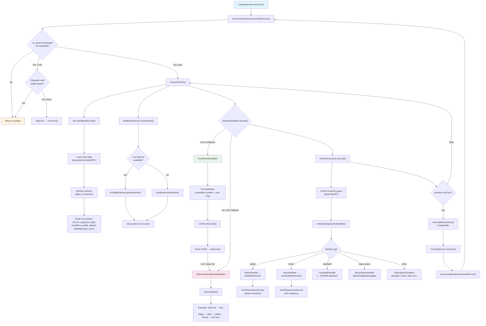
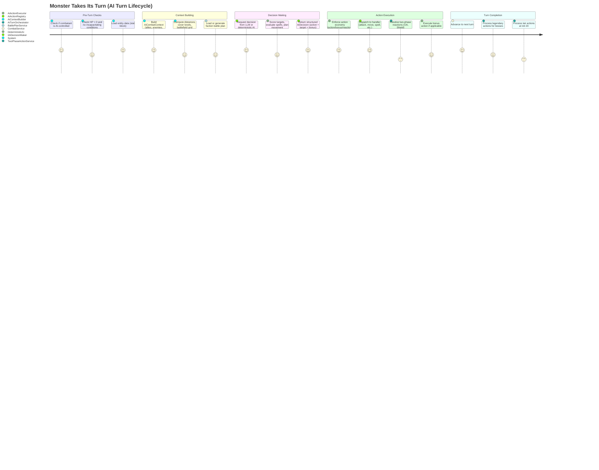

# AIBehavior — Architecture Flow

> **Owner SME**: AIBehavior-SME
> **Last updated**: 2026-04-12
> **Scope**: AI turn orchestration for Monsters/NPCs/AI-Characters + all LLM infrastructure (providers, intent parsing, narration, AI decisions, battle planning)

## Overview

The AIBehavior flow orchestrates turns for AI-controlled combatants (Monsters, NPCs, AI-Characters) through a two-mode decision pipeline: a **deterministic heuristic AI** (`DeterministicAiDecisionMaker`) that evaluates prioritized action steps without any LLM, and an **LLM-assisted mode** (`LlmAiDecisionMaker`) that builds rich tactical context and prompts a language model for a structured JSON decision. Both modes feed into a unified action executor that translates decisions into game state changes via the `ActionService` and `TwoPhaseActionService` facades. The LLM infrastructure layer provides pluggable provider adapters (Ollama, OpenAI, GitHub Models) behind a single `LlmProvider` interface, plus specialized adapters for intent parsing, narration, story generation, and faction-level battle planning. All LLM usage is **optional** — the rules engine is fully deterministic and the AI gracefully degrades to heuristic-only when no LLM is configured.

## UML Class Diagram

```mermaid
classDiagram
    direction TB

    class AiTurnOrchestrator {
        -contextBuilder: AiContextBuilder
        -actionExecutor: AiActionExecutor
        -deterministicAi: DeterministicAiDecisionMaker
        -aiDecisionMaker?: IAiDecisionMaker
        -battlePlanService?: BattlePlanService
        +processMonsterTurnIfNeeded(sessionId, encounterId): bool
        +processAllAiTurns(sessionId, encounterId): void
        +processLegendaryActionsAfterTurn(sessionId, encounterId, justEndedId): void
        -executeAiTurn(sessionId, encounter, aiCombatant, all): bool
        -aiDecideReaction(combatant, type, ctx): bool
        -processLairActionsIfNeeded(sessionId, encounterId): void
    }

    class AiContextBuilder {
        -characterCache: Map
        -monsterCache: Map
        -npcCache: Map
        +clearCache(): void
        +build(entityData, combatant, all, encounter, ...): AiCombatContext
        -buildEntityInfo(entityData, combatant): CombatantInfo
        -buildAllyDetails(allies, nameMap): AllyInfo[]
        -buildEnemyDetails(enemies, nameMap): EnemyInfo[]
        -renderBattlefieldContext(encounter, ...): BattlefieldView
    }

    class AiActionExecutor {
        -registry: AiActionRegistry
        +execute(sessionId, encounterId, combatant, decision, all): TurnStepResult
        +executeBonusAction(sessionId, encounterId, combatant, decision, ref): Result
        -setupRegistry(): void
    }

    class AiActionRegistry {
        -handlers: AiActionHandler[]
        +register(handler): void
        +execute(ctx, deps): AiHandlerResult
        +findHandler(action): AiActionHandler
    }

    class DeterministicAiDecisionMaker {
        +decide(input): AiDecision
    }

    class BattlePlanService {
        +ensurePlan(encounterId, encounter, combatant, all): BattlePlan
        +getPlanViewForCombatant(plan, name): CombatantBattlePlanView
        -shouldReplan(plan, encounter, combatants): bool
        -buildDeterministicPlan(...): BattlePlan
    }

    class AiAttackResolver {
        +resolve(params): AiAttackOutcome
    }

    class AiTargetScorer {
        +scoreTargets(selfPos, enemies): ScoredTarget[]
    }

    class AiMovementPlanner {
        +isRangedCreature(combatant): bool
        +pickBestAttack(attacks, ac, defenses): string
        +findCoverPosition(...): Position
        +findFlankingPosition(...): Position
    }

    class IAiDecisionMaker {
        <<interface>>
        +decide(input): AiDecision | null
    }

    class IAiBattlePlanner {
        <<interface>>
        +generatePlan(input): BattlePlan | null
    }

    class LlmProvider {
        <<interface>>
        +chat(input: LlmChatInput): string
    }

    class LlmAiDecisionMaker {
        -llm: LlmProvider
        +decide(input): AiDecision | null
        -buildSystemPrompt(...): string
        -parseDecision(json): AiDecision
    }

    class LlmBattlePlanner {
        -llm: LlmProvider
        +generatePlan(input): BattlePlan | null
    }

    class OllamaProvider {
        +chat(input): string
    }

    class OpenAiProvider {
        +chat(input): string
    }

    class GitHubModelsProvider {
        +chat(input): string
    }

    class SpyLlmProvider {
        -inner: LlmProvider
        -captures: Array
        +chat(input): string
        +getCapturedCalls(): Array
    }

    class IntentParser {
        -llm: LlmProvider
        +parseIntent(input): unknown
    }

    class NarrativeGenerator {
        -llm: LlmProvider
        +narrate(input): string
    }

    class StoryGenerator {
        -llm: LlmProvider
        +generateStoryFramework(input): StoryFramework
    }

    class PromptBuilder {
        -sections: Map
        +addSection(name, content): this
        +addSectionIf(cond, name, content): this
        +buildAsMessages(): LlmMessage[]
        +estimateTokens(): number
    }

    %% Relationships
    AiTurnOrchestrator --> AiContextBuilder : builds context
    AiTurnOrchestrator --> AiActionExecutor : executes decisions
    AiTurnOrchestrator --> DeterministicAiDecisionMaker : fallback AI
    AiTurnOrchestrator --> BattlePlanService : faction plans
    AiTurnOrchestrator ..> IAiDecisionMaker : optional LLM brain

    AiActionExecutor --> AiActionRegistry : dispatches actions
    AiActionExecutor --> AiAttackResolver : resolves attacks

    DeterministicAiDecisionMaker ..|> IAiDecisionMaker : implements
    DeterministicAiDecisionMaker --> AiTargetScorer : scores targets
    DeterministicAiDecisionMaker --> AiMovementPlanner : plans movement

    LlmAiDecisionMaker ..|> IAiDecisionMaker : implements
    LlmAiDecisionMaker --> LlmProvider : calls LLM
    LlmAiDecisionMaker --> PromptBuilder : builds prompts

    LlmBattlePlanner ..|> IAiBattlePlanner : implements
    LlmBattlePlanner --> LlmProvider : calls LLM

    BattlePlanService ..> IAiBattlePlanner : optional LLM planner

    OllamaProvider ..|> LlmProvider : implements
    OpenAiProvider ..|> LlmProvider : implements
    GitHubModelsProvider ..|> LlmProvider : implements
    SpyLlmProvider ..|> LlmProvider : decorates

    IntentParser --> LlmProvider : calls LLM
    NarrativeGenerator --> LlmProvider : calls LLM
    StoryGenerator --> LlmProvider : calls LLM

    IntentParser --> PromptBuilder : builds prompts
    NarrativeGenerator --> PromptBuilder : builds prompts
    StoryGenerator --> PromptBuilder : builds prompts
    LlmBattlePlanner --> PromptBuilder : builds prompts
```

## Data Flow Diagram

## User Journey: Monster Takes Its Turn

## File Responsibility Matrix

### Application Layer (`application/services/combat/ai/`)

| File | Lines (approx) | Layer | Responsibility |
|------|----------------|-------|---------------|
| `ai-turn-orchestrator.ts` | ~1280 | app | **Main orchestrator**: AI turn loop, 0-HP skip, condition checks, death save setup, legendary/lair actions, reaction decisions, deferred bonus actions |
| `ai-context-builder.ts` | ~810 | app | **Context assembly**: builds `AiCombatContext` with entity info, allies, enemies, distances, cover, battlefield grid, zones, battle plan view |
| `ai-action-executor.ts` | ~450 | app | **Action dispatch facade**: action economy enforcement, `AiActionRegistry` setup, bonus action execution (registry + legacy fallback), Spiritual Weapon resolution |
| `ai-attack-resolver.ts` | ~670 | app | **Two-phase attack resolution**: d20 rolls, advantage/disadvantage from effects + conditions + flanking + obscuration, damage with crits/defenses/retaliatory, reaction initiation, Divine Smite |
| `ai-movement-resolver.ts` | ~370 | app | **Two-phase movement pipeline**: `resolveAiMovement()` handles initiateMove → OA decisions → zone damage → completeMove, War Caster spell OA selection |
| `deterministic-ai.ts` | ~560 | app | **Heuristic AI**: prioritized decision pipeline (stand up → flee → triage → target → move → spell → feature → attack → bonus → end); delegates to extracted modules |
| `ai-target-scorer.ts` | ~120 | app | **Target ranking**: composite score from HP ratio, AC, concentration, conditions (stunned/paralyzed/prone), distance |
| `ai-movement-planner.ts` | ~280 | app | **Movement helpers**: `isRangedCreature()`, `pickBestAttack()` with damage-type-aware selection, `hasAdjacentEnemy()`, `findCoverPosition()`, `findFlankingPosition()` |
| `ai-multiattack-parser.ts` | ~45 | app | **Multiattack parsing**: extracts attack count from monster Multiattack action description text |
| `battle-plan-service.ts` | ~300 | app | **Faction battle plans**: LLM-first with deterministic fallback, `shouldReplan()` heuristics (stale rounds, HP loss, casualty changes), per-combatant plan views |
| `battle-plan-types.ts` | ~55 | app | **Plan types**: `BattlePlan` (faction, priority, roles, snapshot) + `CombatantBattlePlanView` |
| `ai-types.ts` | ~270 | app | **Core types**: `AiDecision`, `AiCombatContext`, `TurnStepResult`, `IAiDecisionMaker` port, `ActorRef` |
| `ai-action-handler.ts` | ~100 | app | **Handler interface**: `AiActionHandler` strategy interface, `AiActionHandlerContext`, `AiActionHandlerDeps` type bundles |
| `ai-action-registry.ts` | ~70 | app | **Handler registry**: linear scan dispatch via `handles()`, mirrors `AbilityRegistry` pattern |
| `legendary-action-handler.ts` | ~220 | app | **Legendary actions**: `chooseLegendaryAction()` with spread-across-round heuristic, attack/move/special priorities |
| `build-actor-ref.ts` | ~30 | app | **Shared helper**: `buildActorRef()` converts `CombatantStateRecord` → `ActorRef` |
| `index.ts` | ~40 | app | **Barrel**: re-exports all public types, classes, and helpers |

### Application Layer — Action Handlers (`ai/handlers/`)

| File | Lines (approx) | Layer | Responsibility |
|------|----------------|-------|---------------|
| `attack-handler.ts` | varies | app | Handles `attack` — target resolution, delegates to `AiAttackResolver`, falls back to `ActionService.attack()` |
| `move-handler.ts` | varies | app | Handles `move` — coordinate-based movement via `resolveAiMovement()` |
| `move-toward-handler.ts` | varies | app | Handles `moveToward` — A* pathfinding then `resolveAiMovement()` |
| `move-away-from-handler.ts` | varies | app | Handles `moveAwayFrom` — computes escape direction, pathfinding, `resolveAiMovement()` |
| `basic-action-handler.ts` | varies | app | Handles `dash`, `dodge`, `disengage` via `ActionService` |
| `cast-spell-handler.ts` | varies | app | Handles `castSpell` — spell lookup, slot spend, AI spell delivery (→ AISpellEvaluation sub-domain) |
| `help-handler.ts` | varies | app | Handles `help` — applies advantage effect to ally's next attack |
| `shove-handler.ts` | varies | app | Handles `shove` — contested Athletics check via `ActionService.shove()` |
| `grapple-handler.ts` | varies | app | Handles `grapple` — contested Athletics check via `ActionService.grapple()` |
| `escape-grapple-handler.ts` | varies | app | Handles `escapeGrapple` via `ActionService.escapeGrapple()` |
| `hide-handler.ts` | varies | app | Handles `hide` — Stealth check via `ActionService.hide()` |
| `search-handler.ts` | varies | app | Handles `search` — Perception check for hidden creatures |
| `use-object-handler.ts` | varies | app | Handles `useObject` — drink healing potion from inventory |
| `use-feature-handler.ts` | varies | app | Handles `useFeature` — dispatches to `AbilityRegistry` for class features (Turn Undead, Lay on Hands, etc.) |
| `end-turn-handler.ts` | varies | app | Handles `endTurn` — no-op action, triggers bonus action execution |
| `ai-spell-delivery.ts` | varies | app | AI spell damage/healing/save resolution (→ AISpellEvaluation sub-domain) |
| `index.ts` | ~20 | app | Handler barrel export |

### Infrastructure Layer (`infrastructure/llm/`)

| File | Lines (approx) | Layer | Responsibility |
|------|----------------|-------|---------------|
| `ai-decision-maker.ts` | ~690 | infra | **LLM AI adapter**: massive system prompt with D&D tactical instructions, context serialization, JSON parsing with retry, compact prompt for small models |
| `battle-planner.ts` | ~170 | infra | **LLM battle plan adapter**: faction-level system prompt, parse plan JSON → `BattlePlan` |
| `intent-parser.ts` | ~50 | infra | **Intent adapter**: natural language → structured JSON via schema hint |
| `narrative-generator.ts` | ~55 | infra | **Narration adapter**: events → 1-2 sentence vivid prose, strict hallucination guardrails |
| `story-generator.ts` | ~100 | infra | **Story adapter**: generates adventure framework (opening/arc/ending/checkpoints) |
| `ollama-provider.ts` | ~110 | infra | **Ollama transport**: POST to `/api/chat`, retry + exponential backoff for 5xx/network errors |
| `openai-provider.ts` | ~110 | infra | **OpenAI transport**: standard chat completions, retry on 429/5xx |
| `github-models-provider.ts` | ~110 | infra | **GitHub Models transport**: OpenAI-compatible endpoint, rate-limit-aware retry with `Retry-After` parsing |
| `spy-provider.ts` | ~35 | infra | **Testing decorator**: transparent `LlmProvider` wrapper that captures all calls for snapshot testing |
| `factory.ts` | ~55 | infra | **Provider factory**: `createLlmProviderFromEnv()` selects Ollama/OpenAI/GitHub Models from env vars |
| `prompt-builder.ts` | ~95 | infra | **Prompt utility**: named sections, conditional inclusion, system/user message splitting, token estimation |
| `context-budget.ts` | ~140 | infra | **Token budget**: progressive truncation of `AiCombatContext` — stat block summaries → ally/enemy reduction → narrative trim |
| `json.ts` | ~55 | infra | **JSON extractor**: `extractFirstJsonObject()` with brace-depth + string-state tracking for robust LLM output parsing |
| `debug.ts` | ~25 | infra | **Debug logger**: `llmDebugLog()` gated behind `DM_LLM_DEBUG` env var |
| `types.ts` | ~25 | infra | **Core types**: `LlmProvider` interface, `LlmMessage`, `LlmGenerateOptions`, `LlmChatInput` |
| `character-generator.ts` | varies | infra | **Character gen adapter**: LLM-based character sheet generation (separate concern, not AI combat) |
| `index.ts` | ~15 | infra | **Barrel**: re-exports all public adapters and types |
| `mocks/index.ts` | varies | infra | **Mock implementations**: `MockIntentParser`, `MockNarrativeGenerator`, `MockAiDecisionMaker` for deterministic testing |

## Key Types & Interfaces

| Type | File | Purpose |
|------|------|---------|
| `AiDecision` | `ai-types.ts` | Structured action decision: 18 action types + target, destination, spell, bonus action, intent narration |
| `AiCombatContext` | `ai-types.ts` | Full tactical context: combatant stats, allies, enemies with distances/cover, battlefield grid, zones, battle plan, turn history |
| `TurnStepResult` | `ai-types.ts` | Per-step outcome: action, ok/fail, summary, optional data payload |
| `ActorRef` | `ai-types.ts` | Typed union: `{ type: "Monster", monsterId }` or `"NPC"` or `"Character"` |
| `IAiDecisionMaker` | `ai-types.ts` | Port interface for AI brain — `decide(input): AiDecision | null` |
| `BattlePlan` | `battle-plan-types.ts` | Faction plan: priority, focus target, creature roles, tactical notes, HP snapshot for replan detection |
| `CombatantBattlePlanView` | `battle-plan-types.ts` | Per-creature view of faction plan (priority, your role, notes) |
| `IAiBattlePlanner` | `battle-plan-service.ts` | Port interface for plan generation — `generatePlan(input): BattlePlan | null` |
| `AiActionHandler` | `ai-action-handler.ts` | Strategy interface: `handles(action): bool` + `execute(ctx, deps): AiHandlerResult` |
| `AiActionHandlerDeps` | `ai-action-handler.ts` | Deps bundle: all services, repos, and bound helper methods handlers need |
| `AiAttackOutcome` | `ai-attack-resolver.ts` | Discriminated union: `not_applicable | miss | awaiting_reactions | hit | awaiting_damage_reaction` |
| `AiMovementOutcome` | `ai-movement-resolver.ts` | Discriminated union: `aborted_by_trigger | player_oa_pending | no_reactions | completed` |
| `ScoredTarget` | `ai-target-scorer.ts` | Ranked enemy: name, composite score, distance, raw enemy data |
| `LlmProvider` | `types.ts` | Core LLM interface: `chat(input: LlmChatInput): Promise<string>` |
| `LlmChatInput` | `types.ts` | `{ messages: LlmMessage[], options: LlmGenerateOptions }` |
| `LlmMessage` | `types.ts` | `{ role: "system" | "user" | "assistant", content: string }` |
| `IIntentParser` | `intent-parser.ts` | Port: `parseIntent({ text, seed?, schemaHint? }): unknown` |
| `INarrativeGenerator` | `narrative-generator.ts` | Port: `narrate({ storyFramework, events, seed? }): string` |
| `IStoryGenerator` | `story-generator.ts` | Port: `generateStoryFramework(input?): StoryFramework` |

## Cross-Flow Dependencies

| This flow depends on | For |
|----------------------|-----|
| **CombatOrchestration** | `ActionService` for programmatic action execution (attack, move, dash, dodge, etc.), `TwoPhaseActionService` for reaction-aware movement and attacks, `CombatService.nextTurn()` for turn advancement |
| **CombatRules** | `calculateDistance()`, `deriveRollModeFromConditions()`, `applyDamageDefenses()`, `hasReactionAvailable()`, flanking checks, A* pathfinding, cover/sight calculations, evasion, War Caster OA |
| **ClassAbilities** | `AbilityRegistry` for bonus action execution (Flurry, Patient Defense, Cunning Action), `ClassFeatureResolver.getAttacksPerAction()` for Extra Attack/Multiattack, `getClassAbilities()` for context enrichment |
| **ReactionSystem** | `TwoPhaseActionService.initiateAttack()` for Shield/Deflect reactions, `initiateMove()` for opportunity attacks, `initiateDamageReaction()` for Absorb Elements/Hellish Rebuke |
| **EntityManagement** | `ICharacterRepository`, `IMonsterRepository`, `INPCRepository` for entity loading, `FactionService` for ally/enemy determination, `ICombatantResolver` for combat stats + names |
| **SpellSystem** | Spell lookup for AI spell delivery, concentration tracking, spell slot management (via AISpellEvaluation sub-domain handlers) |
| **CombatMap** | `CombatMap` type for battlefield rendering, `getCoverLevel()` for cover context, `getMapZones()` for zone context, `isPositionPassable()` for movement validation |
| **ActionEconomy** | `normalizeResources()`, `spendAction()`, `setAttacksAllowed()`, `getResourcePools()`, `getActiveEffects()` for action economy tracking |

| Depends on this flow | For |
|----------------------|-----|
| **CombatOrchestration** | `AiTurnOrchestrator.processAllAiTurns()` called from session routes after turn advancement; `AiTurnOrchestrator.processMonsterTurnIfNeeded()` from combat loop |
| **ReactionSystem** | `aiDecideReaction()` callback for Monster/NPC OA, Shield, and Counterspell decisions during two-phase resolution |
| **Infrastructure/API** | Session routes wire `AiTurnOrchestrator` into the combat flow; route handlers call `processAllAiTurns()` after player actions complete |

## Known Gotchas & Edge Cases

1. **LLM null → deterministic fallback → null = end turn** — The orchestrator chains: LLM decision → if null, deterministic AI → if still null, force end turn. A bug in the deterministic AI returning null causes silent turn skips. The safety limit of 5 iterations per turn prevents infinite loops but can also truncate complex multi-step turns (Extra Attack + bonus action + movement).

2. **Deferred bonus actions across reaction pauses** — When an AI attack triggers a player reaction (Shield/Deflect), the turn pauses. The intended bonus action is stored in `resources.pendingBonusAction` and re-executed on the next iteration after the reaction resolves. If the reaction resolution changes game state (e.g., target dies from retaliatory damage), the deferred bonus action may target a dead creature.

3. **AiContextBuilder entity caches are per-turn, not per-encounter** — `clearCache()` is called at turn start, but within a single turn's multiple iterations, cached entity data may go stale if another combatant's reaction modifies entity state (e.g., Shield spell changes AC). The context builder doesn't re-fetch mid-turn.

4. **Action economy key mismatch** — The context builder reads `bonusActionUsed` from resources, but some code paths write `bonusActionSpent`. The `getEconomy()` method in `AiActionExecutor` reads `actionSpent` while `AiContextBuilder.getEconomy()` reads `actionSpent` and `bonusActionUsed`. Inconsistent key names between writers and readers can cause the AI to believe it hasn't used its bonus action when it has.

5. **Two-phase attack resolution divergence** — `AiAttackResolver` resolves attacks independently from the tabletop `RollStateMachine` path. They use different code for damage calculation, effect application, and event emission. Changes to one path (e.g., new damage modifier from an ActiveEffect) must be mirrored in the other, or AI attacks will resolve differently from player attacks. See the flanking, obscuration, and Divine Smite sections that were manually kept in sync.

6. **LLM prompt size can exceed context window** — The `LlmAiDecisionMaker` system prompt alone is ~600+ lines. Combined with a large `AiCombatContext` (many combatants, stat block arrays), the prompt can blow past small-model context windows. `context-budget.ts` applies progressive truncation, but the system prompt itself is never truncated. Small models (Phi, Gemma) use a separate compact prompt (~50 lines), auto-detected by model name pattern matching.

7. **`AiTurnOrchestrator.processAllAiTurns()` processes legendary and lair actions** — After each AI turn completes, the orchestrator checks ALL legendary creatures (not just the one that acted) for legendary action opportunities, and processes lair actions at init 20. This means legendary actions can fire during what appears to be another creature's turn processing, potentially confusing event ordering.

8. **Battle plan replan heuristic is synchronous** — `shouldReplan()` compares current combatant state against the HP snapshot stored at plan generation time. If a combatant was healed above the snapshot, it won't trigger a replan even though the tactical situation changed. The stale-round threshold (2 rounds) is the safety net.

9. **Mock LLM provider in E2E tests uses `DeterministicAiDecisionMaker`** — When `DM_OLLAMA_MODEL` is not set, the orchestrator falls back to deterministic AI. The mock LLM provider in `mocks/index.ts` is never used by the orchestrator directly — it's wired for intent/narration routes. This means E2E combat scenarios always test the deterministic code path, not the LLM prompt/parse path.

## Testing Patterns

- **Unit tests**: `deterministic-ai.test.ts`, `ai-target-scorer.test.ts`, `ai-context-builder.test.ts`, `ai-action-executor.test.ts`, `ai-attack-resolver.test.ts`, `ai-reaction-decision.test.ts`, `legendary-action-handler.test.ts`, `battle-plan-service.test.ts` — all use in-memory repos, mock `DiceRoller` (deterministic dice), and stub entity data. No LLM required.

- **LLM integration tests**: `ai-actions.llm.test.ts`, `character-abilities.llm.test.ts` — gated behind `DM_RUN_LLM_TESTS=1`. Test real LLM prompt → parse round-trip with actual Ollama.

- **E2E combat scenarios**: `scripts/test-harness/scenarios/` — ~43 JSON scenarios exercise AI turns via the deterministic fallback AI. Run with `pnpm test:e2e:combat:mock -- --all`. Scenarios verify AI attack resolution, movement, bonus actions, spell casting, grapple/shove, opportunity attacks, and legendary actions.

- **LLM accuracy E2E**: `scripts/test-harness/llm-e2e.ts` with scenarios in `llm-scenarios/` — tests intent parsing accuracy, narration quality, and AI decision reasonableness with a real LLM. Run with `pnpm test:llm:e2e`.

- **Prompt snapshot testing**: `SpyLlmProvider` wraps a real `LlmProvider` and captures all calls. `llm-snapshot.ts` compares captured prompts against stored baselines in `llm-snapshots/`. Update snapshots with `pnpm test:llm:e2e:snapshot-update`. Detects unintended prompt regressions.

- **Context budget tests**: `context-budget.test.ts` — verifies progressive truncation produces contexts within token budgets while preserving critical information.

- **Key test files**:
  - `src/application/services/combat/ai/deterministic-ai.test.ts`
  - `src/application/services/combat/ai/ai-target-scorer.test.ts`
  - `src/application/services/combat/ai/ai-context-builder.test.ts`
  - `src/application/services/combat/ai/ai-action-executor.test.ts`
  - `src/application/services/combat/ai/ai-attack-resolver.test.ts`
  - `src/application/services/combat/ai/ai-reaction-decision.test.ts`
  - `src/application/services/combat/ai/battle-plan-service.test.ts`
  - `src/application/services/combat/ai/legendary-action-handler.test.ts`
  - `src/infrastructure/llm/context-budget.test.ts`
  - `src/infrastructure/llm/mocks/index.ts` (Mock providers)
  - `scripts/test-harness/llm-e2e.ts` (LLM accuracy)
