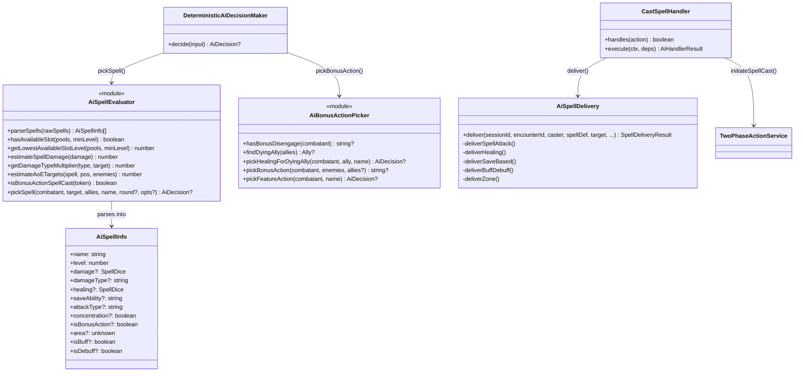
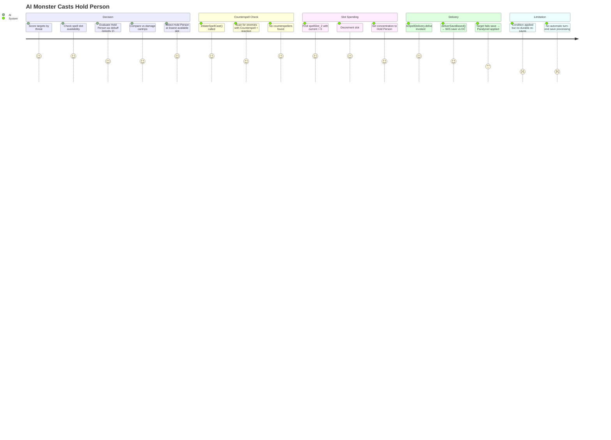

# AISpellEvaluation — Architecture Flow

> **Owner SME**: AISpellEvaluation-SME
> **Last updated**: 2026-04-12
> **Scope**: AI spell decision-making — slot economy, spell value computation, target selection, bonus-action spell coordination, the AI spell casting pipeline. Application layer only (no domain rules ownership).

## Overview

The AISpellEvaluation flow governs **how the AI decides which spell to cast, on whom, and at what level**. It sits in the **application layer** (`application/services/combat/ai/`) and implements a priority-ranked scoring system: healing (if allies hurt) → debuffs → buffs (early rounds) → damage cantrips → leveled damage spells. The flow is constrained by a critical limitation: AI spell delivery (`AiSpellDelivery`) provides basic effect application but does NOT resolve full spell mechanics (saves with stat validation, durable conditions with re-saves, concentration conflicts). Full spell resolution only works through the player-facing tabletop dice flow.

## UML Class Diagram

## Data Flow Diagram

```mermaid
flowchart LR
    A["AI Turn\n(DeterministicAiDecisionMaker)"] --> B{"BA spell\ncoordination"}
    B -->|"BA is spell"| C["pickSpell()\ncantripsOnly: true"]
    B -->|"BA not spell"| D["pickSpell()\nunrestricted"]

    C --> E["parseSpells(rawSpells)\n→ AiSpellInfo[]"]
    D --> E
    E --> F{"Concentration\ncheck"}
    F -->|"Already concentrating"| G["Filter to\nnon-concentration only"]
    F -->|"Not concentrating"| H["All spells available"]
    G --> I["pickFromCandidates()"]
    H --> I

    I --> J{"Priority Ranking"}
    J -->|"1. Healing"| K["Ally HP < 50%\nHighest-level heal"]
    J -->|"2. Debuff"| L["Hold Person, Fear\nHighest level"]
    J -->|"3. Buff"| M["Round ≤ 2\nBless, Shield of Faith"]
    J -->|"4. Cantrip"| N["damage × targets × typeMultiplier\nBest scoring"]
    J -->|"5. Leveled damage"| O["Only if weak attacks\ndamage × targets × typeMultiplier"]

    K --> P["AiDecision\n{castSpell, spellName, level, target}"]
    L --> P
    M --> P
    N --> P
    O --> P

    P --> Q["CastSpellHandler.execute()"]
    Q --> R["initiateSpellCast()\nCounterspell check"]
    R -->|"awaiting_reactions"| S["Return pending\n(player must respond)"]
    R -->|"no_reactions"| T["prepareSpellCast()\nSpend slot + concentration"]
    T --> U["AiSpellDelivery.deliver()"]
    U -->|"attackType"| V["Spell attack roll"]
    U -->|"healing"| W["Roll healing dice"]
    U -->|"saveAbility"| X["Save-based damage"]
    U -->|"effects"| Y["Buff/debuff effects"]
    U -->|"zone"| Z["Zone placement\nwith AoE targeting"]
```

## User Journey: AI Casts a Spell

## File Responsibility Matrix

| File | Lines (approx) | Layer | Responsibility |
|------|----------------|-------|---------------|
| `application/services/combat/ai/deterministic-ai.ts` | ~565 | application | `DeterministicAiDecisionMaker` — main AI decision loop; spell casting at step 4b with BA-spell coordination (`cantripsOnly` restriction); routes to `pickSpell()` with context |
| `application/services/combat/ai/ai-spell-evaluator.ts` | ~389 | application | Spell evaluation scoring logic — `parseSpells()`, `hasAvailableSlot()`, `getLowestAvailableSlotLevel()`, `estimateSpellDamage()`, `getDamageTypeMultiplier()`, `estimateAoETargets()`, `pickSpell()` (facade routing to `pickFromCandidates()`); priority ranking: healing → debuff → buff → cantrip → leveled damage |
| `application/services/combat/ai/handlers/cast-spell-handler.ts` | ~167 | application | `CastSpellHandler` — executes spell-cast decision; counterspell check via `initiateSpellCast()`, slot spending via `prepareSpellCast()`, effect delivery via `AiSpellDelivery`, action marking, bonus action execution |
| `application/services/combat/ai/handlers/ai-spell-delivery.ts` | ~557 | application | `AiSpellDelivery` class — strategy-pattern dispatcher routing by spell type to 5 private delivery methods: `deliverSpellAttack()`, `deliverHealing()`, `deliverSaveBased()`, `deliverBuffDebuff()`, `deliverZone()`; intelligent AoE targeting (score = enemies×2 − allies×3) |
| `application/services/combat/ai/ai-bonus-action-picker.ts` | ~313 | application | Bonus action selection — `pickBonusAction()` (8-priority chain: Second Wind → Rage → Patient Defense → Flurry → Step of the Wind → Cunning Action → BA heal spells → Spiritual Weapon); `findDyingAlly()`, `pickHealingForDyingAlly()`, `pickFeatureAction()` (Wholeness of Body, Lay on Hands) |

## Key Types & Interfaces

| Type | File | Purpose |
|------|------|---------|
| `AiSpellInfo` | `ai-spell-evaluator.ts` | Parsed spell for evaluation: name, level, damage, healing, attackType, concentration, isBonusAction, isBuff, isDebuff |
| `AiDecision` | `ai-types.ts` | AI output: `{ action, spellName?, spellLevel?, target?, endTurn, intentNarration }` |
| `AiCombatContext` | `ai-types.ts` | Full combat context: combatant stats, enemies, allies, map, round, etc. |
| `AiActionHandler` | (handler interface) | `{ handles(action): boolean; execute(ctx, deps): AiHandlerResult }` |
| `AiHandlerResult` | (handler interface) | `{ action, ok, summary, data: { awaitingPlayerInput?, pendingActionId?, ... } }` |
| `SpellDeliveryResult` | `ai-spell-delivery.ts` | `{ applied: boolean, summary: string }` |
| `AiSpellDeliveryDeps` | `ai-spell-delivery.ts` | `{ combat, characters?, monsters, npcs, diceRoller }` |
| `BUFF_SPELLS` | `ai-spell-evaluator.ts` | `Set<string>` — 15 known buff spell names for classification |
| `DEBUFF_SPELLS` | `ai-spell-evaluator.ts` | `Set<string>` — 16 known debuff spell names for classification |

## Cross-Flow Dependencies

| This flow depends on | For |
|----------------------|-----|
| **SpellCatalog** | `PreparedSpellDefinition` for spell effect data; `getCanonicalSpell()` for spell lookup; cantrip scaling for damage estimation |
| **ReactionSystem** | `TwoPhaseActionService.initiateSpellCast()` for Counterspell detection before spell delivery |
| **ActionEconomy** | `bonusActionSpellCastThisTurn` flag for BA-spell coordination; resource pool reading for slot availability |
| **CombatRules** | Save DC computation, spell attack bonus, damage defenses (resist/immune/vuln) for delivery |
| **CombatMap** | `getCreaturesInArea()` for AoE target selection; zone placement for zone spells |
| **CreatureHydration** | Combat stats for caster (spellSaveDC, spellAttackBonus, spellcastingModifier) and target (AC, ability scores for saves) |
| **EntityManagement** | Repository reads for character sheets, monster stat blocks, NPC stat blocks to resolve spell lists and caster sources |

| Depends on this flow | For |
|----------------------|-----|
| **AIBehavior** | `DeterministicAiDecisionMaker.decide()` is the primary consumer — calls `pickSpell()` and `pickBonusAction()` during AI turn orchestration |

## Known Gotchas & Edge Cases

1. **AI spells do NOT resolve full mechanics** — `AiSpellDelivery` applies damage/healing and basic conditions but does NOT: resolve durable conditions with turn-end re-saves, validate concentration conflicts properly, handle complex spell-triggered skill checks, or support spell chaining. The tabletop dice flow is required for full resolution. Test scenarios use `applyCondition` action to manually patch conditions when testing condition-dependent behavior.

2. **Spell slot is spent BEFORE Counterspell resolution** — In `CastSpellHandler.execute()`, `prepareSpellCast()` is called before the player responds to the Counterspell prompt. If the spell is counterspelled, the slot is still consumed. This matches D&D rules but means failed spell casts always cost a slot.

3. **BA-spell coordination follows D&D 5e 2024 rules strictly** — If `pickBonusAction()` returns a spell token (starts with `"castSpell:"`), `pickSpell()` is called with `cantripsOnly: true`, restricting the main action to cantrips only. Without this check, AI could cast two leveled spells per turn.

4. **Concentration conflict is checked but not fully validated** — `pickSpell()` filters to non-concentration spells if the caster already has `concentrationSpell` active. However, `AiSpellDelivery` doesn't validate this — if a concentration spell somehow gets through, it's applied without dropping the existing one. The concentration drop logic lives in the tabletop flow.

5. **`getDamageTypeMultiplier()` returns 0 for immune, skipping the spell entirely** — When scoring spells, immune targets yield 0 score, effectively removing the spell from consideration. If ALL enemies are immune to a damage type, that spell is never picked. However, resistance + vulnerability cancel to multiplier 1.0.

6. **AoE targeting uses max-distance heuristic, not true grid geometry** — `estimateAoETargets()` uses Chebyshev distance (`Math.max(dx, dy)`) for a rough target count. `AiSpellDelivery.deliverZone()` uses the more precise `getCreaturesInArea()` for actual zone placement. The estimation may over/under-count targets at decision time.

7. **Spell slot pool naming is regex-based** — `hasAvailableSlot()` matches pool names via `/^spellSlot_(\d+)$/i`. Any pool not matching this pattern is invisible to the spell evaluator. Warlock pact magic uses the same naming convention.

8. **`parseSpells()` classifies buff/debuff via hardcoded sets** — `BUFF_SPELLS` (15 entries) and `DEBUFF_SPELLS` (16 entries) are static sets. New spells added to the catalog must also be added to these sets for correct AI classification, or they'll be treated as pure damage spells.

9. **Healing priority triggers at < 50% HP** — Both self-healing and ally-healing activate when any ally or self is below 50% HP. If multiple allies are hurt, the lowest-HP ally (by current HP, not percentage) is targeted for healing spells.

## Testing Patterns

- **Unit tests**: `ai-spell-evaluator.ts` functions are pure and testable — `estimateSpellDamage()`, `getDamageTypeMultiplier()`, `parseSpells()`, `hasAvailableSlot()` can be tested with mock data. `pickSpell()` tested with mock combatant context.
- **E2E scenarios**: AI spell casting tested via scenarios where monsters have spell lists — `wizard/` scenarios (AI counterspell), `core/spell-combat-basic.json`, faction tests with spellcasting monsters. `applyCondition` action used to set up conditions AI spells can't apply durably.
- **Integration tests**: `combat-service-domain.integration.test.ts` exercises full AI turns including spell casting decisions. `combat-flow-tabletop.integration.test.ts` tests the CastSpellHandler pipeline end-to-end.
- **Key test file(s)**: `combat-service-domain.integration.test.ts`, `combat-flow-tabletop.integration.test.ts`, E2E scenarios with spellcasting combatants
