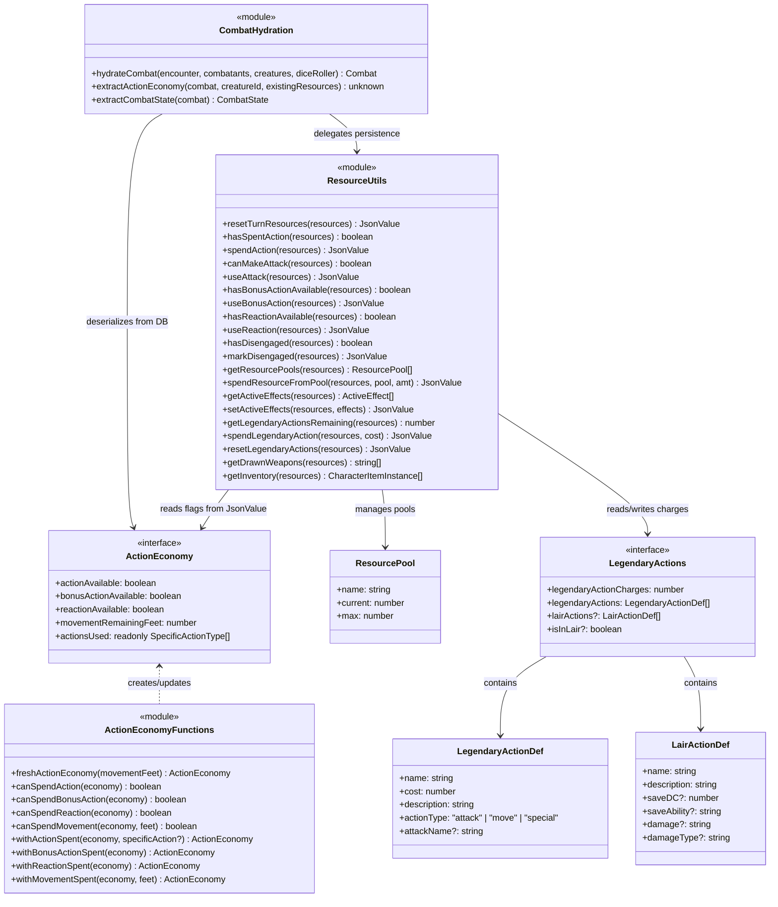
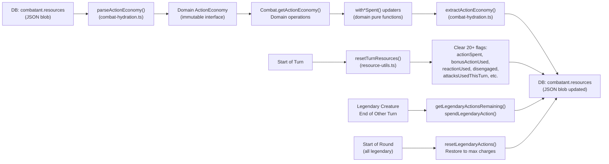
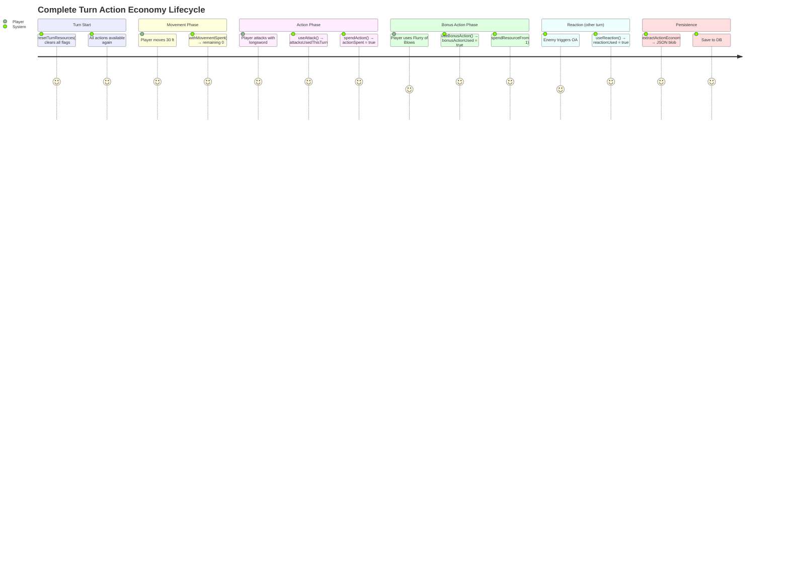

# ActionEconomy — Architecture Flow

> **Owner SME**: ActionEconomy-SME
> **Last updated**: 2026-04-12
> **Scope**: Action/bonus/reaction/movement tracking, resource flag lifecycle, turn resets, legendary actions. The 30+ flags that gate what a creature can do on its turn.

## Overview

The ActionEconomy flow tracks the **per-turn and per-encounter resource state** of every combatant. It spans three DDD layers: a clean **domain** interface (`ActionEconomy` in `action-economy.ts` — 4 boolean/numeric fields with immutable updaters), an **application** layer of 60+ JSON resource-bag helpers (`resource-utils.ts` — reading/writing 30+ flags stored as DB column JSON), and a **bridge** layer (`combat-hydration.ts` — serializing/deserializing between the two). This three-layer model exists because the domain needs a clean abstraction while persistence needs a flexible JSON bag that holds action economy flags alongside resource pools, active effects, inventory, position, and legendary actions.

## UML Class Diagram

## Data Flow Diagram

## User Journey: Complete Turn Action Economy Lifecycle

## File Responsibility Matrix

| File | Lines (approx) | Layer | Responsibility |
|------|----------------|-------|---------------|
| `domain/entities/combat/action-economy.ts` | ~115 | domain | `ActionEconomy` readonly interface, `ActionType`/`SpecificActionType` unions; immutable builders: `freshActionEconomy()`, `with*Spent()` updaters; deprecated mutable `spend*()` functions; `canSpend*()` guards |
| `application/services/combat/helpers/resource-utils.ts` | ~635 | application | 60+ JsonValue resource bag helpers — turn reset, action/bonus/reaction/movement flags, attack tracking, Disengage, resource pools (ki/rage/etc.), active effects CRUD, speed/position, legendary action tracking, drawn weapons, inventory, normalization |
| `application/services/combat/helpers/combat-hydration.ts` | ~129 | application | Bridge layer: `hydrateCombat()` (DB → domain `Combat`), `extractActionEconomy()` (domain → DB JSON), `extractCombatState()`, internal `parseActionEconomy()` (DB JSON → domain `ActionEconomy`) |
| `domain/entities/creatures/legendary-actions.ts` | ~96 | domain | `LegendaryTraits`, `LegendaryActionDef`, `LairActionDef` type definitions; `parseLegendaryTraits()` for monster stat block parsing |
| `domain/entities/combat/resource-pool.ts` | ~11 | domain | Generic `ResourcePool { name, current, max }` interface; immutable `spendResource()` with validation |

## Key Types & Interfaces

| Type | File | Purpose |
|------|------|---------|
| `ActionEconomy` | `action-economy.ts` | Clean domain abstraction: `{ actionAvailable, bonusActionAvailable, reactionAvailable, movementRemainingFeet, actionsUsed[] }` |
| `ActionType` | `action-economy.ts` | `"Action" \| "BonusAction" \| "Reaction" \| "Movement"` |
| `SpecificActionType` | `action-economy.ts` | `"Attack" \| "Dash" \| "Dodge" \| "Help" \| "Hide" \| "Ready" \| "Search" \| "UseObject" \| "CastSpell"` |
| `ResourcePool` | `resource-pool.ts` | Generic `{ name: string, current: number, max: number }` for ki, rage, spell slots, action surge, etc. |
| `LegendaryTraits` | `legendary-actions.ts` | `{ legendaryActionCharges, legendaryActions[], lairActions?, isInLair? }` |
| `LegendaryActionDef` | `legendary-actions.ts` | `{ name, cost (1–3), description, actionType, attackName? }` |
| `LairActionDef` | `legendary-actions.ts` | `{ name, description, saveDC?, saveAbility?, damage?, damageType?, effect? }` |
| `JsonValue` | (Prisma) | Flexible JSON persistence type used by resource-utils for resource bag operations |

## Cross-Flow Dependencies

| This flow depends on | For |
|----------------------|-----|
| **EntityManagement** | `CombatantStateRecord.resources` JSON column — the persistence backing store for all action economy flags |
| **CombatRules** | `Combat` class delegates action tracking to `ActionEconomy`; `Combat.endTurn()` triggers economy reset |

| Depends on this flow | For |
|----------------------|-----|
| **CombatOrchestration** | Every action handler checks `canMakeAttack()`, `hasBonusActionAvailable()`, `hasReactionAvailable()` before executing; `spendAction()`, `useBonusAction()`, `useReaction()` after |
| **ReactionSystem** | `hasReactionAvailable()` gates opportunity attacks, Shield, Counterspell; `useReaction()` marks reaction spent |
| **ClassAbilities** | Ability executors use `spendResourceFromPool()` for ki, rage, action surge; `grantAdditionalAction()` for Action Surge extra attacks |
| **AIBehavior** | AI decision-making reads `actionSpent`, `bonusActionUsed`, `reactionUsed`, `movementSpent` to determine available actions; `pickBonusAction()` checks `hasBonusActionAvailable()` |
| **SpellSystem** | `bonusActionSpellCastThisTurn` / `actionSpellCastThisTurn` flags enforce D&D 5e bonus-action spell rule |
| **InventorySystem** | `getInventory()` / `setInventory()` read/write inventory from resources JSON; `getDrawnWeapons()` tracks drawn weapon state |

## Known Gotchas & Edge Cases

1. **Domain vs Application flag inversion** — Domain `ActionEconomy` uses `actionAvailable: true` (positive). DB resources use `actionSpent: true` (negative). `extractActionEconomy()` inverts: `actionSpent = !actionAvailable`. `parseActionEconomy()` inverts back. Mixing up the polarity causes actions to be double-spent or never consumed.

2. **`resetTurnResources()` clears 20+ flags but preserves encounter-scoped state** — Turn-scoped flags (actionSpent, bonusActionUsed, reactionUsed, disengaged, attacksUsedThisTurn, sneakAttackUsedThisTurn, etc.) reset to false/0. Encounter-scoped state (resourcePools, activeEffects, position, drawnWeapons, inventory, legendaryActionsRemaining) is preserved. Adding a new flag requires deciding its scope.

3. **`extractActionEconomy()` detects "fresh economy" and triggers full turn reset** — When all 3 action types are available (fresh turn), it resets turn-based flags, spell-casting rule flags, and readied actions. This means persisting a fresh economy has side effects beyond just the 4 ActionEconomy fields.

4. **Legendary actions are per-round, not per-turn** — `legendaryActionsRemaining` resets at the START of the legendary creature's turn (not at the end), to max `legendaryActionCharges`. Between turns, the creature can spend charges on `LegendaryActionDef` entries (each with cost 1–3). This differs from regular action economy which resets at turn start.

5. **`grantAdditionalAction()` is not just flag-setting** — It sets `attacksAllowedThisTurn` AND clears `actionSpent`, enabling a second full action's worth of attacks (Action Surge pattern). Callers must not independently set these fields.

6. **Resource pool names are convention-based, not type-checked** — Pools are identified by string name (`"ki"`, `"focusPoints"`, `"rage"`, `"actionSurge"`, `"secondWind"`, `"spellSlot_1"`, etc.). Different class implementations may use different name variations (e.g., `"ki"` vs `"focusPoints"` for Monk). The `spendResourceFromPool()` helper does case-insensitive substring matching.

7. **`bonusActionSpellCastThisTurn` and `actionSpellCastThisTurn` enforce 5e bonus-action spell rule** — If `bonusActionSpellCastThisTurn` is true, only cantrips can be cast as the main action. These flags are turn-scoped and reset by `resetTurnResources()`.

8. **Active effects live in the resources JSON bag** — `getActiveEffects()` / `setActiveEffects()` manage the `activeEffects` array within the same JSON blob as action economy flags. Effect duration tracking, concentration cleanup, and AoE zone effects all write to this shared bag.

## Testing Patterns

- **Unit tests**: `resource-utils` functions are pure (JsonValue in → JsonValue out) and tested directly. `action-economy.ts` immutable builders tested with assertion on returned objects.
- **E2E scenarios**: Every E2E scenario exercises action economy implicitly — attack counts, bonus action usage, reaction spending. `fighter/action-surge.json` specifically tests `grantAdditionalAction()`. `monk/flurry-of-blows.json` tests bonus action + resource pool spending. `core/legendary-actions.json` tests legendary charge tracking.
- **Key test file(s)**: `infrastructure/api/app.test.ts` (integration), `combat-flow-tabletop.integration.test.ts` (full turn lifecycle), `combat-service-domain.integration.test.ts`
