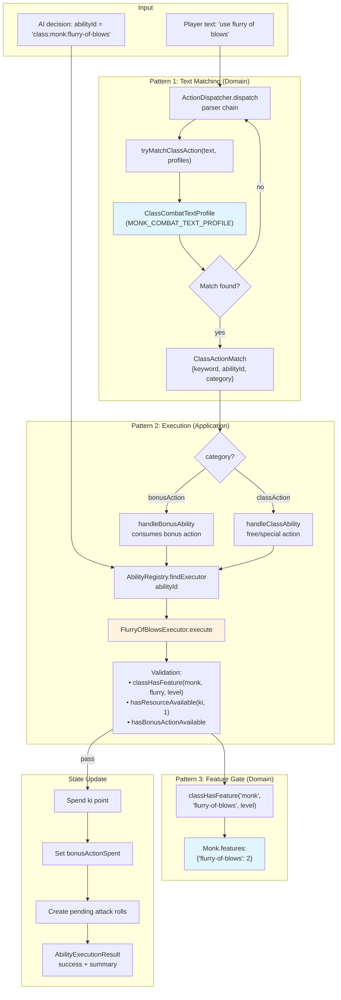
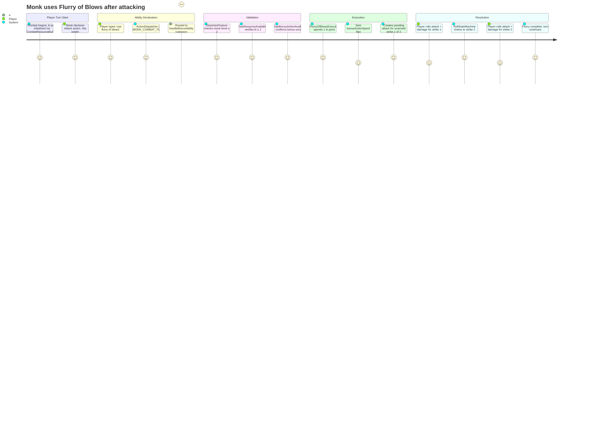

# ClassAbilities — Architecture Flow

> **Owner SME**: ClassAbilities-SME
> **Last updated**: 2026-04-12
> **Scope**: Class-specific ability definitions, text-to-action matching, resource pools, feature gates, and executor-based ability execution across domain and application layers.

## Overview

ClassAbilities is the system that makes D&D class features work — from a Monk's Flurry of Blows to a Fighter's Action Surge. It spans two DDD layers using three complementary patterns: **ClassCombatTextProfile** (domain: regex→action mapping + reaction/enhancement declarations), **AbilityRegistry + Executors** (application: execute abilities with resource/economy validation), and **Feature Maps** (domain: data-driven boolean eligibility gates). The domain layer defines *what* each class can do; the application layer handles *how* abilities execute and modify combat state.

## UML Class Diagram

```mermaid
classDiagram
    direction TB

    %% ── Domain Layer: Class Definitions ──────────────────────
    class CharacterClassDefinition {
        +id: CharacterClassId
        +name: string
        +hitDie: HitDie
        +proficiencies: ClassProficiencies
        +features?: Record~string, number~
        +resourcesAtLevel?(level, abilityModifiers?, subclassId?): ResourcePool[]
        +restRefreshPolicy?: RestRefreshPolicyEntry[]
        +capabilitiesForLevel?(level): ClassCapability[]
        +subclasses?: SubclassDefinition[]
    }

    class SubclassDefinition {
        +id: string
        +name: string
        +classId: CharacterClassId
        +features: Record~string, number~
        +combatTextProfile?: ClassCombatTextProfile
    }

    class ClassCombatTextProfile {
        +classId: string
        +actionMappings: ClassActionMapping[]
        +attackEnhancements: AttackEnhancementDef[]
        +attackReactions?: AttackReactionDef[]
        +damageReactions?: DamageReactionDef[]
        +spellReactions?: SpellReactionDef[]
    }

    class ClassActionMapping {
        +keyword: string
        +normalizedPatterns: RegExp[]
        +abilityId: string
        +category: "bonusAction" | "classAction"
    }

    class AttackEnhancementDef {
        +keyword: string
        +displayName?: string
        +patterns: RegExp[]
        +minLevel: number
        +resourceCost?: ~pool, amount~
        +trigger?: "onDeclare" | "onHit"
        +requiresMelee?: boolean
        +requiresSubclass?: string
        +requiresBonusAction?: string
    }

    class AttackReactionDef {
        +reactionType: string
        +classId: string
        +detect(input): DetectedAttackReaction?
    }

    class ResourcePool {
        +name: string
        +current: number
        +max: number
    }

    %% ── Domain Layer: Feature Keys ──────────────────────────
    class FeatureKeys {
        <<constants>>
        +RAGE: string
        +ACTION_SURGE: string
        +FLURRY_OF_BLOWS: string
        +CUNNING_ACTION: string
        +EXTRA_ATTACK: string
        +STUNNING_STRIKE: string
        +DEFLECT_ATTACKS: string
        ...etc
    }

    %% ── Domain Layer: Registry ──────────────────────────────
    class Registry {
        <<module>>
        +getClassDefinition(classId): CharacterClassDefinition
        +classHasFeature(classId, feature, level, subclassId?): boolean
        +hasFeature(classLevels, feature): boolean
        +getAllCombatTextProfiles(): ClassCombatTextProfile[]
        +getCriticalHitThreshold(classId, level, subclassId?): number
    }

    %% ── Domain Layer: Ability Interface ─────────────────────
    class AbilityExecutor {
        <<interface>>
        +canExecute(abilityId: string): boolean
        +execute(context: AbilityExecutionContext): Promise~AbilityExecutionResult~
    }

    class AbilityExecutionContext {
        +sessionId: string
        +encounterId: string
        +actor: AbilityActor
        +combat: AbilityCombatContext
        +abilityId: string
        +target?: AbilityActor
        +params?: Record~string, unknown~
        +services: ActionServiceMap
    }

    %% ── Application Layer: Registry ─────────────────────────
    class AbilityRegistry {
        -executors: AbilityExecutor[]
        +register(executor)
        +findExecutor(abilityId): AbilityExecutor?
        +execute(context): AbilityExecutionResult
        +hasExecutor(abilityId): boolean
    }

    %% ── Application Layer: Executors ────────────────────────
    class ActionSurgeExecutor {
        +canExecute(abilityId): boolean
        +execute(context): Promise~Result~
    }
    class SecondWindExecutor {
        +canExecute(abilityId): boolean
        +execute(context): Promise~Result~
    }
    class FlurryOfBlowsExecutor {
        +canExecute(abilityId): boolean
        +execute(context): Promise~Result~
    }
    class PatientDefenseExecutor {
        +canExecute(abilityId): boolean
        +execute(context): Promise~Result~
    }
    class StepOfTheWindExecutor {
        +canExecute(abilityId): boolean
        +execute(context): Promise~Result~
    }
    class RageExecutor {
        +canExecute(abilityId): boolean
        +execute(context): Promise~Result~
    }
    class CunningActionExecutor {
        +canExecute(abilityId): boolean
        +execute(context): Promise~Result~
    }
    class NimbleEscapeExecutor {
        +canExecute(abilityId): boolean
        +execute(context): Promise~Result~
    }

    %% ── Application Layer: Helpers ──────────────────────────
    class CombatResourceBuilder {
        <<module>>
        +buildCombatResources(input): CombatResourcesResult
    }

    class ClassFeatureResolver {
        +getAttacksPerAction(sheet, className?, level?): number$
        +getUnarmedStrikeStats(sheet, className?, level?): UnarmedStats$
        +getClassCapabilities(sheet, className?, level?): ClassCapability[]$
        +hasOpenHandTechnique(sheet, className?, subclass?, level?): boolean$
    }

    %% ── Relationships ───────────────────────────────────────
    CharacterClassDefinition *-- SubclassDefinition : subclasses
    CharacterClassDefinition --> ClassCombatTextProfile : exported per-class
    CharacterClassDefinition --> ResourcePool : resourcesAtLevel()
    CharacterClassDefinition --> FeatureKeys : features map uses

    ClassCombatTextProfile *-- ClassActionMapping : actionMappings
    ClassCombatTextProfile *-- AttackEnhancementDef : attackEnhancements
    ClassCombatTextProfile *-- AttackReactionDef : attackReactions

    Registry --> CharacterClassDefinition : lazy-loads all 12
    Registry --> ClassCombatTextProfile : getAllCombatTextProfiles()
    Registry --> FeatureKeys : classHasFeature()

    AbilityRegistry o-- AbilityExecutor : registers many
    AbilityExecutor <|.. ActionSurgeExecutor
    AbilityExecutor <|.. SecondWindExecutor
    AbilityExecutor <|.. FlurryOfBlowsExecutor
    AbilityExecutor <|.. PatientDefenseExecutor
    AbilityExecutor <|.. StepOfTheWindExecutor
    AbilityExecutor <|.. RageExecutor
    AbilityExecutor <|.. CunningActionExecutor
    AbilityExecutor <|.. NimbleEscapeExecutor

    CombatResourceBuilder --> CharacterClassDefinition : calls resourcesAtLevel()
    ClassFeatureResolver --> Registry : delegates to classHasFeature()
```

## Data Flow Diagram

## User Journey: Use Flurry of Blows

## File Responsibility Matrix

### Domain: `domain/entities/classes/` (19 source files + 12 test files)

| File | Lines (approx) | Layer | Responsibility |
|------|----------------|-------|---------------|
| `combat-text-profile.ts` | ~530 | domain | Core types: `ClassCombatTextProfile`, `ClassActionMapping`, `AttackEnhancementDef`, `AttackReactionDef`, `DamageReactionDef`, `SpellReactionDef`. Pure matching functions: `tryMatchClassAction()`, `matchAttackEnhancements()`, `detectAttackReactions()`, `detectDamageReactions()`, `detectSpellReactions()`, `getEligibleOnHitEnhancements()`, `matchOnHitEnhancementsInText()` |
| `class-definition.ts` | ~165 | domain | Core types: `CharacterClassDefinition`, `SubclassDefinition`, `CharacterClassId`, `ClassCapability`, `RestRefreshPolicyEntry`, `HitDie`, `ClassProficiencies` |
| `registry.ts` | ~195 | domain | Central registry: lazy-loaded class defs, `classHasFeature()`, `hasFeature()`, `getClassDefinition()`, `getAllCombatTextProfiles()`, `getCriticalHitThreshold()`, `getSubclassDefinition()`, `getArmorTrainingForClass()` |
| `feature-keys.ts` | ~100 | domain | String constants for all feature IDs: `RAGE`, `ACTION_SURGE`, `FLURRY_OF_BLOWS`, `EXTRA_ATTACK`, etc. (90+ constants across 12 classes) |
| `class-feature-resolver.ts` | ~175 | domain | Computed class values only: `getAttacksPerAction()`, `getUnarmedStrikeStats()`, `getClassCapabilities()`, `hasOpenHandTechnique()`, `abilityModifier()`, `proficiencyBonusByLevel()` |
| `combat-resource-builder.ts` | ~175 | domain | `buildCombatResources()`: single source of truth for initializing all combat resource pools. Iterates class definitions, merges spell slots, detects prepared spells + feats |
| `monk.ts` | ~250 | domain | Monk class definition + `MONK_COMBAT_TEXT_PROFILE` (6 action mappings, 1 attack enhancement, 1 attack reaction). Resource factory: `createKiState()`, `getMonkResourcePools()`. Subclass: `OpenHandSubclass` with Open Hand Technique enhancement |
| `fighter.ts` | ~280 | domain | Fighter class definition + `FIGHTER_COMBAT_TEXT_PROFILE` (3 action mappings, 2 attack reactions: Protection + Interception). Resource factories: `createActionSurgeState()`, `createSecondWindState()`, `createIndomitableState()`. Subclass: `ChampionSubclass` |
| `barbarian.ts` | ~280 | domain | Barbarian class definition + `BARBARIAN_COMBAT_TEXT_PROFILE` (4 action mappings). Resource factory: `createRageState()`. Rage lifecycle: `startRage()`, `endRage()`, `shouldRageEnd()`. Brutal Strike system. Subclass: `BerserkerSubclass` |
| `rogue.ts` | ~150 | domain | Rogue class definition + `ROGUE_COMBAT_TEXT_PROFILE` (1 action mapping). `sneakAttackDiceForLevel()`, `isSneakAttackEligible()`. Attack reaction: `UNCANNY_DODGE_REACTION`. Subclass: `ThiefSubclass` |
| `wizard.ts` | ~200 | domain | Wizard class definition + `WIZARD_COMBAT_TEXT_PROFILE`. Shield, Absorb Elements, Silvery Barbs, and Counterspell reaction defs. Arcane Recovery resource |
| `warlock.ts` | ~175 | domain | Warlock class definition + `WARLOCK_COMBAT_TEXT_PROFILE` (1 action mapping). Pact Magic: `pactMagicSlotsForLevel()`, `createPactMagicState()`. Hellish Rebuke damage reaction |
| `paladin.ts` | ~200 | domain | Paladin class definition + `PALADIN_COMBAT_TEXT_PROFILE` (2 action mappings). Lay on Hands + Channel Divinity resources. Divine Smite dice calc. Aura of Protection helpers |
| `cleric.ts` | ~115 | domain | Cleric class definition + `CLERIC_COMBAT_TEXT_PROFILE` (1 action mapping). Channel Divinity. Destroy Undead CR thresholds |
| `bard.ts` | ~120 | domain | Bard class definition + `BARD_COMBAT_TEXT_PROFILE` (1 action mapping). Bardic Inspiration: die size scaling, uses = CHA mod |
| `sorcerer.ts` | ~90 | domain | Sorcerer class definition + `SORCERER_COMBAT_TEXT_PROFILE` (2 action mappings: Quickened/Twinned). Sorcery Points resource |
| `ranger.ts` | ~130 | domain | Ranger class definition + `RANGER_COMBAT_TEXT_PROFILE`. Favored Enemy uses, spell slot pools. Hunter subclass |
| `druid.ts` | ~130 | domain | Druid class definition + `DRUID_COMBAT_TEXT_PROFILE` (1 action mapping). Wild Shape: beast form stat blocks, uses per level |
| `fighting-style.ts` | ~75 | domain | Fighting style type, all 7 style IDs, maps styles to feat IDs |
| `index.ts` | ~20 | domain | Barrel re-export for all class files |

### Domain: `domain/abilities/` (2 source files + 1 test file)

| File | Lines (approx) | Layer | Responsibility |
|------|----------------|-------|---------------|
| `ability-executor.ts` | ~165 | domain | Core interfaces: `AbilityExecutor`, `AbilityExecutionContext`, `AbilityExecutionResult`, `AbilityActor`, `AbilityCombatContext`. Defines the contract all executors implement |
| `creature-abilities.ts` | ~300 | domain | `listCreatureAbilities()`: extracts hybrid creature action list from Characters (via class capabilities) and Monsters (from stat block JSON). Types: `CreatureAbility`, `AbilityExecutionIntent` |
| `index.ts` | ~1 | domain | Barrel re-export |

### Application: `application/services/combat/abilities/` (2 source files + 5 test files)

| File | Lines (approx) | Layer | Responsibility |
|------|----------------|-------|---------------|
| `ability-registry.ts` | ~95 | application | `AbilityRegistry` class: register/find/execute/clear executors. Linear scan lookup |
| `ability-registry.test.ts` | ~150 | application | Tests for NimbleEscape + CunningAction executors via registry |
| `action-economy.test.ts` | ~180 | application | Tests action economy tracking (Flurry requires Attack first) |
| `monk-executors.test.ts` | ~350 | application | Tests for PatientDefense, StepOfTheWind, MartialArts executors |
| `goblin-executors.test.ts` | ~100 | application | Tests for NimbleEscape with monsters |
| `lay-on-hands-executor.test.ts` | ~150 | application | Tests for LayOnHands executor |

### Application: `application/services/combat/abilities/executors/` (23 executor files + 1 helper + 1 barrel)

| File | Lines (approx) | Layer | Responsibility |
|------|----------------|-------|---------------|
| `executor-helpers.ts` | ~120 | application | Shared validation: `requireActor()`, `requireSheet()`, `requireResources()`, `requireClassFeature()`, `extractClassInfo()`, `extractSubclassId()` |
| `index.ts` | ~45 | application | Barrel export for all 22 executor classes |
| **Barbarian** |||
| `barbarian/rage-executor.ts` | ~120 | application | Enter Rage: spend use, create ActiveEffect (resistance + damage bonus + STR advantage) |
| `barbarian/reckless-attack-executor.ts` | ~80 | application | Toggle Reckless Attack: grants advantage on STR melee, enemies get advantage on attacker |
| `barbarian/brutal-strike-executor.ts` | ~110 | application | Brutal Strike options (Forceful Blow, Hamstring Blow, Staggering Blow) |
| `barbarian/frenzy-executor.ts` | ~80 | application | Berserker Frenzy: bonus action melee attack while raging |
| **Bard** |||
| `bard/bardic-inspiration-executor.ts` | ~90 | application | Grant Bardic Inspiration die to an ally |
| **Cleric** |||
| `cleric/turn-undead-executor.ts` | ~100 | application | Channel Divinity: Turn Undead (WIS save or turned/destroyed) |
| **Druid** |||
| `druid/wild-shape-executor.ts` | ~100 | application | Wild Shape transformation (spend use, apply beast form stats) |
| **Fighter** |||
| `fighter/action-surge-executor.ts` | ~95 | application | Action Surge: grant additional actions/attacks |
| `fighter/second-wind-executor.ts` | ~90 | application | Second Wind: heal 1d10 + Fighter level HP |
| `fighter/indomitable-executor.ts` | ~80 | application | Indomitable: reroll a failed saving throw |
| **Monk** |||
| `monk/flurry-of-blows-executor.ts` | ~160 | application | Flurry: spend 1 ki, make 2 unarmed strikes. Supports tabletop + AI modes |
| `monk/patient-defense-executor.ts` | ~80 | application | Patient Defense: spend 1 ki, take Dodge action as bonus action |
| `monk/step-of-the-wind-executor.ts` | ~100 | application | Step of the Wind: spend 1 ki, Disengage or Dash + doubled jump |
| `monk/martial-arts-executor.ts` | ~100 | application | Martial Arts bonus unarmed strike (free after Attack action) |
| `monk/wholeness-of-body-executor.ts` | ~110 | application | Wholeness of Body: heal Martial Arts die + WIS mod (Open Hand subclass only) |
| **Paladin** |||
| `paladin/lay-on-hands-executor.ts` | ~90 | application | Lay on Hands: spend from HP pool to heal or cure diseases |
| `paladin/channel-divinity-executor.ts` | ~80 | application | Paladin Channel Divinity: Sacred Weapon or Turn the Unholy |
| **Rogue** |||
| `rogue/cunning-action-executor.ts` | ~100 | application | Cunning Action: Dash, Disengage, or Hide as bonus action |
| **Sorcerer** |||
| `sorcerer/quickened-spell-executor.ts` | ~80 | application | Quickened Spell metamagic: cast a spell as bonus action |
| `sorcerer/twinned-spell-executor.ts` | ~80 | application | Twinned Spell metamagic: target two creatures with single-target spell |
| **Monster** |||
| `monster/nimble-escape-executor.ts` | ~70 | application | Nimble Escape: Disengage or Hide as bonus action (Goblin/Kobold) |
| **Common** |||
| `common/offhand-attack-executor.ts` | ~90 | application | Offhand Attack: bonus action attack with light weapon in off hand |

## Key Types & Interfaces

| Type | File | Purpose |
|------|------|---------|
| `CharacterClassDefinition` | `class-definition.ts` | Master class definition: hit die, proficiencies, features map, resource factories, rest policies, capabilities |
| `SubclassDefinition` | `class-definition.ts` | Subclass specialization with own features map and optional combat text profile |
| `ClassCombatTextProfile` | `combat-text-profile.ts` | Per-class profile declaring text→action mappings, attack enhancements, and attack/damage/spell reactions |
| `ClassActionMapping` | `combat-text-profile.ts` | Single regex→abilityId mapping with action economy category (bonusAction or classAction) |
| `AttackEnhancementDef` | `combat-text-profile.ts` | On-declare or on-hit enhancement (e.g., Stunning Strike, Divine Smite, Open Hand Technique) |
| `AttackReactionDef` | `combat-text-profile.ts` | Reaction triggered when a character is targeted by attack (Shield, Deflect Attacks, Uncanny Dodge, Protection, Interception) |
| `DamageReactionDef` | `combat-text-profile.ts` | Reaction triggered after taking damage (Absorb Elements, Hellish Rebuke) |
| `SpellReactionDef` | `combat-text-profile.ts` | Reaction triggered when a spell is cast nearby (Counterspell) |
| `AbilityExecutor` | `ability-executor.ts` | Interface: `canExecute(abilityId)` + `execute(context)` |
| `AbilityExecutionContext` | `ability-executor.ts` | Full context for execution: actor, combat, services, params |
| `AbilityExecutionResult` | `ability-executor.ts` | Execution outcome: success/error, summary, resourcesSpent, pendingAction for tabletop flow |
| `AbilityRegistry` | `ability-registry.ts` | Application-layer registry: linear scan of registered executors |
| `ResourcePool` | `combat/resource-pool.ts` | `{name, current, max}` — generic resource counter used for ki, rage, spell slots, etc. |
| `ClassCapability` | `class-definition.ts` | Tactical context entry: name, economy, cost, effect, abilityId, resourceCost, executionIntent |
| `CombatResourcesResult` | `combat-resource-builder.ts` | Output of `buildCombatResources()`: all pools + prepared spell flags + feat flags |
| `CreatureAbility` | `creature-abilities.ts` | Unified ability descriptor for Characters (class) + Monsters (stat block) |
| `RestRefreshPolicyEntry` | `class-definition.ts` | Per-pool rest refresh config: short/long/both + optional max recomputation |

## Cross-Flow Dependencies

| This flow depends on | For |
|----------------------|-----|
| **CombatRules** | `ResourcePool` type, `spendResource()`, `proficiencyBonusForLevel()`, `getMartialArtsDieSize()`, `computeFeatModifiers()`, `computeSpellSaveDC()`, martial arts die |
| **CombatMap** | `getPosition()` / `setPosition()` on `AbilityCombatContext` (Step of the Wind movement) |
| **SpellCatalog** | `getSpellSlots()` for Ranger spell slot pools in `ranger.ts` |
| **ActionEconomy** | `hasBonusActionAvailable()`, `grantAdditionalAction()` from `resource-utils.ts` (used by executors) |
| **EntityManagement** | `Character` class and `Creature` interface for `creature-abilities.ts` class info extraction |

| Depends on this flow | For |
|----------------------|-----|
| **CombatOrchestration** | `tryMatchClassAction()` in ActionDispatcher, `matchAttackEnhancements()` in attack parsing, `getAllCombatTextProfiles()` for init |
| **ReactionSystem** | `detectAttackReactions()`, `detectDamageReactions()`, `detectSpellReactions()` for building ReactionOpportunities |
| **AIBehavior** | `listCreatureAbilities()` + `ClassCapability` for AI tactical decisions, `AbilityRegistry.execute()` for AI ability usage |
| **CreatureHydration** | `buildCombatResources()` for resource pool initialization at combat start, `getArmorTrainingForClass()` for AC calculation |
| **SpellSystem** | `CombatResourcesResult.hasShieldPrepared` / `hasCounterspellPrepared` flags for reaction detection |

## Known Gotchas & Edge Cases

1. **Lazy-init to avoid TDZ** — `registry.ts` uses lazy initialization (`_classDefs = null`, populated on first access) because class domain files (e.g., `monk.ts`) import `classHasFeature` from `registry.ts` while `registry.ts` imports class definitions from them. Without lazy init, ESM circular dependencies cause TDZ (Temporal Dead Zone) crashes at import time.

2. **Flurry negative lookbehind** — The Monk's Flurry of Blows regex uses `(?<!attack.*?)flurry` to reject compound text like "attackwithflurryofblows". A player must Attack first, *then* declare Flurry as a separate bonus action. This subtle regex prevents the parser from routing attack+flurry as a single action, which would skip the attack roll state machine.

3. **Executor canExecute() normalization** — Every executor normalizes the abilityId by stripping non-alphanumeric characters and lowercasing (e.g., `"class:monk:flurry-of-blows"` → `"classmonkflurryofblows"`). This means ability IDs are case/separator-insensitive at the matching layer, but **must be unique after normalization**. Adding a new executor whose normalized form collides with an existing one will silently shadow it.

4. **Subclass-gated features need BOTH patterns** — Open Hand Technique is in the subclass's `features` map (Pattern 3 gate) AND the subclass's `combatTextProfile` with `requiresSubclass: "open-hand"` (Pattern 1 gate). Neither alone is sufficient. The features map provides the level gate, the profile/executor guards the subclass requirement. Missing one path means the feature either always passes or never matches.

5. **AbilityRegistry is linear scan** — `findExecutor()` iterates all registered executors calling `canExecute()` on each until one matches. With 22+ executors, registration order matters for correctness when normalized IDs could overlap (e.g., `"rage"` would match a Rage executor before a hypothetical RageStrike executor). First matching executor wins.

6. **Two execution modes per executor** — Many executors (FlurryOfBlows, SecondWind, etc.) support both **AI mode** (auto-resolve, return final result) and **tabletop mode** (`params.tabletopMode: true`, return `pendingAction` for player dice rolls). Forgetting to handle tabletop mode means the ability works for AI turns but breaks for player turns.

7. **Protection/Interception reactions are declared but not fully wired** — Fighter's Protection and Interception `AttackReactionDef` declarations exist in `fighter.ts`, but their detection runs on the *target* of the attack. These fighting styles actually protect an *ally* near the target. Full integration requires scanning adjacent allies, which is tracked as TODO (CO-L5/CO-L6).

8. **`buildCombatResources()` is the ONLY initialization point** — All combat resource pools must flow through `CombatResourceBuilder.buildCombatResources()`. Initializing pools elsewhere (e.g., directly in roll-state-machine) creates duplicate or stale pools. The builder calls each class's `resourcesAtLevel()` and merges pools from all class entries (multi-class ready).

## Testing Patterns

- **Unit tests**: Each class domain file has a co-located `.test.ts` (e.g., `monk.test.ts`, `fighter.test.ts`) testing resource pool factories, feature calculations, and combat text profile matching. Tests use plain assertions — no mocks needed since domain code is pure.
- **Executor tests**: In `abilities/monk-executors.test.ts`, `abilities/ability-registry.test.ts`, `abilities/action-economy.test.ts`, `abilities/lay-on-hands-executor.test.ts`, `abilities/goblin-executors.test.ts`. Use `Combat` instances with `Character`/`Monster` entities and mock `services` delegates.
- **Subclass framework tests**: `subclass-framework.test.ts` validates `classHasFeature()` with subclass IDs, `getSubclassDefinition()`, `getCriticalHitThreshold()`, and subclass combat text profile inclusion.
- **Combat resource builder tests**: `combat-resource-builder.test.ts` validates pool initialization for all classes.
- **Combat text profile tests**: `combat-text-profile.test.ts` validates `tryMatchClassAction()`, `matchAttackEnhancements()`, `detectAttackReactions()`, reaction detection across profiles.
- **E2E scenarios**: Extensive JSON scenarios in `scripts/test-harness/scenarios/` organized by class:
  - **Monk** (19 scenarios): `flurry.json`, `flurry-ki-spending.json`, `flurry-extra-attack.json`, `martial-arts.json`, `patient-defense.json`, `step-of-the-wind.json`, `step-of-the-wind-dash.json`, `step-of-the-wind-jump.json`, `stunning-strike.json`, `stunning-strike-on-hit.json`, `stunning-strike-decline.json`, `stunning-strike-expiry.json`, `deflect-attacks.json`, `deflect-attacks-redirect.json`, `wholeness-of-body.json`, `uncanny-metabolism.json`, `open-hand-technique.json`, `open-hand-on-hit.json`, `monk-vs-npc-monk.json`
  - **Fighter** (7 scenarios): `action-surge.json`, `second-wind.json`, `extra-attack.json`, `grapple-extra-attack.json`, `dodge.json`, `help.json`, `shove.json`
  - **Barbarian** (7 scenarios): `rage.json`, `rage-resistance.json`, `rage-ends.json`, `reckless-attack.json`, `extra-attack.json`, `unarmored-defense.json`, `brutal-strike-variants.json`
  - **Rogue** (6 scenarios): `cunning-action-hide.json`, `hide.json`, `tactics.json`, `sneak-attack.json`, `sneak-attack-non-finesse-blocked.json`, `uncanny-dodge.json`, `evasion-dex-save.json`
  - **Paladin** (3 scenarios): `lay-on-hands.json`, `divine-smite.json`, `aura-of-protection.json`
  - **Cleric** (2 scenarios): `turn-undead.json`, `cure-wounds.json`
  - **Wizard** (12 scenarios): `shield-reaction.json`, `counterspell.json`, `concentration.json`, `absorb-elements.json`, etc.
  - **Warlock** (3 scenarios): `hellish-rebuke.json`, `eldritch-blast-multi-beam.json`, `short-rest-pact-magic.json`
- **Key test files**: `combat-text-profile.test.ts`, `ability-registry.test.ts`, `action-economy.test.ts`, `monk-executors.test.ts`, `subclass-framework.test.ts`, `combat-resource-builder.test.ts`
