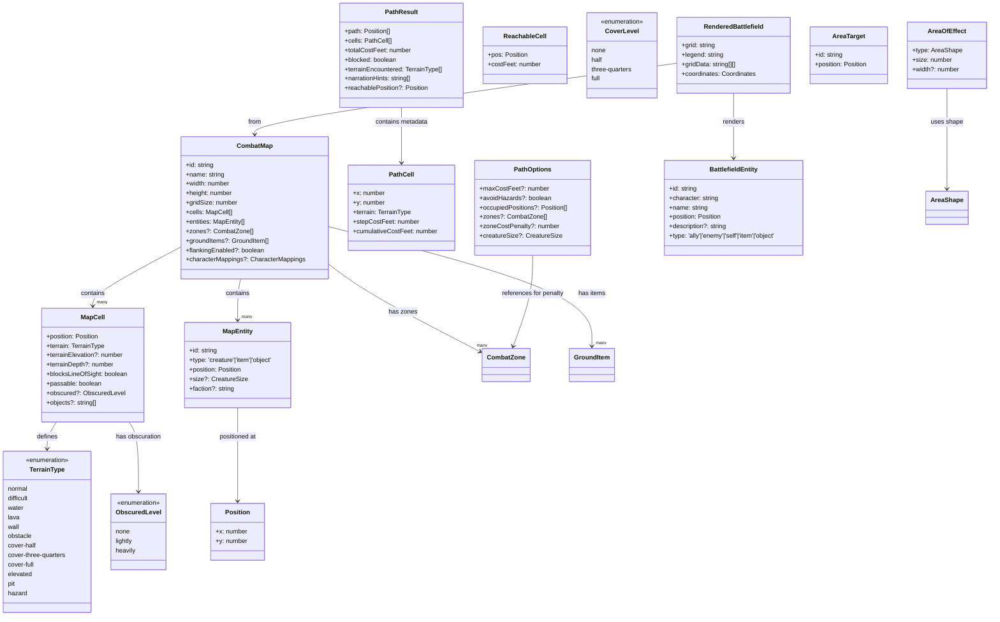
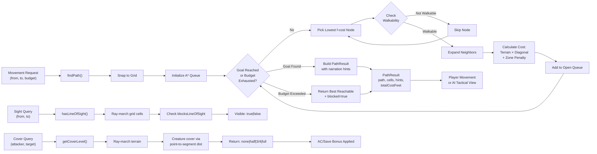
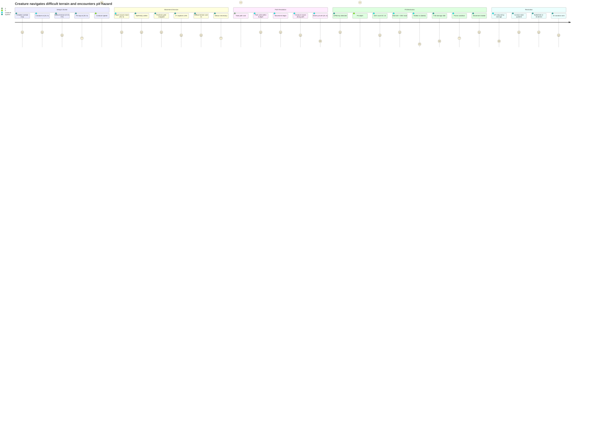

# CombatMap — Spatial Combat Subsystem Architecture Flow

> **Domain Subsystem**: Combat Map Grid, Pathfinding, Cover/Sight, Zone Management, Terrain Effects, AoE Templates, Battlefield Rendering
> **Last updated**: 2026-04-12
> **Scope**: Pure domain geometry and map state — grid cells, 8-directional A* pathfinding with D&D 5e rules, line-of-sight/cover calculations, zone management, AoE targeting, pit terrain mechanics, ASCII battlefield rendering for AI context.

## Overview

The CombatMap subsystem provides a **pure domain implementation of spatial combat mechanics** on a D&D 5e 5ft grid. It manages arena geometry, terrain types (12 variants including pit, elevated, obstacles, and 3-tier cover), line-of-sight and cover calculations with creature-based occlusion, A* pathfinding with D&D-specific rules (diagonal alternating cost, difficult terrain, hazard avoidance, zone cost penalties), zone effects (spell areas, auras), area-of-effect targeting (5 shape templates with half-grid tolerance), elevation/pit mechanics with DEX saves and fall damage, and ASCII battlefield rendering for AI context. All functions are **stateless, composable, and deterministic** — perfect for both live gameplay and rules engine auditing.

The subsystem sits in the **domain layer** (no Fastify, Prisma, or LLM dependencies) and is purely geometry and D&D 5e 2024 rule interpretation. Application layer (pit-terrain-resolver.ts) handles orchestration of pit entry mechanics (condition application, damage rolling).

---

## UML Class Diagram

---

## Data Flow Diagram

---

## User Journey: Move Through Difficult Terrain With Pit Trap

---

## File Responsibility Matrix

| File | Lines | Layer | Responsibility |
|------|-------|-------|-----------------|
| [combat-map-types.ts](combat-map-types.ts) | ~145 | domain | Type definitions: `CombatMap`, `MapCell`, `MapEntity`, `TerrainType` (12 variants), `CoverLevel`, `ObscuredLevel`, `Position`, terrain properties (elevation, depth, passability, obscuration, objects list) |
| [combat-map-core.ts](combat-map-core.ts) | ~315 | domain | Map factory (`createCombatMap`), cell access (`getCellAt`, `setTerrainAt`), entity CRUD (`addEntity`, `moveEntity`, `removeEntity`, `getEntity`, `getEntitiesAt`, `getCreatures`, `getItems`), passability utilities (`isPositionPassable`, `isOnMap`, `getTerrainSpeedModifier`), terrain type checks (`isElevatedTerrain`, `isPitTerrain`), elevation utilities (`getElevationOf`, `getPitDepthOf`, `getElevationAttackModifier`, `hasElevationAdvantage`), pit detection (`isPitEntry`, `computeFallDamage`, `computePitFallDamage` with 1d6/10ft max 20d6 rule), creature footprint (`getCreatureCellFootprint`) |
| [combat-map-sight.ts](combat-map-sight.ts) | ~300 | domain | Line-of-sight tracing (`hasLineOfSight` via ray-march), cover calculation (`getCoverLevel` with ray-march + creature-based cover via point-to-segment distance test), cover bonuses (`getCoverACBonus` +2/+5/null, `getCoverSaveBonus`), entity radius queries (`getEntitiesInRadius`, `getFactionsInRange` with ally/enemy splitting), obscuration detection (`getObscuredLevelAt` none/lightly/heavily), obscuration attack modifiers (`getObscurationAttackModifiers`) |
| [combat-map-zones.ts](combat-map-zones.ts) | ~45 | domain | Zone management: `getMapZones`, `addZone`, `removeZone`, `updateZone`, `setMapZones` (spell areas, auras, damaging zones) — all pure/immutable |
| [combat-map-items.ts](combat-map-items.ts) | ~55 | domain | Ground item management: `getGroundItems`, `addGroundItem`, `removeGroundItem`, `getGroundItemsAtPosition` (same cell), `getGroundItemsNearPosition` (radius-based, default 5ft) |
| [combat-map.ts](combat-map.ts) | ~25 | domain | Barrel re-export aggregating all `combat-map-*.ts` modules into unified `combat-map.js` surface; stable public API |
| [pathfinding.ts](pathfinding.ts) | ~630 | domain | A* pathfinding algorithm: `findPath()` (shortest route with cost budgets, returns blocked flag if exhausted), `getReachableCells()` (Dijkstra flood-fill for tactical awareness, returns all reachable within budget), `findAdjacentPosition()` (closest passable cell within range of target); handles D&D 5e diagonal alternating cost rule (1st/3rd/5th diag = 5ft, 2nd/4th = 10ft), terrain multipliers (difficult/water = 2x, wall/obstacle = impassable), creature footprints (Large/Huge/Gargantuan multi-cell occupancy), zone penalties (+15ft per cell for first matching zone penalty at that position), corner-cutting constraint (both orthogonal neighbors must be passable for diagonal), budget exhaustion graceful fallback (return best reachable + blocked flag), narration hints for movement description |
| [area-of-effect.ts](area-of-effect.ts) | ~180 | domain | AoE shape targeting: `getCreaturesInArea()` finds all targets in area, `computeDirection()` unit vector; supports 5 shapes (cone with half-width rule, sphere/cylinder radius, cube, line with width) with half-grid tolerance (2.5ft) for "at least half a square" rule; pure geometry, never mutates targets |
| [battlefield-renderer.ts](battlefield-renderer.ts) | ~320 | domain | ASCII battlefield visualization: `renderBattlefield()` converts tactical map to character grid with coordinate axes and legend, `createCombatantEntity()` wraps combatant data; customizable character mappings (terrain glyphs, object types), entity priority rendering (creatures > items > objects > terrain), faction-grouped legend (self/allies/enemies/objects), coordinate labels, supports custom map character mappings |
| [pit-terrain-resolver.ts](pit-terrain-resolver.ts) | ~85 | application | Pit entry orchestration: `resolvePitEntry()` applies DEX save (with disadvantage for conditions, auto-fail flags), assigns Prone condition, computes pit fall damage (1d6/10ft, max 20d6), checks `isPitEntry` guard, returns `PitEntryResolution` with save details and outcome |

**Total CombatMap domain code: ~1,650 lines** (excluding tests; comments ~35% of total)

---

## Key Types & Interfaces

| Type | File | Purpose | D&D Rule |
|------|------|---------|----------|
| `CombatMap` | combat-map-types.ts | Root arena: cells grid, entity list, zones, ground items, display mappings, optional flanking flag | D&D 5e arena |
| `MapCell` | combat-map-types.ts | 5ft×5ft square: position, terrain, optional elevation/depth, passability flags, line-of-sight blocking, obscuration level, objects list | Grid cell |
| `TerrainType` | combat-map-types.ts | 12 terrain variants: `normal`, `difficult` (½ speed), `water` (swim), `lava` (damage), `wall`/`obstacle` (impassable), `cover-half`/`cover-three-quarters`/`cover-full` (ranged modifiers), `elevated` (attack advantage), `pit` (DEX save + fall), `hazard` (generic dangerous) | D&D 5e terrain rules |
| `MapEntity` | combat-map-types.ts | Positioned combatant or item: type (creature/item/object), size (Tiny→Gargantuan for footprint), faction (ally/enemy detection) | Creature placement |
| `Position` | movement.ts (transitive) | `{x, y}` in feet on 5ft grid; always grid-snapped in pathfinding | Grid positions |
| `PathResult` | pathfinding.ts | Pathfinding output: `path` (ordered positions), `cells` (per-cell metadata with costs), `totalCostFeet`, `blocked` flag (true if budget exhausted), `terrainEncountered` list, `narrationHints` (human-readable description), optional `reachablePosition` if blocked | Path result |
| `PathOptions` | pathfinding.ts | Pathfinding config: `maxCostFeet` (movement budget), `avoidHazards` (bool, skip lava/pit), `occupiedPositions` (blocking creatures), `zones` (cost penalty sources), `zoneCostPenalty` (default 15ft), `creatureSize` (footprint lookup) | A* config |
| `CoverLevel` | combat-map-types.ts | Ranged attack cover: `none` (0), `half` (+2 AC/DEX save), `three-quarters` (+5), `full` (untargetable) | D&D 5e cover |
| `ObscuredLevel` | combat-map-types.ts | Vision obscuration: `none`, `lightly` (disadvantage on Perception checks), `heavily` (Blinded when seeing into/through) | D&D 5e obscuration |
| `AreaOfEffect` | area-of-effect.ts | Spell AoE: type (cone/sphere/cube/line/cylinder), `size` (distance/radius/side), optional `width` (lines) | Spell areas |
| `AreaTarget` | area-of-effect.ts | Creature for AoE targeting: `id`, `position` | Target list |
| `BattlefieldEntity` | battlefield-renderer.ts | Display character: `id`, ASCII glyph, `type` (self/ally/enemy/item/object), position, name, optional description | Render entity |
| `RenderedBattlefield` | battlefield-renderer.ts | ASCII output: `grid` string (with axes), `legend` string (grouped by type), `gridData` (2D char array), `coordinates` metadata | Rendered output |
| `CharacterMappings` | battlefield-renderer.ts | Customizable ASCII glyphs: `terrain` map (normal→., wall→#, etc.), optional `objects` (barrel→B), `empty` fallback | Display config |
| `PitEntryResolution` | pit-terrain-resolver.ts | Pit trap outcome: `triggered` (bool), `saved` (DEX save success), `damageApplied`, `hpAfter`, `updatedConditions`, `movementEnds`, optional save roll/total/mode, optional `depthFeet` | Pit result |
| `ReachableCell` | pathfinding.ts | Dijkstra flood-fill result: position + cost from origin | Reachable cell |

---

## Cross-Flow Dependencies

### This flow depends on:

| Flow | Provides | Used For |
|------|----------|----------|
| **CombatRules** | `advantage/disadvantage` computation, `savingThrow()` mechanics, damage rolling | Elevation attack advantage (getElevationAttackModifier), pit DEX saves (resolvePitEntry), pit fall damage (computeFallDamage, computePitFallDamage) |
| **Movement** (movement.ts) | `Position` type, `calculateDistance()`, `isWithinRange()`, `snapToGrid()` | Pathfinding core, cover ray-march distance, entity radius queries |
| **Zones** (entities/combat/zones.ts) | `CombatZone` type, `isPositionInZone()` | Pathfinding zone cost penalties, getEntitiesInRadius filtering |
| **CreatureSize** (entities/core/types.ts) | `CreatureSize` enum (Tiny→Gargantuan) | Pathfinding creature footprint lookup, Large+ multi-cell occupancy |
| **DiceRoller** (domain/rules/dice-roller.ts) | `rollDie()` method | Pit fall damage (1d6/10ft), pit entry DEX save roll |
| **Conditions** (entities/combat/conditions.ts) | `Condition` type, `createCondition()`, `addCondition()`, `normalizeConditions()`, `hasCondition()`, `getConditionEffects()` | Pit entry: apply Prone condition, check auto-fail DEX saves (paralyzed, petrified), check disadvantage (frightened) |
| **Ability Checks** (domain/rules/ability-checks.ts) | `savingThrow()`, `getAbilityModifier()` | Pit entry DEX modifier + save roll |

### Depends on this flow:

| Flow | Consumes | For |
|---|---|---|
| **CombatOrchestration** (TabletopCombatService, ActionService) | `pathfinding` (findPath, getReachableCells), `cover` (getCoverLevel), `elevation` (hasElevationAdvantage) | Movement validation, opportunity attack detection (path length), path preview UI, ranged attack cover bonus, elevation advantage on attacks |
| **ReactionSystem** (TwoPhaseActionService, MoveReactionHandler) | `pathfinding` (movement path), `pit-terrain-resolver` (pit entry checks) | Opportunity attack detection on movement, pit entry halting movement, reaction initiation during movement |
| **AIBehavior** (DeterministicAI, ai-spell-evaluator.ts) | `battlefield-renderer` (ASCII grid), `pathfinding` (getReachableCells, findPath), `cover` (getCoverLevel, getCoverACBonus), `elevation` (hasElevationAdvantage) | AI context display (LLM prompt), tactical positioning (reachable cells), target selection (cover analysis, elevation advantage), retreat path planning |
| **Infrastructure: API routes** | Combat map state query, `pathfinding` result (path-preview endpoint), `battlefield-renderer` output (tactical view), arena mutations (setTerrainAt, addZone) | Session `/sessions/:id/combat/query`, `/sessions/:id/combat/:encounterId/path-preview`, `/sessions/:id/combat/:encounterId/tactical` endpoints; terrain mutation routes |

---

## Known Gotchas & Edge Cases

1. **Diagonal Corner-Cutting Constraint** — A* expansion forbids cutting diagonal corners unless BOTH orthogonal adjacent cells are walkable. This prevents creatures from squeezing through wall diagonal gaps (e.g., between two walls at opposite corners). However, this constraint only applies at pathfinding time; if you manually place a creature at a corner-cut position (outside pathfinding), movement validation won't reject it. **Fix:** Validate initial creature placement against corner-cutting rules in combat start, or enforce the check in movement acceptance logic.

   *Code location:* `pathfinding.ts` lines ~330-335, `pathfinding.ts` lines ~540-545 (getReachableCells has same check)

2. **Pit Entry Detection Logic: Non-Pit to Pit Transition Only** — `isPitEntry(map, from, to)` returns true **only when moving FROM a non-pit cell TO a pit cell**. A creature already standing in a pit and moving within or exiting it won't trigger pit mechanics again. This is correct for one-time trap mechanics, but if a pit has variable depth or you want re-entry penalties, you must handle that separately. **Implication:** Pit traps only trigger on entry, not on every movement through them.

   *Code location:* `combat-map-core.ts` lines ~285-292, consumed by `pit-terrain-resolver.ts` line ~15 and movement handlers

3. **Ray-March Cover Calculation Excludes Endpoints** — `getCoverLevel()` ray-marches from attacker to target but **skips terrain checks at the exact attacker and target positions** (loop condition `for (let i = 1; i < steps; i++)` skips i=0 and i=steps). This prevents the target's own terrain (e.g., standing in cover) from granting cover to themselves. However, it also means a creature standing partially on cover-terrain while straddling two cells might not claim half cover. **Fix:** If granular cover-straddling is needed, require creatures to fully occupy a covered cell center, or move to point-in-polygon testing.

   *Code location:* `combat-map-sight.ts` lines ~96-141; ray-march loop starts at i=1, not i=0

4. **Creature-Based Cover Uses Point-to-Segment Distance; May Miss Edge Cases** — The half-cover calculation for intervening creatures uses perpendicular distance to the attacker→target segment with tolerance `gridSize / 2` (2.5ft). If a creature is **exactly on a corner or edge** of the 5ft grid boundary, the point-to-segment test might miss it or incorrectly grant cover depending on floating-point precision and segment projection math. **Fix:** Add a small epsilon (±0.1ft) to the tolerance, or use a grid-cell-based membership test instead of continuous geometry.

   *Code location:* `combat-map-sight.ts` lines ~159-185 (`getCreatureCover` function)

5. **Pathfinding Heuristic (Chebyshev) Makes Optimistic Assumptions About Alternating Diagonal Cost** — The A* heuristic assumes half diagonals cost 5ft and half cost 10ft (average 7.5 per diagonal), but actual pathfinding enforces strict alternation (1st = 5, 2nd = 10, 3rd = 5, etc.). This means the heuristic can **overestimate** in some edge cases (e.g., paths with many consecutive diagonals), potentially causing non-optimal node expansions. The algorithm remains **correct** because f = g + h is admissible overall, but efficiency may suffer on complex maps. **Fix:** Use a more pessimistic heuristic (all diagonals cost 10ft) if correctness needs proof; current approach is acceptable for practical gameplay.

   *Code location:* `pathfinding.ts` lines ~153-162 (`chebyshevHeuristic` function), compared to `diagonalStepCost` lines ~145-150

6. **Zone Cost Penalty Selection Is First-Match** — Pathfinding checks zones in order and applies one penalty when the first matching zone is found at a cell. If callers need stronger overlap semantics, they must define deterministic ordering or add explicit combination logic.

   *Code location:* `pathfinding.ts` lines ~378-386; zone penalty loop applies per zone

7. **Pit Terrain Depth Defaults to 0 When Missing** — Pit damage depends on `terrainDepth`; if not provided, fallback depth is 0 and fall damage is 0d6. Define depth explicitly for pit terrain scenarios.

   *Code location:* `combat-map-core.ts` lines ~85-115 (`setTerrainAt`), lines ~245-252 (`getPitDepthOf` returns `typeof ... "number" ? ... : 0`), line ~307 (`computePitFallDamage`)

8. **Battlefield Renderer Priority Doesn't Handle Entity Overlap** — When multiple creatures occupy the same position, `renderBattlefield()` overwrites earlier entities with later ones in the entity list. Only the **last creature at a position is visible** in the ASCII grid. Callers must ensure creatures are at unique positions or handle multi-creature rendering themselves.

   *Code location:* `battlefield-renderer.ts` lines ~125-135 (creature placement loop overwrites previous character)

9. **Large/Huge/Gargantuan Creatures Must Occupy Grid-Aligned Positions** — `getCreatureCellFootprint()` returns footprint ≥ 2, and `isCellWalkable()` checks a 2×2 (or larger) grid of cells starting from the given position. **If the creature position is not grid-snapped**, the footprint check may pass when it shouldn't or fail unexpectedly. Example: creature at (7,7) with footprint 2 would check cells (7,7), (12,7), (7,12), (12,12), missing intermediate cells. **Fix:** Always snap creature positions to the grid (via `snapToGrid()`) before path validation or movement acceptance.

   *Code location:* `combat-map-core.ts` lines ~24-32 (`getCreatureCellFootprint`), `pathfinding.ts` lines ~212-224 (`isCellWalkable` multi-cell check)

10. **Pit DEX Save Uses Dexterity Score, Not Modifier** — `resolvePitEntry()` takes `dexterityScore` (e.g., 15) and internally computes the modifier via `getAbilityModifier(dexterityScore)`. If callers accidentally pass the modifier directly (e.g., +2), the save succeeds almost always (DC 15 vs roll 2+d20). **Fix:** Add JSDoc warning, or rename parameter to `dexterityModifier` to force contract clarity; consider accepting `dexterityScore` **or** `dexterityModifier` with a tag to disambiguate.

    *Code location:* `pit-terrain-resolver.ts` lines ~22-45, `api/app.test.ts` examples with `dexterityScore: 15`

11. **getReachableCells Only Returns Reachable Cells, Not Blocked Cells** — `getReachableCells()` returns all cells within budget via Dijkstra flood-fill, but **excludes unreachable cells** (walls, occupied, over-budget). If you need to visualize "all cells tried but blocked," you must track the closed set separately. **Fix:** If showing obstacle/wall cells is needed for AI context, add a `getBlockedCellsBoundary()` function that returns perimeter cells one step outside the reachable set.

    *Code location:* `pathfinding.ts` lines ~482-555 (`getReachableCells` returns only result array, not closed set)

12. **Zone Cost Penalty Only Applies Inside Zone, Not for "Entering" the Zone** — `getReachableCells()` and `findPath()` only penalize cells that are `isPositionInZone()`. Zone entry cost (like a web spell slowing on entry) would need an edge-cost lookup, not a cell-cost lookup. **Implication:** Entering a damaging zone doesn't cost more than already being in it; both cost equal. **Fix:** If zone entry needs special handling, inspect the previous cell's zone membership and apply an entry penalty.

    *Code location:* `pathfinding.ts` lines ~378-386

---

## Testing Patterns

### Unit Tests:
- **[combat-map.test.ts](../../src/domain/rules/combat-map.test.ts)** — Map factory, cell CRUD, terrain/entity mutations, in-memory map state, getCreatures/getItems filtering
- **[pathfinding.test.ts](../../src/domain/rules/pathfinding.test.ts)** — A* correctness, corner-cutting enforcement, budget exhaustion, zone penalties, creature footprints, narration hints, diagonal cost alternation, reachable cell flood-fill
- **[area-of-effect.test.ts](../../src/domain/rules/area-of-effect.test.ts)** — Shape membership (cone/sphere/cube/line with half-grid tolerance), direction computation, exclude-list handling
- **[battlefield-renderer.test.ts](../../src/domain/rules/battlefield-renderer.test.ts)** & **[battlefield-renderer.visual.test.ts](../../src/domain/rules/battlefield-renderer.visual.test.ts)** — ASCII grid output, legend formatting, entity priority rendering, coordinate axis labels
- **Stubs Used:** `DiceRoller` (deterministic rolls for fall damage, pit DEX saves)

### Integration Tests:
- **[combat-flow-tabletop.integration.test.ts](../../src/infrastructure/api/app.test.ts)** — Full movement chain: parse action → find path → check pit entry → resolve DEX save → apply damage + conditions → update combat state; covers both success and failure paths

### E2E Scenarios (test-harness):
- **`core/happy-path.json`** — Basic movement without terrain hazards
- **`core/pit-terrain-entry.json`** — Pit entry, DEX save (success/fail branches), fall damage application
- **`core/difficult-terrain-movement.json`** — Path around obstacles, difficult terrain cost doubling, narration hints
- **`core/cover-advantage.json`** — Ranged attack with cover bonus (+2/+5) via getCoverLevel
- **`core/elevation-advantage.json`** — Higher-ground attack advantage via hasElevationAdvantage

### AI Context Tests:
- Battlefield rendering fed to LLM in **`packages/game-server/src/infrastructure/llm/spy-provider.ts`** snapshots; verify ASCII grid structure
- Reachable cells output validated against Dijkstra correctness; cost tracking accuracy
- Cover analysis used in **`ai-spell-evaluator.ts`** and target selection; verify getCoverLevel is called with correct attacker/target positions

**Key test files:**
- [packages/game-server/src/domain/rules/combat-map.test.ts](../../src/domain/rules/combat-map.test.ts)
- [packages/game-server/src/domain/rules/pathfinding.test.ts](../../src/domain/rules/pathfinding.test.ts)
- [packages/game-server/src/domain/rules/area-of-effect.test.ts](../../src/domain/rules/area-of-effect.test.ts)
- [packages/game-server/scripts/test-harness/scenarios/](../../scripts/test-harness/scenarios/)

---

## Architecture Rationale

**Why modular barrel exports (combat-map.ts)?**
Keeps the public API stable when internal file organization changes. Callers import from `combat-map.js` and don't break if we split core.ts into smaller sub-modules later.

**Why both findPath() A* and getReachableCells() Dijkstra?**
`findPath()` optimizes for a **specific destination** and stops early via A* heuristic. `getReachableCells()` computes **all cells within budget** for tactical AI movement planning (Dijkstra, no heuristic). Different use cases, different algorithms.

**Why ray-march cover calculation instead of pre-computed cover maps?**
Sight/cover is **dynamic and creature-dependent** (intervening creatures grant half cover per D&D 5e). Ray-marching is O(grid steps ≈ 20), fast enough for per-attack checks. Pre-computing would require updating on every creature movement.

**Why pit entry resolved in application layer, not domain?**
Pit **detection** (`isPitEntry`) is pure domain geometry. Pit **resolution** (`resolvePitEntry`: DEX save, damage roll, condition application) requires orchestration of rules engine (ability checks, damage, conditions) — belongs in application layer as a use-case service.

**Why battlefield ASCII renderer in domain?**
Rendering is **pure deterministic output** (no I/O, no database), and AI needs it immediately for LLM context. Keeping it in domain ensures it's always available and never depends on framework state or database query latency.

**Why zone cost penalties instead of blocked cells?**
Damaging zones (lava, web) should **slow movement, not prevent it**. Cost penalty models this: creatures take longer but don't get stuck. Blocked cells are for walls/obstacles/impassable terrain.

**Why separate cover types (half/3-quarters/full) instead of single cover value?**
D&D 5e 2024 distinguishes cover by +AC bonus: half (+2), 3/4 (+5), full (untargetable). Encoding the bonus directly would lose the "full = unreachable" semantics; API layer needs to know when to reject spell targeting.

---

## Summary

The **CombatMap subsystem** is a **self-contained, rule-complete spatial combat engine** for D&D 5e grids. It provides:

- **Pathfinding**: A* with D&D 5e 2024 rules (diagonal alternating cost, difficult terrain 2x, hazard avoidance, zone penalties, creature footprints, budget tracking, narration hints)
- **Cover/Sight**: Ray-march line-of-sight, cover calculation with creature-based occlusion (point-to-segment distance), AC/save bonuses
- **Elevation**: Higher-ground advantage on melee attacks, elevation modifiers
- **Terrain Effects**: Pit traps (DEX save DC 15 + 1d6/10ft fall damage), elevated terrain, difficult terrain, water, lava, obstacles
- **Zone Management**: Spell areas and auras with dynamic cost penalties
- **AoE Targeting**: 5 shape templates (cone, sphere, cube, line, cylinder) with half-grid tolerance
- **Battlefield Rendering**: ASCII grid + legend for AI context, customizable character mappings, entity priority rendering

All functions are **pure, deterministic, and immutable** — enabling functional composition, undo/redo patterns, and offline rule auditing. The subsystem is production-ready for both interactive gameplay and comprehensive D&D 5e 2024 rules validation.
