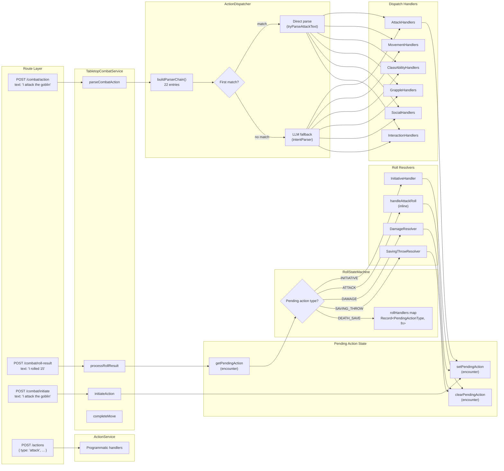
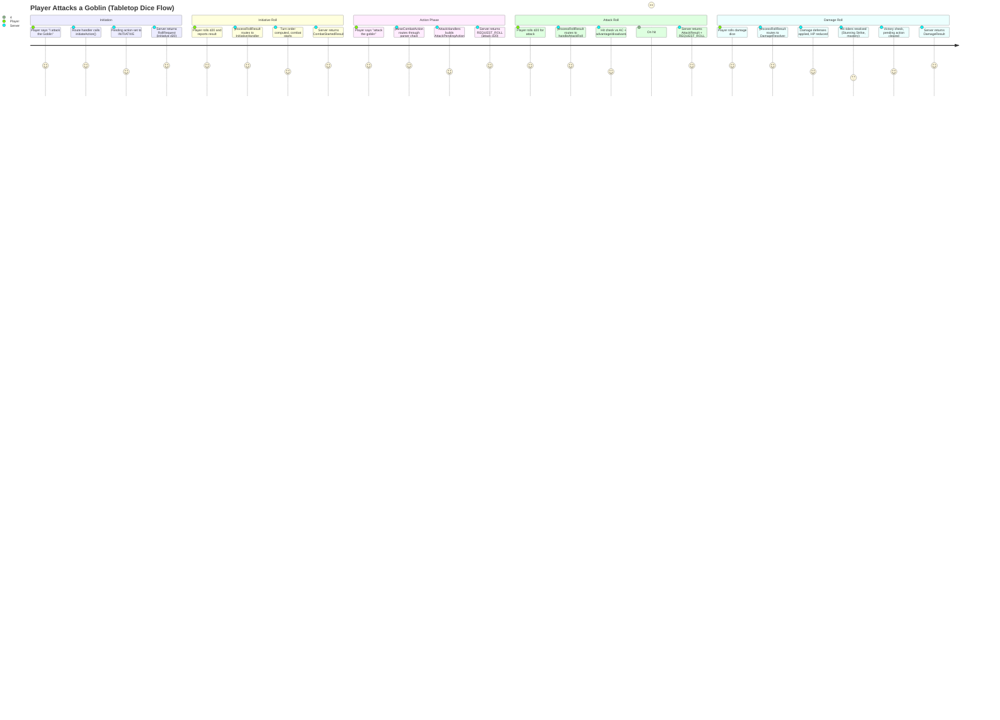

# CombatOrchestration — Architecture Flow

> **Owner SME**: CombatOrchestration-SME
> **Last updated**: 2026-04-12
> **Scope**: Two facade services (TabletopCombatService for dice flow, ActionService for programmatic), the parser chain, roll state machine, and all action dispatch/resolution sub-modules.

## Overview

CombatOrchestration is the application-layer orchestration backbone that routes player intent into deterministic combat resolution. It provides two parallel entry points: **TabletopCombatService** (text-based tabletop flow with manual dice rolling — `initiateAction → processRollResult → parseCombatAction → completeMove`) and **ActionService** (programmatic API for immediate action resolution — `attack`, `move`, `dodge`, `shove`, etc.). Both facades are thin (~510 and ~890 lines respectively) and delegate to focused sub-modules: **ActionDispatcher** routes parsed text through a 22-entry parser chain to 6 handler classes, **RollStateMachine** dispatches dice results through an exhaustive handler map to 5 resolvers, and **CombatService** manages encounter lifecycle and turn progression. All three sit in the application layer and depend on domain rules for mechanics — they never decide rules themselves.

## UML Class Diagram

```mermaid
classDiagram
    direction TB

    class TabletopCombatService {
        +initiateAction(sessionId, text, actorId) RollRequest
        +processRollResult(sessionId, text, actorId) CombatStartedResult|AttackResult|DamageResult|DeathSaveResult|SavingThrowAutoResult
        +parseCombatAction(sessionId, text, actorId, encounterId) ActionParseResult
        +completeMove(sessionId, pendingActionId, roll?, rollType?) ActionParseResult
    }

    class ActionDispatcher {
        -parserChain: ActionParserEntry[]
        +dispatch(sessionId, text, actorId, encounterId, preloaded?) ActionParseResult
        -buildParserChain() ActionParserEntry[]
    }

    class RollStateMachine {
        -rollHandlers: PendingActionHandlerMap
        +processRollResult(sessionId, text, actorId, preloaded?) Result
        -parseRollValue(text, expectedType, roster) RollResultCommand
    }

    class SpellActionHandler {
        -deliveryHandlers: SpellDeliveryHandler[]
        +handleCastSpell(sessionId, encounterId, actorId, castInfo, chars, roster) ActionParseResult
    }

    class TabletopEventEmitter {
        +generateNarration(eventType, payload) string?
        +markActionSpent(encounterId, actorId) void
        +emitAttackEvents(...) void
        +emitDamageEvents(...) void
    }

    class MovementHandlers {
        +handleMoveAction() ActionParseResult
        +handleMoveTowardAction() ActionParseResult
        +handleJumpAction() ActionParseResult
    }
    class AttackHandlers {
        +handleAttackAction() ActionParseResult
        +resolveAttackTarget() CombatantRef
        +enrichRosterWithDistances() LlmRoster
    }
    class ClassAbilityHandlers {
        +handleClassAbility() ActionParseResult
        +handleBonusAbility() ActionParseResult
    }
    class GrappleHandlers {
        +handleShoveAction() ActionParseResult
        +handleGrappleAction() ActionParseResult
        +handleEscapeGrappleAction() ActionParseResult
    }
    class SocialHandlers {
        +handleSimpleAction() ActionParseResult
        +handleReadyAction() ActionParseResult
        +handleHideAction() ActionParseResult
        +handleSearchAction() ActionParseResult
        +handleHelpAction() ActionParseResult
    }
    class InteractionHandlers {
        +handlePickupAction() ActionParseResult
        +handleDropAction() ActionParseResult
        +handleDrawWeaponAction() ActionParseResult
        +handleSheatheWeaponAction() ActionParseResult
        +handleUseItemAction() ActionParseResult
    }

    class InitiativeHandler {
        +handleInitiativeRoll() CombatStartedResult
        +handleInitiativeSwap() CombatStartedResult
    }
    class DamageResolver {
        +handleDamageRoll() DamageResult
        +dropThrownWeaponOnGround() void
    }
    class HitRiderResolver {
        +assembleOnHitEnhancements() HitRiderEnhancement[]
        +resolvePostDamageEffect() HitRiderEnhancementResult
    }
    class WeaponMasteryResolver {
        +resolve(mastery, ...) string
    }
    class SavingThrowResolver {
        +autoResolveSavingThrow() SavingThrowAutoResult
        +createSavingThrowAction() SavingThrowPendingAction
    }

    class CombatTextParser {
        <<module>>
        +tryParseMoveText()
        +tryParseMoveTowardText()
        +tryParseAttackText()
        +tryParseCastSpellText()
        +deriveRollModeFromConditions()
        +doubleDiceInFormula()
        +inferActorRef()
    }

    class ActionService {
        +attack() result
        +move() result
        +dodge() actor
        +dash() actor
        +disengage() actor
        +hide() result
        +search() result
        +help() actor
        +shove() result
        +grapple() result
        +escapeGrapple() result
        +castSpell() actor
    }

    class AttackActionHandler {
        +execute(sessionId, input) result
    }
    class GrappleActionHandler {
        +shove() result
        +grapple() result
        +escapeGrapple() result
    }
    class SkillActionHandler {
        +hide() result
        +search() result
    }

    class CombatService {
        +getEncounterState() state
        +startEncounter() encounter
        +nextTurn() turn
        +endTurn() void
    }

    TabletopCombatService --> ActionDispatcher : delegates parseCombatAction
    TabletopCombatService --> RollStateMachine : delegates processRollResult
    TabletopCombatService --> SpellActionHandler : spell casting
    TabletopCombatService --> TabletopEventEmitter : narration + events

    ActionDispatcher --> MovementHandlers : move/moveToward/jump
    ActionDispatcher --> AttackHandlers : attack actions
    ActionDispatcher --> ClassAbilityHandlers : class/bonus abilities
    ActionDispatcher --> GrappleHandlers : shove/grapple/escape
    ActionDispatcher --> SocialHandlers : dash/dodge/disengage/hide/search/help/ready
    ActionDispatcher --> InteractionHandlers : pickup/drop/draw/sheathe/useItem
    ActionDispatcher --> SpellActionHandler : castSpell
    ActionDispatcher --> CombatTextParser : text parsing

    RollStateMachine --> InitiativeHandler : INITIATIVE / INITIATIVE_SWAP
    RollStateMachine --> DamageResolver : DAMAGE
    RollStateMachine --> SavingThrowResolver : SAVING_THROW
    RollStateMachine --> HitRiderResolver : post-damage enhancements
    RollStateMachine --> WeaponMasteryResolver : weapon mastery effects

    DamageResolver --> HitRiderResolver : resolve hit riders
    DamageResolver --> WeaponMasteryResolver : resolve mastery

    ActionService --> AttackActionHandler : delegates attack
    ActionService --> GrappleActionHandler : delegates shove/grapple
    ActionService --> SkillActionHandler : delegates hide/search

    TabletopCombatService ..> CombatService : encounter state
    ActionService ..> CombatService : encounter state
```

## Data Flow Diagram

## User Journey: Player Attacks via Tabletop Flow

## File Responsibility Matrix

### Facades

| File | Lines (approx) | Layer | Responsibility |
|------|----------------|-------|---------------|
| `tabletop-combat-service.ts` | ~510 | application | Thin facade: 4 public methods — `initiateAction`, `processRollResult`, `parseCombatAction`, `completeMove`. Owns surprise computation, OA roll resolution during completeMove. |
| `action-service.ts` | ~890 | application | Programmatic action facade: `attack`, `move`, `dodge`, `dash`, `disengage`, `hide`, `search`, `help`, `castSpell`, `shove`, `grapple`, `escapeGrapple`. Delegates to 3 handlers. |
| `combat-service.ts` | ~1490 | application | Encounter lifecycle + turn progression: `startEncounter`, `nextTurn`, `endTurn`, death save processing, zone/effect processing at turn boundaries, rage tracking. |

### TabletopCombatService Sub-Modules (`tabletop/`)

| File | Lines (approx) | Layer | Responsibility |
|------|----------------|-------|---------------|
| `tabletop-types.ts` | ~490 | application | Central type hub: `TabletopPendingAction` union, `TabletopCombatServiceDeps` bag, all result types (`CombatStartedResult`, `AttackResult`, `DamageResult`, etc.), `PendingActionHandlerMap`, `RollProcessingCtx`. |
| `action-dispatcher.ts` | ~700 | application | Routes parsed text to handler classes. Builds 22-entry parser chain. Falls back to LLM intent parsing on no match. Blocks incapacitated creature actions. |
| `roll-state-machine.ts` | ~1080 | application | All dice resolution. Exhaustive `rollHandlers` map keyed by `PendingActionType`. Handles attack rolls (hit/miss, Lucky prompt, spell-strike chaining), death saves, inline saving throw dispatch. Delegates damage to `DamageResolver`. |
| `combat-text-parser.ts` | ~800 | application | 20+ pure parsing functions: `tryParseMoveText`, `tryParseAttackText`, `tryParseCastSpellText`, `deriveRollModeFromConditions`, `doubleDiceInFormula`, `inferActorRef`, `findCombatantByName`, etc. Zero side effects. |
| `action-parser-chain.ts` | ~55 | application | Type definitions: `ActionParserEntry<T>` interface and `DispatchContext`. |
| `pending-action-state-machine.ts` | ~58 | application | Formal state machine: `VALID_PENDING_TRANSITIONS` map + `assertValidTransition()`. Defines legal `PendingActionType` transitions (e.g., `ATTACK → [null, DAMAGE, ATTACK]`). |
| `tabletop-event-emitter.ts` | ~250 | application | SSE event emission + LLM narration: `generateNarration`, `markActionSpent`, `emitAttackEvents`, `emitDamageEvents`, `emitHealingEvents`, `emitConcentrationEvent`. |
| `spell-action-handler.ts` | ~440 | application | Spell casting facade: slot spending + concentration, then delegates to 5 `SpellDeliveryHandler` strategies (attack, healing, save, zone, buff/debuff). |
| `tabletop-utils.ts` | ~107 | application | Pure helpers: `isCreatureSurprised`, `computeInitiativeModifiers`, `computeInitiativeRollMode`. |
| `path-narrator.ts` | ~162 | application | Builds natural-language path narration from A* results. |
| `index.ts` | ~20 | application | Barrel re-exports for the tabletop module. |

### Dispatch Handlers (`tabletop/dispatch/`)

| File | Lines (approx) | Layer | Responsibility |
|------|----------------|-------|---------------|
| `attack-handlers.ts` | ~870 | application | Attack target resolution, distance enrichment, weapon spec building (versatile, thrown, ranged), advantage/disadvantage computation, cover/flanking/elevation, auto-draw. |
| `movement-handlers.ts` | ~830 | application | Move-to-coordinate (A* pathfinding), move-toward-creature, jump (long/high), zone damage resolution, pit terrain, aura sync, path narration. |
| `class-ability-handlers.ts` | ~560 | application | Routes class abilities to `AbilityRegistry` executors. Builds `AbilityActor`/`AbilityCombatContext` adapters. Handles both free (class) and bonus-action abilities. Turn Undead inline. |
| `social-handlers.ts` | ~280 | application | Dash/dodge/disengage (delegated to `ActionService`), Ready action, Help (distance validation), Hide (Cunning Action bonus), Search. |
| `grapple-handlers.ts` | ~84 | application | Shove/grapple/escape — thin delegation to `ActionService.shove/grapple/escapeGrapple`. |
| `interaction-handlers.ts` | ~500 | application | Pickup ground items, drop items, draw/sheathe weapons (free object interaction tracking), use consumable items (potions with magic item catalog lookup). |

### Roll Resolvers (`tabletop/rolls/`)

| File | Lines (approx) | Layer | Responsibility |
|------|----------------|-------|---------------|
| `initiative-handler.ts` | ~450 | application | Initiative roll resolution, combatant creation, class resource pool initialization (`buildCombatResources`), Uncanny Metabolism trigger, Alert feat swap offer/resolution, AI orchestrator kickoff. |
| `damage-resolver.ts` | ~790 | application | Full damage pipeline: base calculation, ActiveEffect bonuses, resistance/vulnerability/immunity, HP reduction, KO effects, death save auto-fails, rage tracking, concentration checks, retaliatory damage (Armor of Agathys), Sneak Attack, hit-rider resolution, flurry/spell-strike chaining, victory evaluation, loot drop, thrown weapon ground drop. |
| `hit-rider-resolver.ts` | ~390 | application | Two-phase: (1) Assembly — filter eligible on-hit defs, match player keywords in damage text, build `HitRiderEnhancement[]` (Stunning Strike, Divine Smite, Open Hand Technique). (2) Resolution — execute post-damage effects via `SavingThrowResolver`. |
| `weapon-mastery-resolver.ts` | ~345 | application | All 7 D&D 5e 2024 weapon mastery types: push, topple, vex, sap, slow, cleave, nick, graze. Automatic effects (not opt-in). Saving throws delegated to `SavingThrowResolver`. |
| `saving-throw-resolver.ts` | ~580 | application | Auto-resolves saving throws for all targets. Handles condition application/removal, forced movement (push), concentration break, Aura of Protection bonus, Evasion, exhaustion penalties, species trait modifiers. |

### Programmatic Action Handlers (`action-handlers/`)

| File | Lines (approx) | Layer | Responsibility |
|------|----------------|-------|---------------|
| `attack-action-handler.ts` | ~490 | application | Full attack resolution via `resolveAttack()` domain function. Handles advantage/disadvantage from conditions + ActiveEffects, ranged penalties, cover, elevation, flanking, concentration checks, retaliatory damage, narrative generation. |
| `grapple-action-handler.ts` | ~290 | application | Shove (push/prone), grapple, escape-grapple resolution. Size validation, contested checks, pit terrain on forced movement. |
| `skill-action-handler.ts` | ~230 | application | Hide (stealth check → Hidden condition) and Search (perception vs stealth DC → reveal Hidden). ActiveEffect bonus support (Guidance). |

### Supporting Services

| File | Lines (approx) | Layer | Responsibility |
|------|----------------|-------|---------------|
| `tactical-view-service.ts` | ~700 | application | Builds `TacticalView` and `CombatQueryContext` for API consumers. Assembles combatant positions, action economy, resource pools, zones, ground items, flanking data. |
| `combat-victory-policy.ts` | ~100 | application | `BasicCombatVictoryPolicy`: faction-based victory evaluation. Handles dying characters (death saves < 3 failures), fled combatants. |

## Key Types & Interfaces

| Type | File | Purpose |
|------|------|---------|
| `TabletopPendingAction` | `tabletop-types.ts` | Union of 6 pending action types: `INITIATIVE`, `INITIATIVE_SWAP`, `ATTACK`, `DAMAGE`, `DEATH_SAVE`, `SAVING_THROW` |
| `PendingActionType` | `tabletop-types.ts` | Const tuple `["INITIATIVE","INITIATIVE_SWAP","ATTACK","DAMAGE","DEATH_SAVE","SAVING_THROW"]` — adding an entry causes compile error in `RollStateMachine` |
| `PendingActionHandlerMap` | `tabletop-types.ts` | `Record<PendingActionType, RollHandlerFn>` — exhaustive handler map enforcing compile-time coverage |
| `RollProcessingCtx` | `tabletop-types.ts` | Unified context for all roll handlers: sessionId, text, actorId, encounter, entities, roster, parsed command |
| `ActionParseResult` | `tabletop-types.ts` | Return type for all dispatch handlers: `requiresPlayerInput`, `actionComplete`, `type` (move/REQUEST_ROLL/SIMPLE_ACTION_COMPLETE/etc.), optional pending action / roll request / path data |
| `ActionParserEntry<T>` | `action-parser-chain.ts` | Parser chain entry: `id`, `tryParse(text, roster): T | null`, `handle(parsed, ctx): Promise<ActionParseResult>` |
| `DispatchContext` | `action-parser-chain.ts` | Context for parser handlers: sessionId, encounterId, actorId, text, entities, roster |
| `TabletopCombatServiceDeps` | `tabletop-types.ts` | Central dependency bag: all repos + CombatService + ActionService + TwoPhaseActionService + CombatantResolver + AiOrchestrator + LLM adapters + AbilityRegistry + DiceRoller |
| `WeaponSpec` | `tabletop-types.ts` | Weapon data for attack/damage: name, kind, attackBonus, damage, damageType, properties, ranges, mastery, hands, isThrownAttack |
| `HitRiderEnhancement` | `tabletop-types.ts` | Post-damage enhancement: abilityId, displayName, bonusDice, postDamageEffect type, context |
| `SurpriseSpec` | `tabletop-types.ts` | `"enemies" | "party" | { surprised: string[] }` — D&D 5e 2024 per-creature surprise model |
| `VALID_PENDING_TRANSITIONS` | `pending-action-state-machine.ts` | `Record<PendingActionType | "null", ReadonlyArray<PendingActionType | null>>` — formal state machine transitions |
| `CombatVictoryPolicy` | `combat-victory-policy.ts` | Interface: `evaluate({ combatants }) → "Victory" | "Defeat" | null` |
| `TacticalView` | `tactical-view-service.ts` | Full tactical state: combatants, pending action, map, zones, ground items, flanking, lastMovePath |

## Cross-Flow Dependencies

| This flow depends on | For |
|----------------------|-----|
| **CombatRules** | `resolveAttack()`, `attemptMovement()`, `calculateDistance()`, `concentrationCheckOnDamage()`, `isSavingThrowSuccess()`, `makeDeathSave()`, weapon mastery rule functions, grapple/shove rule functions, pathfinding, area-of-effect |
| **ClassAbilities** | `getAllCombatTextProfiles()` for parser chain class action matching, `AbilityRegistry` for executor dispatch, `ClassFeatureResolver` for attacks-per-action / unarmed stats, `classHasFeature()` for Sneak Attack / Evasion / Danger Sense, `buildCombatResources()` for combat start |
| **SpellSystem** | `SpellActionHandler` + 5 delivery strategies, `resolveSpell()` + `prepareSpellCast()` from spell-slot-manager, spell catalog lookups |
| **ReactionSystem** | `TwoPhaseActionService` for `completeMove()` delegation, counterspell reaction initiation from SpellActionHandler, damage reaction hooks in route layer |
| **EntityManagement** | All repository interfaces (character/monster/NPC/combat/event/pending-action), `CombatantResolver` for combat stats hydration |
| **AIBehavior** | `AiTurnOrchestrator` for monster turn processing after initiative/completeMove/death save auto-advance |
| **ActionEconomy** | `resource-utils.ts` for action/bonus/reaction/movement flags, `canMakeAttack()`/`useAttack()`, `hasBonusActionAvailable()`/`useBonusAction()`, `getEffectiveSpeed()`, `spendAction()` |
| **CombatMap** | `createCombatMap()`, `findPath()`, `getCoverLevel()`, `isPitEntry()`, `getCellAt()`, zone functions, ground item functions |

| Depends on this flow | For |
|----------------------|-----|
| **Route handlers** (session-tabletop.ts, session-actions.ts, session-combat.ts) | All public APIs — routes are thin wrappers calling facade methods |
| **AIBehavior** | `ActionService` for programmatic AI action execution; `CombatService.nextTurn()` for turn progression |
| **ReactionSystem** | `TabletopCombatService.completeMove()` as the entrypoint after reaction resolution |

## Known Gotchas & Edge Cases

1. **Parser chain priority order matters** — The 22-entry parser chain in `buildParserChain()` uses first-match-wins. Attack is deliberately last (#22) because it's the broadest regex. Putting it earlier would swallow "cast fire bolt at goblin" as an attack. The "useItem" entry (#18) explicitly checks `tryMatchClassAction()` to avoid capturing "use flurry of blows" as item use. Reordering entries can break action routing silently.

2. **`PendingActionType` exhaustiveness is compile-enforced** — Adding a new entry to `PENDING_ACTION_TYPES` in `tabletop-types.ts` will cause a TypeScript error in `RollStateMachine.rollHandlers` (which is `Record<PendingActionType, RollHandlerFn>`) and in `EXPECTED_ROLL_TYPE` (also `Record<PendingActionType, string>`). This is intentional — you must wire the handler before the code compiles. The state transition map in `pending-action-state-machine.ts` must also be updated.

3. **Two parallel attack paths exist** — `AttackHandlers.handleAttackAction()` (tabletop text flow → creates `AttackPendingAction` for player to roll) and `AttackActionHandler.execute()` (programmatic → immediately resolves via `resolveAttack()`). They share domain rules but have separate advantage/disadvantage computation, cover checks, and ActiveEffect consumption. Changes to attack mechanics must be applied in **both** paths.

4. **Flurry/spell-strike chaining through state transitions** — Multi-hit sequences (Flurry of Blows strikes 1→2, Eldritch Blast beams) use `ATTACK → ATTACK` and `DAMAGE → ATTACK` transitions. The `flurryStrike` and `spellStrike`/`spellStrikeTotal` fields on pending actions track position in the sequence. DamageResolver checks these after damage resolution and creates the next `AttackPendingAction` instead of clearing the pending action. Miss path in `handleAttackRoll` also chains spell-strikes.

5. **LLM fallback in ActionDispatcher is not guaranteed** — If all 22 parser chain entries return `null` AND `deps.intentParser` is not configured, dispatch throws `ValidationError("LLM intent parser is not configured")`. In test environments without LLM, all actions must be expressible through the pure text parsers. The roster is enriched with distance data before LLM parsing to help disambiguate same-named targets.

6. **`completeMove()` handles player OA rolls inline** — When the two-phase reaction system resolves a move with player opportunity attacks, `completeMove()` on `TabletopCombatService` enters a mini roll-state-machine for player OA attack/damage rolls. It checks `playerOAsAwaitingRolls`, processes `opportunity_attack` and `opportunity_attack_damage` roll types, and only delegates to `TwoPhaseActionService.completeMove()` when all player OA rolls are resolved. Spell-based OA reactions (War Caster) are auto-resolved and skipped.

7. **InitiativeHandler initializes ALL class resources at combat start** — `buildCombatResources()` is called for every character combatant during initiative resolution. This sets up Ki, Action Surge charges, spell slots, Hit Dice, Rage charges, etc. If a class resource pool factory is missing or returns wrong values, combat starts with broken resource economy for that class. Monk Wholeness of Body uses Wisdom modifier passed through `abilityModifiers` param.

8. **`RollStateMachine.handleAttackRoll` is still inline (~400 lines)** — Unlike damage (extracted to `DamageResolver`), the attack roll handler lives directly in `roll-state-machine.ts`. It handles: roll parsing, advantage/disadvantage from conditions + effects, cover AC bonus, Loading weapon tracking, Graze mastery on miss, Lucky feat prompt, Sneak Attack eligibility, on-hit enhancement assembly, spell-strike miss chaining, and `DAMAGE` pending action creation.

## Testing Patterns

- **Unit tests**: `combat-text-parser.test.ts` – tests all 20+ pure parsing functions in isolation with no dependencies. `spell-action-handler.test.ts` – tests spell delivery handler selection and slot management.
- **Integration tests**: `combat-flow-tabletop.integration.test.ts` – full tabletop flow via `app.inject()` using in-memory repos from `memory-repos.ts`. Tests initiative → attack → damage → victory sequences with deterministic dice. Includes faction-based combat tests.
- **E2E scenarios**: 43+ JSON scenarios in `scripts/test-harness/scenarios/` exercise the full orchestration through the HTTP API. Key scenario groups:
  - `core/happy-path` — basic attack/damage/victory
  - `fighter/` — Action Surge, Second Wind
  - `monk/` — Flurry of Blows, Stunning Strike, Patient Defense
  - `rogue/` — Cunning Action, Sneak Attack
  - `wizard/` — spell casting, concentration, counterspell
  - `grapple/` — shove, grapple, escape
  - `reactions/` — opportunity attacks, Shield
  - `movement/` — pathfinding, difficult terrain, pit
- **Key test commands**:
  - `pnpm -C packages/game-server test` — all unit/integration (fast, no LLM)
  - `pnpm -C packages/game-server test:e2e:combat:mock -- --all` — all E2E scenarios with mock LLM
  - VS Code task `game-server: test (faction full transcript)` — faction combat integration test with full transcript output
