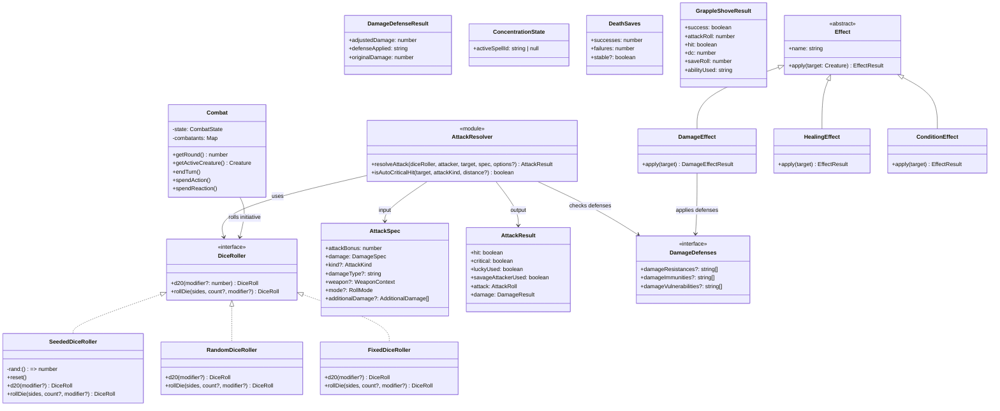
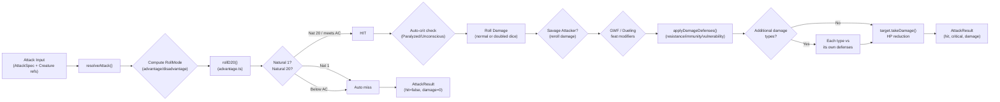
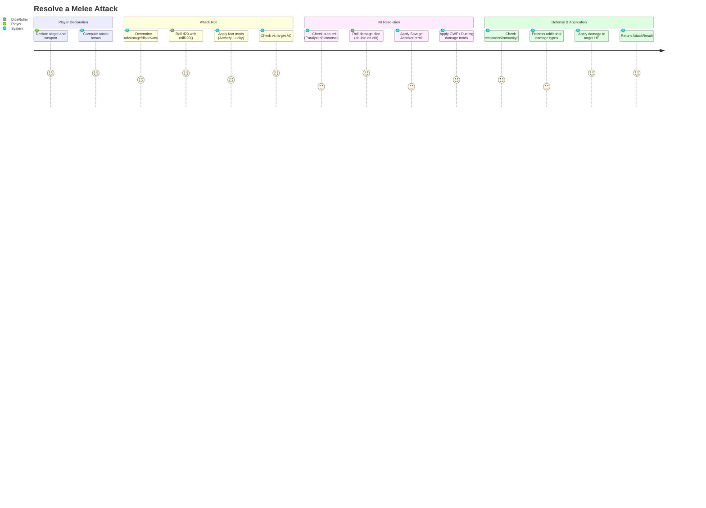

# CombatRules — Architecture Flow

> **Owner SME**: CombatRules-SME
> **Last updated**: 2026-04-12
> **Scope**: Pure D&D 5e 2024 rules engine — attack resolution, damage, conditions, death saves, grapple/shove, concentration, movement, spell mechanics, feats, weapon mastery, rest, initiative. All functions are pure (no Fastify/Prisma/LLM).

## Overview

The CombatRules flow is the deterministic rules foundation of the entire game server. It lives exclusively in the **domain layer** (`domain/rules/`, `domain/combat/`, `domain/effects/`) and implements D&D 5e 2024 mechanics as pure functions: given inputs, they return outputs with no side effects, no repository reads, and no event emission. This separation guarantees that all game logic can be tested with deterministic dice rollers and in-memory stubs, while the application and infrastructure layers handle orchestration, persistence, and I/O.

## UML Class Diagram

## Data Flow Diagram

## User Journey: Resolve a Melee Attack

## File Responsibility Matrix

### `domain/rules/` — Pure Rule Functions

| File | Lines (approx) | Layer | Responsibility |
|------|----------------|-------|---------------|
| `dice-roller.ts` | ~110 | domain | `DiceRoller` interface + `SeededDiceRoller` (deterministic) + `RandomDiceRoller` + `FixedDiceRoller` (test stub) |
| `advantage.ts` | ~100 | domain | `RollMode`, `rollD20()` with adv/disadv, `d20Test()`, `savingThrowTest()` with nat-20/nat-1 auto-rules |
| `ability-checks.ts` | ~170 | domain | Ability checks, skill checks, saving throws; proficiency multiplier (half/full/expertise); creature-aware variants with condition mode adjustment |
| `proficiency.ts` | ~15 | domain | `proficiencyBonusForLevel()` — the canonical level→proficiency mapping |
| `combat-rules.ts` | ~60 | domain | Lightweight `resolveToHit()` and `resolveDamage()` — simpler than `attack-resolver.ts`, used for basic roll resolution |
| `damage-defenses.ts` | ~110 | domain | `DamageDefenses` interface, `applyDamageDefenses()` (immunity > resistance > vulnerability), `extractDamageDefenses()` |
| `feat-modifiers.ts` | ~215 | domain | All feat ID constants, `FeatModifiers` aggregate type, `computeFeatModifiers()`, GWF/Dueling applicability checks, `applyDamageDieMinimum()` |
| `hit-points.ts` | ~80 | domain | `maxHitPoints()` calculator (average or rolled), Tough feat bonus HP |
| `death-saves.ts` | ~165 | domain | `DeathSaves` state, `makeDeathSave()`, crit success/failure, `takeDamageWhileUnconscious()`, `attemptStabilize()` |
| `concentration.ts` | ~90 | domain | `ConcentrationState` machine, `concentrationCheckOnDamage()` (DC = max(10, ⌊dmg/2⌋)), condition-breaking checks, War Caster advantage |
| `grapple-shove.ts` | ~255 | domain | 2024 grapple/shove (Unarmed Strike attack → save), `escapeGrapple()`, `isTargetTooLarge()`, condition-threaded options |
| `movement.ts` | ~570 | domain | `Position`, `MovementState`, Chebyshev distance, `attemptMovement()`, long/high jump calculations, forced movement, grapple drag speed, jump landing/obstacle checks |
| `opportunity-attack.ts` | ~100 | domain | `canMakeOpportunityAttack()` with Disengage, Sentinel, War Caster, charm/involuntary guards |
| `weapon-mastery.ts` | ~190 | domain | `WeaponMasteryProperty` type (8 properties), full weapon→mastery map, `resolveWeaponMastery()`, class eligibility |
| `flanking.ts` | ~80 | domain | `isFlanking()` (midpoint geometry), `checkFlanking()` with ally positions |
| `hide.ts` | ~90 | domain | `attemptHide()` (Stealth check), `detectHidden()` (passive Perception), `searchForHidden()` (active) |
| `search-use-object.ts` | ~100 | domain | `attemptSearch()` (Perception/Investigation), `useObject()` with optional ability checks |
| `evasion.ts` | ~50 | domain | `applyEvasion()` — success→0/fail→half for Monk/Rogue 7+, `creatureHasEvasion()` via feature map |
| `exhaustion.ts` | ~55 | domain | 2024 exhaustion: −2 per level on d20 Tests, −5ft speed, 10 = death |
| `lucky.ts` | ~35 | domain | `LUCKY_POINTS_MAX` (3), `canUseLucky()`, `useLuckyPoint()`, `resetLuckyPoints()` |
| `spell-slots.ts` | ~65 | domain | `SpellSlotsState`, `canSpendSpellSlot()`, `spendSpellSlot()`, `restoreAllSpellSlots()` |
| `spell-casting.ts` | ~85 | domain | `computeSpellSaveDC()`, `computeSpellAttackBonus()`, `getSpellcastingAbility()` class→ability mapping |
| `spell-preparation.ts` | ~75 | domain | `SpellCasterType` (prepared/known/none), `getMaxPreparedSpells()`, `isSpellAvailable()` |
| `class-resources.ts` | ~25 | domain | `defaultResourcePoolsForClass()` — delegates to class definition's `resourcesAtLevel()` |
| `rest.ts` | ~215 | domain | `refreshClassResourcePools()`, hit dice spending/recovery, rest interruption detection, Lucky point restoration |
| `martial-arts-die.ts` | ~55 | domain | Monk martial arts die scaling by level (d6→d12) |
| `war-caster-oa.ts` | ~105 | domain | `isEligibleWarCasterSpell()`, `hasSpellSlotForOA()`, `findBestWarCasterSpell()` for AI spell-as-OA selection |
| `ability-score-improvement.ts` | ~145 | domain | ASI level tables (Fighter/Rogue extras), `validateASIChoice()`, `applyASIChoices()`, `collectASIFeatIds()` |
| `combat-map.ts` | ~varies | domain | Grid state, terrain, cover, sight — **now in CombatMap sub-domain** |
| `combat-map-core.ts` | ~varies | domain | Core CombatMap creation/manipulation |
| `combat-map-types.ts` | ~varies | domain | CombatMap type definitions |
| `combat-map-sight.ts` | ~varies | domain | Line-of-sight / visibility |
| `combat-map-items.ts` | ~varies | domain | Ground items on the map |
| `combat-map-zones.ts` | ~varies | domain | Zone effect management |
| `pathfinding.ts` | ~varies | domain | A* pathfinding — **CombatMap sub-domain** |
| `area-of-effect.ts` | ~varies | domain | AoE templates — **CombatMap sub-domain** |
| `battlefield-renderer.ts` | ~varies | domain | ASCII battlefield rendering — **CombatMap sub-domain** |
| `index.ts` | ~30 | domain | Barrel re-export of all rule modules |

### `domain/combat/` — Combat Mechanics Primitives

| File | Lines (approx) | Layer | Responsibility |
|------|----------------|-------|---------------|
| `attack-resolver.ts` | ~310 | domain | Full `resolveAttack()` — feat integration (GWF, Dueling, Savage Attacker, Lucky), finesse auto-selection, expanded crit, auto-crit on Paralyzed, additional damage types, damage defenses |
| `combat.ts` | ~275 | domain | `Combat` class — turn order, round tracking, action economy delegation, effect lifecycle, position/movement state |
| `initiative.ts` | ~65 | domain | `rollInitiative()` — sorted by roll then DEX then ID; `swapInitiative()` for Alert feat |
| `two-weapon-fighting.ts` | ~55 | domain | `canMakeOffhandAttack()` (Light property check), `computeOffhandDamageModifier()` |
| `protection.ts` | ~50 | domain | `canUseProtection()` — eligibility check (style + reaction + shield + 5ft range) |
| `mount.ts` | ~160 | domain | `canMount()` (size check), mount/dismount cost, `MountState` tracking, controlled vs independent mode |
| `index.ts` | ~10 | domain | Barrel re-export |

### `domain/effects/` — Effect Model

| File | Lines (approx) | Layer | Responsibility |
|------|----------------|-------|---------------|
| `effect.ts` | ~15 | domain | Abstract `Effect` base class with `apply(target: Creature)` |
| `damage-effect.ts` | ~55 | domain | `DamageEffect` — applies damage through `DamageDefenses` pipeline, calls `target.takeDamage()` |
| `healing-effect.ts` | ~30 | domain | `HealingEffect` — calls `target.heal()` (death save reset is caller's responsibility) |
| `condition-effect.ts` | ~25 | domain | `ConditionEffect` — calls `target.addCondition()` |
| `resource-cost.ts` | ~25 | domain | `applyResourceCost()` — spend from a named `ResourcePool` |
| `index.ts` | ~6 | domain | Barrel re-export |

## Key Types & Interfaces

| Type | File | Purpose |
|------|------|---------|
| `DiceRoller` | `rules/dice-roller.ts` | Interface for all randomness — d20 and arbitrary dice rolls |
| `DiceRoll` | `rules/dice-roller.ts` | `{ total, rolls[] }` — individual dice results + sum |
| `RollMode` | `rules/advantage.ts` | `"normal" \| "advantage" \| "disadvantage"` |
| `D20TestResult` | `rules/advantage.ts` | Full d20 test result: mode, dc, rolls, success, natural 20/1 |
| `AttackSpec` | `combat/attack-resolver.ts` | Input for attack: bonus, damage dice, type, weapon context, mode |
| `AttackResult` | `combat/attack-resolver.ts` | Output: hit/crit/lucky, attack roll, damage applied with defense info |
| `DamageDefenses` | `rules/damage-defenses.ts` | Creature's resistances, immunities, vulnerabilities |
| `DamageDefenseResult` | `rules/damage-defenses.ts` | Adjusted damage + which defense applied |
| `FeatModifiers` | `rules/feat-modifiers.ts` | Aggregate boolean/numeric flags computed from feat ID array |
| `ConcentrationState` | `rules/concentration.ts` | `{ activeSpellId }` — null means not concentrating |
| `DeathSaves` | `rules/death-saves.ts` | `{ successes, failures, stable? }` — 0-3 counters |
| `DeathSaveResult` | `rules/death-saves.ts` | Discriminated union: success/failure/stabilized/dead |
| `GrappleShoveResult` | `rules/grapple-shove.ts` | Hit check + save result + which ability target used |
| `Position` | `rules/movement.ts` | `{ x, y }` in feet — grid coordinates |
| `MovementState` | `rules/movement.ts` | Per-creature movement tracking (used, available, jump, terrain) |
| `MovementResult` | `rules/movement.ts` | Success/fail + actual position + speed remaining |
| `SpellSlotsState` | `rules/spell-slots.ts` | Level 1-9 → `{ current, max }` slot tracker |
| `WeaponMasteryProperty` | `rules/weapon-mastery.ts` | 8-variant union: cleave, graze, nick, push, sap, slow, topple, vex |
| `OpportunityAttackResult` | `rules/opportunity-attack.ts` | `canAttack` + reason + War Caster / Sentinel flags |
| `ExhaustionPenalty` | `rules/exhaustion.ts` | `{ d20Penalty, speedReduction }` per exhaustion level |
| `CombatState` | `combat/combat.ts` | `{ round, turnIndex, order[] }` — turn tracking |
| `Effect` | `effects/effect.ts` | Abstract base for DamageEffect / HealingEffect / ConditionEffect |

## Cross-Flow Dependencies

| This flow depends on | For |
|----------------------|-----|
| **EntityManagement** (`domain/entities/`) | `Creature` interface (getAC, takeDamage, getAbilityModifier, getFeatIds, hasCondition, etc.), `AbilityScores`, weapon property types, `CharacterClassDefinition`, class registry, `ResourcePool` |
| **ClassAbilities** (`domain/entities/classes/`) | `getCriticalHitThreshold()` for Champion expanded crit, `classHasFeature()` for Evasion check, `getClassDefinition()` for resource pool factories and rest refresh policies, feature-keys constants |
| **SpellCatalog** (`domain/entities/spells/`) | `PreparedSpellDefinition` for War Caster OA spell eligibility |

| Depends on this flow | For |
|----------------------|-----|
| **CombatOrchestration** (`application/services/combat/`) | `resolveAttack()`, `resolveToHit()`, `resolveDamage()`, concentration checks, death saves, grapple/shove, OA eligibility, movement calculations, dice rolling |
| **SpellSystem** (`application/services/combat/tabletop/spell-*`) | `computeSpellSaveDC()`, `computeSpellAttackBonus()`, spell slot state management, concentration state machine, evasion calculations |
| **ReactionSystem** (`application/services/combat/two-phase/`) | `canMakeOpportunityAttack()`, `canUseProtection()`, `resolveAttack()` for OA damage |
| **AIBehavior** (`application/services/combat/ai/`) | `calculateDistance()`, `isWithinRange()`, feat modifiers for AI decision-making, damage defenses, `findBestWarCasterSpell()` |
| **ClassAbilities** (`application/services/combat/abilities/`) | `spendSpellSlot()`, `defaultResourcePoolsForClass()`, `refreshClassResourcePools()`, martial arts die |
| **CreatureHydration** (`application/services/combat/helpers/`) | `maxHitPoints()`, `computeFeatModifiers()`, `proficiencyBonusForLevel()`, `getSpellcastingAbility()` |
| **ActionEconomy** (`domain/entities/combat/`) | `Combat` class delegates to `ActionEconomy` for action/bonus/reaction/movement tracking |

## Known Gotchas & Edge Cases

1. **`resolveAttack()` mutates the target** — Despite being in the "pure domain" layer, `resolveAttack()` calls `target.takeDamage(applied)` directly on the Creature reference. This is a controlled mutation (the caller passes the object) but callers must be aware the target's HP changes as a side effect of calling this function. The `Effect` subclasses (`DamageEffect`, `HealingEffect`, `ConditionEffect`) do the same.

2. **`combat-rules.ts` vs `attack-resolver.ts` — two attack resolution paths** — `combat-rules.ts` has a simpler `resolveToHit()` + `resolveDamage()` pair that does NOT integrate feats, finesse auto-selection, crit expansion, Savage Attacker, or damage defenses. The full-featured path is `attack-resolver.ts::resolveAttack()`. Application services should use the latter for actual combat; the former is a lightweight utility for basic checks.

3. **`class-resources.ts` is a coupling hub** — It imports from all class definition files via `getClassDefinition()` to build resource pools. Any change to a class's `resourcesAtLevel()` signature or `restRefreshPolicy` propagates through this file and `rest.ts`.

4. **Creature interface methods must exist on adapters** — `resolveAttack()` unconditionally calls `attacker.getFeatIds()`, `attacker.getClassId()`, `attacker.getSubclass()`, and `attacker.getLevel()`. If a `CreatureAdapter` (used for monsters/NPCs in application layer) doesn't define these methods, attacks crash. The adapter must always provide safe defaults (`[]`, `undefined`, `undefined`, `undefined`).

5. **Grapple/shove DC is NOT the attack roll** — The 2024 rules use a two-step process: (1) Unarmed Strike attack roll vs AC, then (2) target saves vs DC 8+STR+prof. The save DC is computed separately from the attack roll. Callers must not confuse the attack total with the save DC.

6. **Healing does NOT reset death saves** — `HealingEffect.apply()` calls `target.heal()` but explicitly does NOT reset death saves (tracked at the combatant/application layer). The application-layer handlers (RollStateMachine, HealingSpellDeliveryHandler) are responsible for resetting `DeathSaves` when healing brings a creature from 0 HP.

7. **Concentration breaking conditions are a fixed set** — `CONCENTRATION_BREAKING_CONDITIONS` is a hardcoded `Set` of 5 conditions (incapacitated, paralyzed, petrified, stunned, unconscious). Adding new conditions that should break concentration requires updating this set.

8. **Advantage/disadvantage cancellation is NOT in `rollD20()`** — `rollD20()` takes a final `RollMode` and rolls accordingly. The cancellation logic (advantage + disadvantage → normal) must be handled by callers before passing the mode. `getAdjustedMode()` in `ability-checks.ts` handles condition-based mode adjustment via the Creature's `getD20TestModeForAbility()` method, but callers combining multiple advantage/disadvantage sources must resolve cancellation themselves.

9. **`mount.ts` uses module-level mutable state** — `activeMounts` is a module-level `Map` that persists mount state. This is the only module in `domain/` that uses mutable module state rather than pure function parameters. Call `clearMountStates()` between encounters/tests.

10. **Savage Attacker is once-per-turn, tracked by caller** — `resolveAttack()` accepts `savageAttackerUsedThisTurn` in options. The domain function doesn't track turn state — the application layer must pass this flag correctly across multiple attacks in a single turn, or the feat will be applied on every attack.

## Testing Patterns

- **Unit tests**: Every rule module has a co-located `.test.ts` file (e.g., `death-saves.test.ts`, `grapple-shove.test.ts`, `weapon-mastery.test.ts`). Tests use `FixedDiceRoller` or `SeededDiceRoller` for deterministic results — never real randomness.
- **Effect tests**: `effects/effects.test.ts` covers `DamageEffect`, `HealingEffect`, `ConditionEffect`, and `applyResourceCost()` using NPC test doubles with known HP/defenses.
- **Integration tests**: `combat/fighting-style-attack.test.ts` tests feat integration through the full `resolveAttack()` pipeline; `combat/attack-resolver.test.ts` tests the core attack resolution.
- **E2E scenarios**: Scenarios in `scripts/test-harness/scenarios/` exercise these rules through the full API stack — e.g., `core/happy-path.json`, `fighter/action-surge.json`, `monk/flurry-stunning-strike.json`, `grapple/grapple-escape.json`, `weapon-mastery/topple.json`, `rogue/cunning-action-disengage.json`.
- **Key test files**: `domain/rules/*.test.ts` (27 test files), `domain/combat/*.test.ts` (7 test files), `domain/effects/effects.test.ts`.
- **Pattern**: Tests construct minimal `Creature` instances (usually `NPC` or `Character` with known stats), inject a `FixedDiceRoller` with predetermined rolls, call the pure function, and assert on the returned result object. No mocking of internal functions — tests go through the public API of each module.
