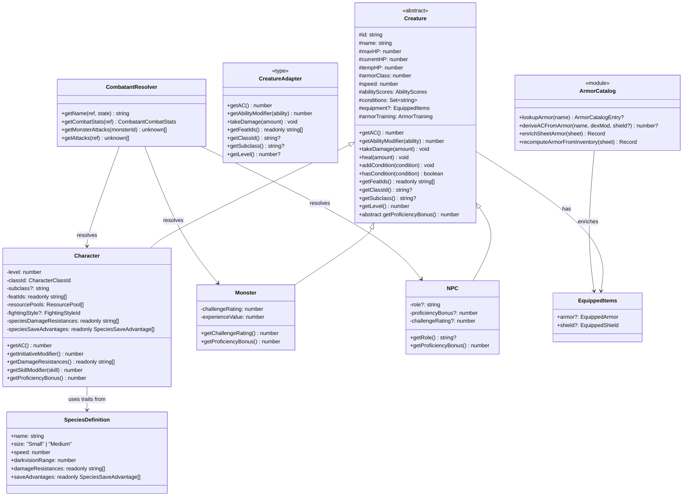
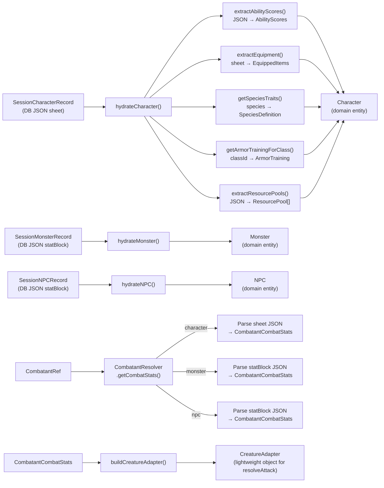
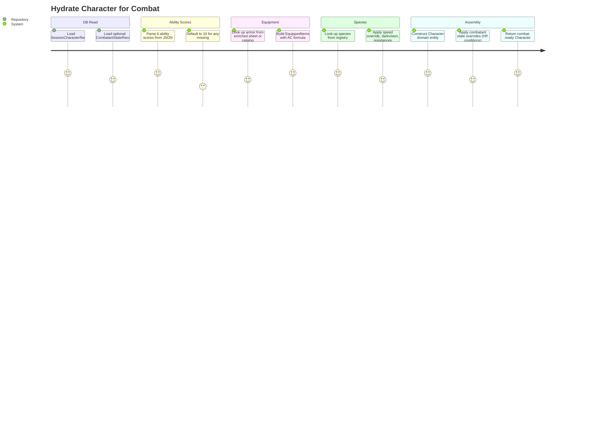

# CreatureHydration — Architecture Flow

> **Owner SME**: CreatureHydration-SME
> **Last updated**: 2026-04-12
> **Scope**: How raw DB entities become combat-ready domain objects. Character sheet parsing, stat block mapping, species traits, AC computation, `buildCreatureAdapter()`, combat stat resolution.

## Overview

The CreatureHydration flow is the **bridge between persistence and combat**. It transforms raw JSON blobs from the database (`SessionCharacterRecord.sheet`, `SessionMonsterRecord.statBlock`, `SessionNPCRecord.statBlock`) into strongly-typed domain entities (`Character`, `Monster`, `NPC`) that the combat engine can operate on. It spans the **domain layer** (entity classes, species registry, armor catalog) and the **application layer** (hydration functions, combat-utils adapter builder, combatant resolver). This flow runs on every combat operation — any bug here cascades into incorrect AC, broken attacks, missing feats, or wrong ability modifiers.

## UML Class Diagram

## Data Flow Diagram

## User Journey: Hydrate Character for Combat

## File Responsibility Matrix

| File | Lines (approx) | Layer | Responsibility |
|------|----------------|-------|---------------|
| `application/services/combat/helpers/creature-hydration.ts` | ~564 | application | `hydrateCharacter()`, `hydrateMonster()`, `hydrateNPC()`, `extractCombatantState()`; internal parsers: `extractAbilityScores()`, `extractResourcePools()`, `extractConditions()`, `extractEquipment()` |
| `application/services/combat/helpers/combat-utils.ts` | ~470 | application | `buildCreatureAdapter()` (lightweight `CreatureAdapter` for `resolveAttack()`), `extractAbilityScores()` (6-ability check, returns null), `parseAttackSpec()`, `hashStringToInt32()`, action input types (`AttackActionInput`, `MoveActionInput`, etc.) |
| `application/services/combat/helpers/combatant-resolver.ts` | ~330 | application | `CombatantResolver` class implementing `ICombatantResolver`; resolves `CombatantCombatStats` from character sheet / monster statBlock / NPC statBlock; size extraction, skill proficiency parsing, proficiency bonus computation |
| `domain/entities/creatures/creature.ts` | ~563 | domain | Abstract `Creature` class — HP management, AC computation (equipment formula), conditions, ability scores, damage defenses, serialization; `proficiencyBonusFromCR()` utility |
| `domain/entities/creatures/character.ts` | ~571 | domain | `Character extends Creature` — level, classId, subclass, feats, resource pools, fighting style, species resistances/save-advantages, skills (proficiency + expertise), Unarmored Defense (Barbarian/Monk), Alert initiative, ASI, spells |
| `domain/entities/creatures/monster.ts` | ~54 | domain | `Monster extends Creature` — challenge rating, experience value, CR-based proficiency bonus |
| `domain/entities/creatures/npc.ts` | ~38 | domain | `NPC extends Creature` — role, explicit or CR-derived proficiency bonus |
| `domain/entities/creatures/species.ts` | ~169 | domain | `SpeciesDefinition` (name, size, speed, darkvision, resistances, saveAdvantages); 10 species constants (Human, Elf, Dwarf, Halfling, Dragonborn, Gnome, Orc, Tiefling, Aasimar, Goliath); `getDragonbornAncestryResistance()` |
| `domain/entities/creatures/species-registry.ts` | ~57 | domain | `getSpeciesTraits()` (case-insensitive + aliases: half-elf→Elf, half-orc→Orc), `getAllSpecies()` |
| `domain/entities/items/equipped-items.ts` | ~28 | domain | Type definitions: `EquippedArmorCategory`, `EquippedArmorClassFormula`, `EquippedArmor`, `EquippedShield`, `EquippedItems`, `ArmorTraining` |
| `domain/entities/items/armor-catalog.ts` | ~219 | domain | 12 canonical armor entries (Padded→Plate); `lookupArmor()`, `deriveACFromArmor()`, `enrichSheetArmor()`, `recomputeArmorFromInventory()` |

## Key Types & Interfaces

| Type | File | Purpose |
|------|------|---------|
| `Creature` | `creature.ts` | Abstract base class — all HP, AC, condition, ability score operations |
| `CreatureData` | `creature.ts` | Constructor input: id, name, maxHP, currentHP, tempHP?, armorClass, speed, abilityScores, equipment?, armorTraining?, damage defenses |
| `Character` | `character.ts` | Player character — extends Creature with level, class, feats, skills, spells, species traits |
| `CharacterData` | `character.ts` | Constructor input: extends CreatureData + level, classId, subclass, experiencePoints, resourcePools, featIds, fightingStyle, classLevels, darkvision, skillProficiencies, etc. |
| `Monster` | `monster.ts` | Monster entity — extends Creature with CR and XP value |
| `NPC` | `npc.ts` | Non-player character — extends Creature with role and optional CR |
| `CreatureAdapter` | `combat-utils.ts` | Lightweight object implementing enough of `Creature` for `resolveAttack()`: getAC, getAbilityModifier, takeDamage, getFeatIds, getClassId, getSubclass, getLevel |
| `CombatantCombatStats` | `combatant-resolver.ts` | Resolved combat stats: name, armorClass, abilityScores, featIds, equipment, size, skills, level, proficiencyBonus, damageDefenses, className |
| `ICombatantResolver` | `combatant-resolver.ts` | Interface: getName, getNames, getCombatStats, getMonsterAttacks, getAttacks |
| `SpeciesDefinition` | `species.ts` | Species traits: name, size, speed, darkvision, damageResistances, saveAdvantages |
| `SpeciesSaveAdvantage` | `species.ts` | `{ againstCondition?, abilities?, qualifier? }` — e.g., Elf: advantage vs charmed |
| `EquippedItems` | `equipped-items.ts` | `{ armor?: EquippedArmor, shield?: EquippedShield }` |
| `ArmorTraining` | `equipped-items.ts` | `{ light, medium, heavy, shield }` boolean flags per armor category |
| `ArmorCatalogEntry` | `armor-catalog.ts` | Canonical armor: name, category, acFormula, strengthRequirement, stealthDisadvantage, weight, don/doff times |

## Cross-Flow Dependencies

| This flow depends on | For |
|----------------------|-----|
| **CombatRules** | `proficiencyBonusForLevel()` for character proficiency; `maxHitPoints()` for HP calculation; `computeFeatModifiers()` for feat integration |
| **ClassAbilities** | `getArmorTrainingForClass()` for armor proficiency; `defaultResourcePoolsForClass()` for resource pool initialization; class definition features |
| **SpellCatalog** | Spell progression tables for `getSpellSlots()` during initial stat assembly |
| **InventorySystem** | `ArmorCatalog` for AC computation from equipped armor; `recomputeArmorFromInventory()` for magic item armor bonuses |

| Depends on this flow | For |
|----------------------|-----|
| **CombatOrchestration** | All combat handlers need hydrated `Character`/`Monster`/`NPC` entities; `CombatantResolver.getCombatStats()` powers attack resolution, spell DC computation, HP tracking |
| **AIBehavior** | AI reads combat stats via `CombatantResolver` for target scoring, movement planning, spell evaluation |
| **ActionEconomy** | `combat-hydration.ts` hydrates the `Combat` domain object from DB state including action economy |
| **ReactionSystem** | `CombatantResolver` provides stats for OA damage resolution, Shield AC recalculation |
| **SpellSystem** | Spell save DC and attack bonus computed from hydrated creature ability scores |

## Known Gotchas & Edge Cases

1. **`CreatureAdapter` MUST implement ALL `Creature` methods used by `resolveAttack()`** — `resolveAttack()` unconditionally calls `attacker.getFeatIds()`, `attacker.getClassId()`, `attacker.getSubclass()`, and `attacker.getLevel()`. If the adapter doesn't define these, AI monster/NPC attacks crash with "is not a function". The adapter always provides safe defaults (`[]`, `undefined`, `undefined`, `undefined`).

2. **Two `extractAbilityScores()` functions exist** — One in `creature-hydration.ts` (returns defaults of 10 for missing abilities) and one in `combat-utils.ts` (returns `null` if any ability is missing). Callers must use the right one: hydration needs defaults, validation needs null-check.

3. **Equipment extraction has a 2-step lookup** — First checks for pre-enriched `equippedArmor`/`equippedShield` fields on the sheet (set by `enrichSheetArmor()`), then falls back to catalog lookup via `sheet.equipment.armor.name`. If neither path resolves, creature uses stored `armorClass` as flat AC.

4. **Monster proficiency uses CR+4 level correction** — `CombatantResolver` computes monster level as `max(1, floor(cr))` but proficiency bonus as `calculateProficiencyBonus(monsterLevel + 4)`. This +4 correction aligns monster proficiency with the D&D 5e CR-to-proficiency table. Without it, low-CR monsters would have +2 proficiency regardless of CR.

5. **Species aliases can cause silent mismatches** — `getSpeciesTraits()` handles common aliases (half-elf→Elf, half-orc→Orc) but any unrecognized species name returns `undefined`, silently skipping speed overrides, darkvision, and resistances. No warning is logged.

6. **Unarmored Defense is checked before armor formula** — `Character.getAC()` checks for Barbarian (10+DEX+CON) and Monk (10+DEX+WIS) Unarmored Defense before falling through to the armor formula. Shield bonus still applies on top of Unarmored Defense.

7. **Condition extraction handles two formats** — `extractConditions()` supports both legacy `string[]` format and newer `ActiveCondition[]` format (extracting the `name` field). This dual-format support exists because older combatant records may use the legacy format.

8. **`CombatantCombatStats.className` is only set for Characters** — Monsters and NPCs don't have a className field. Code that switches on className for class-specific behavior must handle the undefined case for non-character combatants.

## Testing Patterns

- **Unit tests**: `creature.ts` class methods tested directly (HP management, conditions, AC computation). Species registry tested with case-insensitive lookups and aliases. Armor catalog tested with all 12 entries.
- **Integration tests**: `character-generator.integration.test.ts` tests full character hydration pipeline including species traits, equipment, and resource pools. `combat-service-domain.integration.test.ts` exercises hydration in combat context.
- **E2E scenarios**: Every E2E scenario exercises hydration implicitly when setting up combat encounters. Character-specific scenarios (fighter, monk, wizard) validate that class features, feats, and equipment are properly hydrated.
- **Key test file(s)**: `character-generator.integration.test.ts`, `combat-service-domain.integration.test.ts`, `infrastructure/api/app.test.ts`
