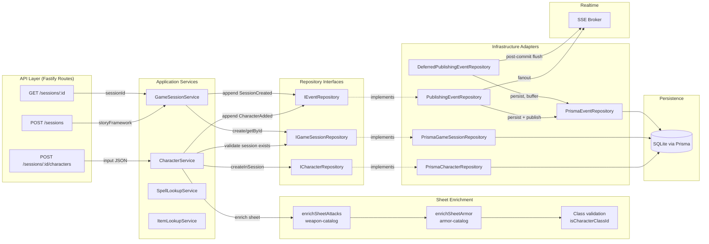
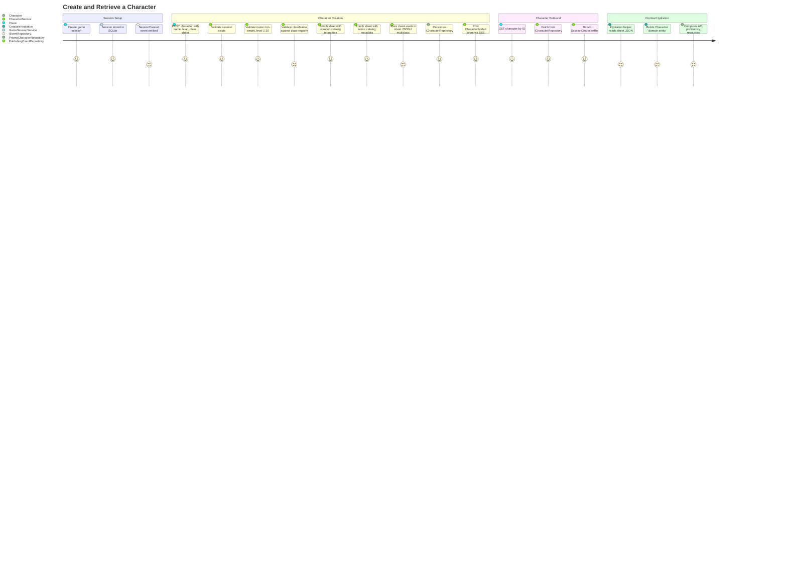

# EntityManagement — Architecture Flow

> **Owner SME**: EntityManagement-SME
> **Last updated**: 2026-04-12
> **Scope**: Entity lifecycle management — CRUD for sessions, characters, monsters, NPCs, spells, items; repository pattern (ports in application, adapters in infrastructure); event sourcing for SSE fanout; Unit of Work transactional boundary.

## Overview

EntityManagement is the **persistence bridge** between the combat/rules domain and the database. It owns the repository interfaces (ports) in `application/repositories/`, the Prisma adapter implementations in `infrastructure/db/`, and the in-memory test doubles in `infrastructure/testing/memory-repos.ts`. Three application services — `CharacterService`, `GameSessionService`, and `SpellLookupService` — orchestrate CRUD with input validation, sheet enrichment (weapon/armor catalog injection), game event emission, and rest mechanics. Nearly every other flow depends on EntityManagement for entity retrieval and persistence; it is the lowest-level shared dependency in the architecture.

## UML Class Diagram

```mermaid
classDiagram
    direction TB

    %% ── Application Services ──────────────────────────────
    class CharacterService {
        -sessions: IGameSessionRepository
        -characters: ICharacterRepository
        -events?: IEventRepository
        -diceRoller?: DiceRoller
        +addCharacter(sessionId, input): SessionCharacterRecord
        +listCharacters(sessionId): SessionCharacterRecord[]
        +getCharacterOrThrow(id): SessionCharacterRecord
        +updateCharacter(sessionId, charId, data): SessionCharacterRecord
        +deleteCharacter(sessionId, charId): void
        +beginRest(sessionId, restType): RestHandle
        +takeSessionRest(sessionId, restType, hitDice?, startedAt?): RestResult
    }

    class GameSessionService {
        -sessions: IGameSessionRepository
        -events?: IEventRepository
        +createSession(input): GameSessionRecord
        +getSessionOrThrow(id): GameSessionRecord
        +deleteSession(id): void
        +listSessions(input?): PaginatedSessions
    }

    class SpellLookupService {
        -spells: ISpellRepository
        +getSpellByIdOrThrow(id): SpellDefinitionRecord
        +getSpellByNameOrThrow(name): SpellDefinitionRecord
    }

    class ItemLookupService {
        -items: IItemDefinitionRepository
        +lookupItem(nameOrId): MagicItemDefinition?
        +lookupEquipment(nameOrId): LookedUpItem?
    }

    %% ── Repository Interfaces (Ports) ────────────────────
    class IGameSessionRepository {
        <<interface>>
        +create(input): GameSessionRecord
        +getById(id): GameSessionRecord?
        +delete(id): void
        +listAll(input?): PaginatedSessions
    }

    class ICharacterRepository {
        <<interface>>
        +createInSession(sessionId, input): SessionCharacterRecord
        +getById(id): SessionCharacterRecord?
        +getManyByIds(ids): SessionCharacterRecord[]
        +listBySession(sessionId): SessionCharacterRecord[]
        +update(id, data): SessionCharacterRecord
        +updateSheet(id, sheet): SessionCharacterRecord
        +delete(id): void
    }

    class IMonsterRepository {
        <<interface>>
        +createInSession(sessionId, input): SessionMonsterRecord
        +createMany(sessionId, inputs): SessionMonsterRecord[]
        +getById(id): SessionMonsterRecord?
        +getManyByIds(ids): SessionMonsterRecord[]
        +listBySession(sessionId): SessionMonsterRecord[]
        +updateStatBlock(id, data): SessionMonsterRecord
        +delete(id): void
    }

    class INPCRepository {
        <<interface>>
        +createInSession(sessionId, input): SessionNPCRecord
        +createMany(sessionId, inputs): SessionNPCRecord[]
        +getById(id): SessionNPCRecord?
        +getManyByIds(ids): SessionNPCRecord[]
        +listBySession(sessionId): SessionNPCRecord[]
        +updateStatBlock(id, data): SessionNPCRecord
        +delete(id): void
    }

    class IEventRepository {
        <<interface>>
        +append(sessionId, input, combatCtx?): GameEventRecord
        +listBySession(sessionId, input?): GameEventRecord[]
        +listByEncounter(encounterId, input?): GameEventRecord[]
    }

    class ICombatRepository {
        <<interface>>
        +createEncounter(sessionId, input): CombatEncounterRecord
        +listCombatants(encounterId): CombatantStateRecord[]
        +updateCombatantState(id, patch): CombatantStateRecord
        +createCombatants(encounterId, combatants): CombatantStateRecord[]
        +setPendingAction(encounterId, action): void
        +findActiveEncounter(sessionId): CombatEncounterRecord?
        +startCombat(encounterId, initiatives): CombatEncounterRecord
    }

    class ISpellRepository {
        <<interface>>
        +getById(id): SpellDefinitionRecord?
        +getByName(name): SpellDefinitionRecord?
        +listByLevel(level): SpellDefinitionRecord[]
    }

    class IItemDefinitionRepository {
        <<interface>>
        +findById(id): ItemDefinitionRecord?
        +findByName(name): ItemDefinitionRecord?
        +listAll(): ItemDefinitionRecord[]
        +upsert(item): ItemDefinitionRecord
    }

    class PendingActionRepository {
        <<interface>>
        +create(action): PendingAction
        +getById(actionId): PendingAction?
        +listByEncounter(encounterId): PendingAction[]
        +addReactionResponse(actionId, response): PendingAction
        +markCompleted(actionId): void
        +update(action): PendingAction
    }

    %% ── Prisma Implementations (Adapters) ────────────────
    class PrismaGameSessionRepository {
        -prisma: PrismaClient
    }
    class PrismaCharacterRepository {
        -prisma: PrismaClient
    }
    class PrismaMonsterRepository {
        -prisma: PrismaClient
    }
    class PrismaNPCRepository {
        -prisma: PrismaClient
    }
    class PrismaEventRepository {
        -prisma: PrismaClient
    }
    class PrismaCombatRepository {
        -prisma: PrismaClient
    }
    class PrismaSpellRepository {
        -prisma: PrismaClient
    }
    class PrismaItemDefinitionRepository {
        -prisma: PrismaClient
    }
    class PrismaPendingActionRepository {
        -prisma: PrismaClient
    }

    %% ── Event Decorators ─────────────────────────────────
    class PublishingEventRepository {
        -inner: IEventRepository
        +append(): publishes SSE
    }
    class DeferredPublishingEventRepository {
        -inner: IEventRepository
        -deferred: DeferredEvent[]
        +append(): buffers SSE
    }

    %% ── Unit of Work ─────────────────────────────────────
    class PrismaUnitOfWork {
        -prisma: PrismaClient
        +run(fn): T
    }

    %% ── Domain Entities ──────────────────────────────────
    class Creature {
        <<abstract>>
        #id: string
        #name: string
        #maxHP: number
        #currentHP: number
        #armorClass: number
        #speed: number
        #abilityScores: AbilityScores
        +getAC(): number
        +getDamageDefenses(): DamageDefenses
        +getProficiencyBonus(): number*
    }

    class Character {
        -level: number
        -classId?: CharacterClassId
        -subclass?: string
        -resourcePools: ResourcePool[]
        -featIds: string[]
        -classLevelsData?: ClassLevel[]
        +getClassLevels(): ClassLevel[]
        +canSpendResource(pool, amount): boolean
        +spendResource(pool, amount): void
        +takeRest(restType): void
        +levelUp(): void
        +getSkillModifier(skill): number
    }

    class Monster {
        -challengeRating: number
        -experienceValue: number
        +getChallengeRating(): number
        +getProficiencyBonus(): number
    }

    class NPC {
        -role?: string
        -proficiencyBonus: number
        +getRole(): string?
        +getProficiencyBonus(): number
    }

    %% ── Relationships ────────────────────────────────────
    Character --|> Creature : extends
    Monster --|> Creature : extends
    NPC --|> Creature : extends

    CharacterService --> IGameSessionRepository : validates session
    CharacterService --> ICharacterRepository : CRUD
    CharacterService --> IEventRepository : emits events
    GameSessionService --> IGameSessionRepository : CRUD
    GameSessionService --> IEventRepository : emits events
    SpellLookupService --> ISpellRepository : lookups
    ItemLookupService --> IItemDefinitionRepository : lookups

    PrismaGameSessionRepository ..|> IGameSessionRepository
    PrismaCharacterRepository ..|> ICharacterRepository
    PrismaMonsterRepository ..|> IMonsterRepository
    PrismaNPCRepository ..|> INPCRepository
    PrismaEventRepository ..|> IEventRepository
    PrismaCombatRepository ..|> ICombatRepository
    PrismaSpellRepository ..|> ISpellRepository
    PrismaItemDefinitionRepository ..|> IItemDefinitionRepository
    PrismaPendingActionRepository ..|> PendingActionRepository

    PublishingEventRepository ..|> IEventRepository
    PublishingEventRepository --> PrismaEventRepository : wraps
    DeferredPublishingEventRepository ..|> IEventRepository
    DeferredPublishingEventRepository --> PrismaEventRepository : wraps

    PrismaUnitOfWork --> DeferredPublishingEventRepository : creates in tx
    PrismaUnitOfWork --> PrismaCharacterRepository : creates in tx
    PrismaUnitOfWork --> PrismaMonsterRepository : creates in tx
    PrismaUnitOfWork --> PrismaCombatRepository : creates in tx
```

## Data Flow Diagram

## User Journey: Create and Retrieve a Character

## File Responsibility Matrix

### Application Services (`application/services/entities/`)

| File | Lines (approx) | Layer | Responsibility |
|------|----------------|-------|---------------|
| `character-service.ts` | ~310 | application | Character CRUD, sheet enrichment (weapon/armor catalogs), rest mechanics (begin/take short/long rest), hit dice spending, resource pool refresh, event emission |
| `game-session-service.ts` | ~62 | application | Session create/get/delete/list, event emission (SessionCreated/Deleted) |
| `spell-lookup-service.ts` | ~50 | application | Spell lookup with canonical catalog primary → DB fallback. Read-only |
| `item-lookup-service.ts` | ~80 | application | Unified item lookup: DB magic items → static magic catalog → weapon catalog → armor catalog |
| `index.ts` | ~5 | application | Barrel re-export of all entity services |

### Repository Interfaces (`application/repositories/`)

| File | Lines (approx) | Layer | Responsibility |
|------|----------------|-------|---------------|
| `character-repository.ts` | ~37 | application | `ICharacterRepository` port — CRUD + `updateSheet`, `getManyByIds` |
| `game-session-repository.ts` | ~8 | application | `IGameSessionRepository` port — create/getById/delete/listAll |
| `monster-repository.ts` | ~32 | application | `IMonsterRepository` port — CRUD + `createMany`, `updateStatBlock` |
| `npc-repository.ts` | ~20 | application | `INPCRepository` port — CRUD + `createMany`, `updateStatBlock` |
| `combat-repository.ts` | ~63 | application | `ICombatRepository` port — encounter lifecycle, combatant state, pending actions, battle plans |
| `event-repository.ts` | ~400 | application | `IEventRepository` port + **all 35+ typed event payload interfaces** (SessionCreated, AttackResolved, DamageApplied, etc.) + `GameEventInput` discriminated union |
| `spell-repository.ts` | ~8 | application | `ISpellRepository` port — getById/getByName/listByLevel |
| `item-definition-repository.ts` | ~16 | application | `IItemDefinitionRepository` port — findById/findByName/listAll/upsert |
| `pending-action-repository.ts` | ~55 | application | `PendingActionRepository` port — reaction pending action CRUD + status management |
| `index.ts` | ~10 | application | Barrel re-export of all repository interfaces |

### Application Types (`application/types.ts`)

| File | Lines (approx) | Layer | Responsibility |
|------|----------------|-------|---------------|
| `types.ts` | ~115 | application | All record types: `GameSessionRecord`, `SessionCharacterRecord`, `SessionMonsterRecord`, `SessionNPCRecord`, `CombatEncounterRecord`, `CombatantStateRecord`, `GameEventRecord`, `SpellDefinitionRecord`, `ItemDefinitionRecord`, `CombatantType`, `JsonValue` |

### Domain Entities (`domain/entities/creatures/`)

| File | Lines (approx) | Layer | Responsibility |
|------|----------------|-------|---------------|
| `creature.ts` | ~250 | domain | Abstract `Creature` base class — HP, AC (with equipment-aware calculation), ability scores, temp HP, damage defenses, armor training, conditions |
| `character.ts` | ~520 | domain | `Character` extends `Creature` — level, class, subclass, resource pools, feats, fighting style, multiclass (classLevels), ASI, skill proficiencies, spell preparation, unarmored defense, rest, level-up, initiative modifier |
| `monster.ts` | ~52 | domain | `Monster` extends `Creature` — CR, XP value, proficiency bonus from CR |
| `npc.ts` | ~35 | domain | `NPC` extends `Creature` — role, proficiency bonus |
| `species.ts` | ~175 | domain | 10 species definitions (Human, Elf, Dwarf, Halfling, Dragonborn, Gnome, Orc, Tiefling, Aasimar, Goliath) — SpeciesDefinition type, darkvision, damage resistances, save advantages |
| `species-registry.ts` | ~50 | domain | `getSpeciesTraits(name)` lookup + aliases (half-elf→Elf, half-orc→Orc) |
| `legendary-actions.ts` | ~120 | domain | `LegendaryTraits`, `LegendaryActionDef`, `LairActionDef` types + `parseLegendaryTraits()` from stat block JSON |

### Prisma Implementations (`infrastructure/db/`)

| File | Lines (approx) | Layer | Responsibility |
|------|----------------|-------|---------------|
| `game-session-repository.ts` | ~48 | infrastructure | `PrismaGameSessionRepository` — session CRUD with pagination |
| `character-repository.ts` | ~80 | infrastructure | `PrismaCharacterRepository` — character CRUD, sheet JSON cast to `Prisma.InputJsonValue` |
| `monster-repository.ts` | ~90 | infrastructure | `PrismaMonsterRepository` — monster CRUD, stat block merge on `updateStatBlock` |
| `npc-repository.ts` | ~80 | infrastructure | `PrismaNPCRepository` — NPC CRUD with faction/aiControlled defaults |
| `combat-repository.ts` | ~220 | infrastructure | `PrismaCombatRepository` — encounter lifecycle, combatant state, pending action (stored on encounter row), initiative-sorted listing with Prisma `include` for relations |
| `event-repository.ts` | ~80 | infrastructure | `PrismaEventRepository` — append-only event store, newest-first retrieval with reverse, since-filtered queries |
| `spell-repository.ts` | ~30 | infrastructure | `PrismaSpellRepository` — read-only spell definition access |
| `item-definition-repository.ts` | ~50 | infrastructure | `PrismaItemDefinitionRepository` — item definition CRUD/upsert |
| `pending-action-repository.ts` | ~130 | infrastructure | `PrismaPendingActionRepository` — reaction pending actions with JSON column storage for complex nested types |
| `publishing-event-repository.ts` | ~45 | infrastructure | Decorator: persists event + immediately publishes to SSE broker |
| `deferred-publishing-event-repository.ts` | ~50 | infrastructure | Decorator: persists event + buffers SSE publish until UoW commit (transaction-safe) |
| `unit-of-work.ts` | ~60 | infrastructure | `PrismaUnitOfWork` — Prisma `$transaction` wrapper that creates all repo instances on `TransactionClient`, buffers events, flushes SSE post-commit |
| `prisma.ts` | ~7 | infrastructure | `createPrismaClient()` factory |
| `index.ts` | ~14 | infrastructure | Barrel re-export |

### Test Infrastructure (`infrastructure/testing/`)

| File | Lines (approx) | Layer | Responsibility |
|------|----------------|-------|---------------|
| `memory-repos.ts` | ~815 | infrastructure/test | In-memory implementations of all 9 repository interfaces + `createInMemoryRepos()` factory + `clearAllRepos()` helper. `MemoryCombatRepository.linkEntityRepos()` enables relation resolution matching Prisma `include` behavior |

## Key Types & Interfaces

| Type | File | Purpose |
|------|------|---------|
| `GameSessionRecord` | `application/types.ts` | Session data shape — id, storyFramework, timestamps |
| `SessionCharacterRecord` | `application/types.ts` | Character data shape — id, sessionId, name, level, className, sheet (JSON), faction, aiControlled |
| `SessionMonsterRecord` | `application/types.ts` | Monster data shape — id, sessionId, name, monsterDefinitionId, statBlock (JSON), faction, aiControlled |
| `SessionNPCRecord` | `application/types.ts` | NPC data shape — id, sessionId, name, statBlock (JSON), faction, aiControlled |
| `CombatEncounterRecord` | `application/types.ts` | Encounter state — id, sessionId, status, round, turn, mapData, surprise, battlePlans |
| `CombatantStateRecord` | `application/types.ts` | Per-combatant combat state — id, encounterId, type, entity IDs, initiative, HP, conditions, resources. Includes optional hydrated relation fields (`character?`, `monster?`, `npc?`) |
| `GameEventRecord` | `application/types.ts` | Append-only event — id, sessionId, type, payload, optional encounterId/round/turnNumber |
| `SpellDefinitionRecord` | `application/types.ts` | Spell definition — id, name, level, school, ritual, data (JSON) |
| `ItemDefinitionRecord` | `application/types.ts` | Item definition — id, name, category, data (JSON) |
| `JsonValue` | `application/types.ts` | `unknown` alias for unstructured JSON columns |
| `CombatantType` | `application/types.ts` | `"Character" \| "Monster" \| "NPC"` discriminator |
| `CharacterUpdateData` | `repositories/character-repository.ts` | Partial update — name, level, className, sheet, faction, aiControlled |
| `GameEventInput` | `repositories/event-repository.ts` | Discriminated union of 35+ typed event payloads (compile-time checked event type → payload shape) |
| `GameEventType` | `repositories/event-repository.ts` | String union of all valid event type names |
| `RepositoryBundle` | `infrastructure/db/unit-of-work.ts` | All 9 repos as a typed object — used by `PrismaUnitOfWork.run()` callback |
| `InMemoryRepos` | `infrastructure/testing/memory-repos.ts` | Test-specific repo bundle with Memory* implementations + `clear()` helpers |
| `Creature` (abstract) | `domain/entities/creatures/creature.ts` | Base combat entity — HP, AC, ability scores, equipment, damage defenses |
| `Character` | `domain/entities/creatures/character.ts` | Player character domain entity — class, level, resources, feats, skills, spells, multiclass, leveling |
| `Monster` | `domain/entities/creatures/monster.ts` | Monster domain entity — CR, XP, proficiency from CR |
| `NPC` | `domain/entities/creatures/npc.ts` | NPC domain entity — role, custom proficiency bonus |
| `SpeciesDefinition` | `domain/entities/creatures/species.ts` | Species combat traits — darkvision, damage resistances, save advantages |
| `LegendaryTraits` | `domain/entities/creatures/legendary-actions.ts` | Boss monster legendary + lair action configuration |

## Cross-Flow Dependencies

| This flow depends on | For |
|----------------------|-----|
| Domain Rules (`domain/rules/`) | `rest.ts` (refreshClassResourcePools, spendHitDice, recoverHitDice, detectRestInterruption), `hit-points.ts` (maxHitPoints), `feat-modifiers.ts` (computeFeatModifiers), `class-resources.ts` (defaultResourcePoolsForClass) |
| ClassAbilities (`domain/entities/classes/`) | Class registry (getClassDefinition, isCharacterClassId), feature keys, class definitions for hitDie/resourcesAtLevel |
| InventorySystem (`domain/entities/items/`) | `weapon-catalog.ts` (enrichSheetAttacks), `armor-catalog.ts` (enrichSheetArmor), `magic-item-catalog.ts` (lookupMagicItem) |
| SpellCatalog (`domain/entities/spells/catalog/`) | `getCanonicalSpell()` for SpellLookupService catalog-first lookup |
| SSE Realtime (`infrastructure/api/realtime/`) | `sseBroker.publish()` used by PublishingEventRepository and DeferredPublishingEventRepository |

| Depends on this flow | For |
|----------------------|-----|
| **CombatOrchestration** | Session/character/monster/NPC retrieval, encounter persistence, combatant state management, event emission |
| **CombatRules** | Character domain entity (HP, AC, ability scores, proficiency, resource pools) |
| **ClassAbilities** | Character entity (classId, level, subclass, resourcePools, featIds) for ability eligibility |
| **SpellSystem** | SpellLookupService for spell definitions, Character entity for spell preparation |
| **AIBehavior** | Monster/NPC stat blocks, character sheets, combat encounter state for AI decision context |
| **ReactionSystem** | PendingActionRepository for reaction state machine, event repository for reaction events |
| **CreatureHydration** | SessionCharacterRecord/SessionMonsterRecord → Character/Monster domain entity conversion |
| **InventorySystem** | ItemLookupService, Character sheet data (inventory stored in sheet JSON) |
| **ActionEconomy** | CombatantStateRecord.resources for action economy flags, resource pool state |
| **CombatMap** | CombatEncounterRecord.mapData for grid state |
| **API Routes** | All session route handlers depend on services and repos for request handling |

## Known Gotchas & Edge Cases

1. **Sheet JSON is untyped `JsonValue`** — The `sheet` column on `SessionCharacterRecord` (and `statBlock` on monsters/NPCs) is `unknown` at the type level. All consumers must cast and validate at runtime. Changes to the expected sheet shape (e.g. adding `classLevels`, `resourcePools`, `hitDiceRemaining`) silently succeed at the persistence layer — only type errors in consuming code catch schema drift.

2. **Weapon/armor catalog enrichment happens at CREATE time** — `CharacterService.addCharacter()` calls `enrichSheetAttacks()` and `enrichSheetArmor()` when the character is first created. If the weapon/armor catalogs are updated later (e.g. new import), existing characters retain stale enrichment data in their sheet JSON. There is no re-enrichment on read.

3. **Event repository has two decorator layers** — `PublishingEventRepository` publishes SSE immediately on `append()` (used outside transactions). `DeferredPublishingEventRepository` buffers SSE events and flushes after `PrismaUnitOfWork.run()` commits (used inside transactions). Mixing these up causes either premature SSE events (before commit) or missing SSE events (never published).

4. **MemoryCombatRepository.linkEntityRepos() must be called** — In-memory combat repo needs explicit linking to character/monster/NPC repos to resolve faction/aiControlled relations in `listCombatants()`. Without this, test combatant records lack hydrated relation fields that Prisma's `include` provides automatically. The `createInMemoryRepos()` factory calls `linkEntityRepos()`, but manually-constructed repos will silently return un-hydrated records.

5. **Rest interruption detection depends on event timestamps** — `CharacterService.takeSessionRest()` uses `events.listBySession(sessionId, { since: restStartedAt })` to find combat/damage events that occurred during the rest period. In tests with fast execution, events may share the same millisecond timestamp, causing `gt` (greater-than) filtering to miss them. The `beginRest()` → `takeSessionRest()` two-step pattern must be used to capture the start timestamp correctly.

6. **SpellLookupService canonical catalog bypasses DB entirely** — `getSpellByNameOrThrow()` checks the in-memory canonical spell catalog first (synchronous, no DB round-trip). If a spell exists in both the canonical catalog and the DB, the catalog version always wins. The DB fallback only fires for spells NOT in the catalog. This means DB-level spell customizations are shadowed by catalog entries.

7. **Monster `updateStatBlock()` does shallow merge** — Both Prisma and in-memory implementations merge `data` into the existing stat block via `{ ...currentStatBlock, ...data }`. This is a **shallow merge** — nested objects (e.g. `statBlock.attacks[0].damage`) are replaced entirely, not deeply merged. Callers must provide the complete nested structure for any sub-object they touch.

8. **`CombatantStateRecord` relations are best-effort** — The `character?`, `monster?`, `npc?` fields on `CombatantStateRecord` are optional and populated only when the repository chooses to hydrate them (Prisma `include` in production, `linkEntityRepos()` in tests). Application code must fall back to entity IDs (`characterId`, `monsterId`, `npcId`) when relations are absent.

## Testing Patterns

- **Unit tests**: Use `createInMemoryRepos()` from `infrastructure/testing/memory-repos.ts` to get all 9 repos as in-memory Map-backed implementations. No database, no Prisma, instant setup/teardown. Each repo class has a `clear()` method; `clearAllRepos()` resets everything.

- **Integration tests**: `buildApp(deps)` with `app.inject()` provides full Fastify API-level testing against in-memory repos. The `deps` parameter accepts the same `RepositoryBundle` shape used by `PrismaUnitOfWork`, so tests wire in memory repos while production wires Prisma.

- **Event verification**: `MemoryEventRepository` exposes `getAll()` to inspect all emitted events in test assertions. Events can be filtered by type/payload to verify correct lifecycle event emission.

- **Transaction boundary**: `PrismaUnitOfWork.run()` wraps multi-repo operations in a single Prisma `$transaction`. In tests, the in-memory repos provide implicit atomicity (all in-process). The deferred event pattern is not exercised in most unit tests.

- **E2E scenarios**: Test harness scenarios in `scripts/test-harness/scenarios/` exercise entity creation through the full API flow (POST character → start combat → verify combatant state). The scenario runner creates sessions, adds characters/monsters via HTTP, and validates round-trip persistence.

- **Key test files**:
  - `src/infrastructure/api/app.test.ts` — main integration test suite using `buildApp()` + in-memory repos
  - `src/infrastructure/api/combat-flow-tabletop.integration.test.ts` — combat flow integration (exercises character/monster creation → combat lifecycle)
  - `src/domain/entities/creatures/character.test.ts` — Character domain entity unit tests (leveling, rest, resources)
  - `src/domain/entities/creatures/character-em.test.ts` — Character entity management tests
  - `src/domain/entities/creatures/creature.test.ts` — Base Creature unit tests (HP, AC, conditions)
  - `src/domain/entities/creatures/species-registry.test.ts` — Species lookup tests
  - `src/domain/entities/creatures/legendary-actions.test.ts` — Legendary action parsing tests
  - `src/domain/entities/creatures/fighting-style-character.test.ts` — Fighting style integration with Character
  - `src/application/repositories/pending-action-repository.test.ts` — PendingActionRepository contract tests
