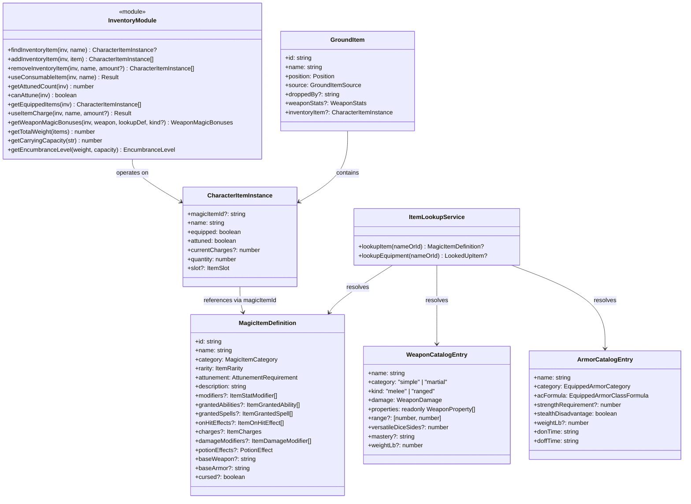
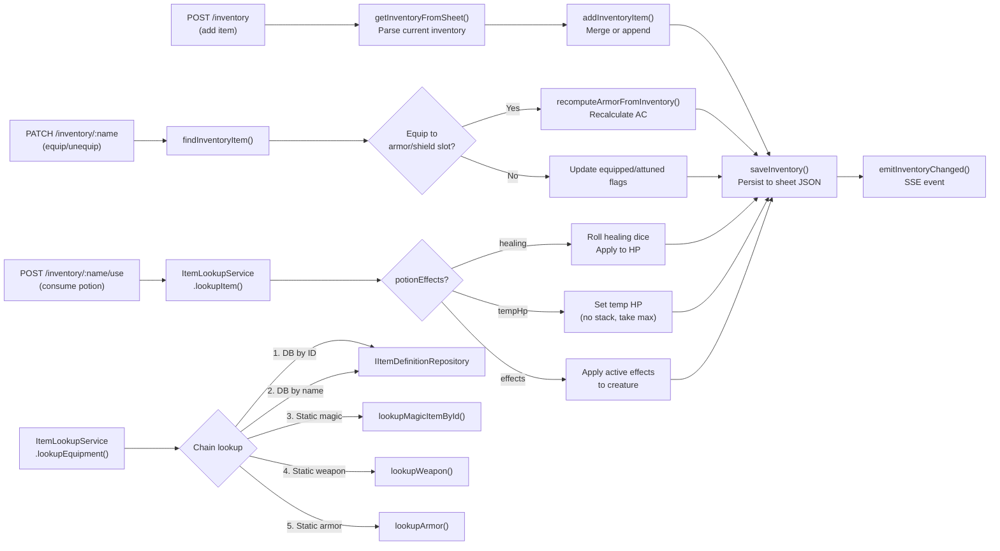
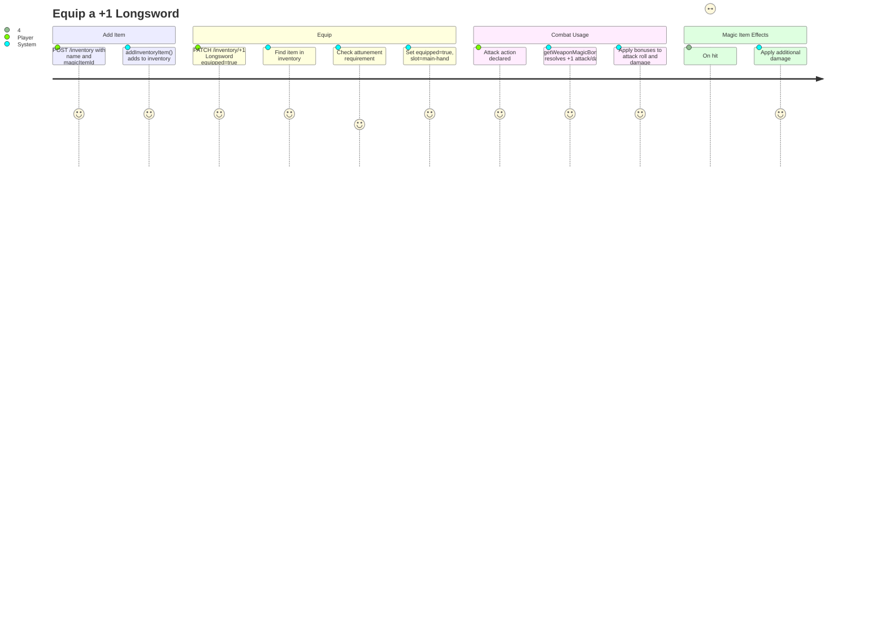

# InventorySystem — Architecture Flow

> **Owner SME**: InventorySystem-SME
> **Last updated**: 2026-04-12
> **Scope**: Item entity models, equip/unequip flow, ground items, weapon/armor catalogs, magic item definitions with 47 hardcoded entries, potion effects, inventory API routes, equipment rulebook parsing.

## Overview

The InventorySystem flow manages **all item and equipment state** in the game server. It spans all three DDD layers: **domain** types for weapons (47 entries), armor (12 entries), magic items (47 entries), ground items, and inventory operations; an **application** service (`ItemLookupService`) that unifies DB-backed and static catalog lookups; and **infrastructure** API routes for full inventory CRUD. The system supports equipment slots, attunement (max 3), charges, consumables (potions with healing/temp HP/effects), magic item bonuses (+N weapons/armor), and D&D 5e 2024 encumbrance rules.

## UML Class Diagram

## Data Flow Diagram

## User Journey: Equip a Magic Weapon

## File Responsibility Matrix

| File | Lines (approx) | Layer | Responsibility |
|------|----------------|-------|---------------|
| `infrastructure/api/routes/sessions/session-inventory.ts` | ~337 | infrastructure | 6 HTTP endpoints: GET inventory, POST add, DELETE remove, PATCH equip/unequip, POST use-charge, POST use (consume). Event emission, AC recomputation on armor changes |
| `domain/entities/items/magic-item.ts` | ~415 | domain | Core magic item data model: `MagicItemDefinition`, `ItemStatModifier` (10 targets), `ItemGrantedAbility`, `ItemGrantedSpell`, `ItemOnHitEffect`, `ItemCharges`, `ItemDamageModifier`, `PotionEffect`, `CharacterItemInstance`, `ItemSlot` (14 slots) |
| `domain/entities/items/magic-item-catalog.ts` | ~671 | domain | 47 hardcoded magic items + 3 factory functions (`bonusWeapon`, `bonusArmor`, `potionOfResistance`); `lookupMagicItemById()`, `lookupMagicItem()`, `getAllMagicItems()` |
| `domain/entities/items/weapon-catalog.ts` | ~411 | domain | 47 weapons across Simple/Martial × Melee/Ranged; `WeaponCatalogEntry` with 2024 mastery properties; `lookupWeapon()`, `getAllWeapons()`, `hasWeaponProperty()`, `enrichAttackProperties()` |
| `domain/entities/items/weapon-properties.ts` | ~116 | domain | 10 boolean property checkers: `isFinesse()`, `isLight()`, `isHeavy()`, `isThrown()`, `isLoading()`, `isReach()`, `isVersatile()`, `isTwoHanded()`, `usesAmmunition()`, `hasProperty()` |
| `domain/entities/items/armor-catalog.ts` | ~219 | domain | 12 canonical armor entries (Padded→Plate); `lookupArmor()`, `deriveACFromArmor()`, `enrichSheetArmor()`, `recomputeArmorFromInventory()` |
| `domain/entities/items/equipped-items.ts` | ~28 | domain | Type definitions: `EquippedArmor`, `EquippedShield`, `EquippedItems`, `ArmorTraining`, `EquippedArmorClassFormula` |
| `domain/entities/items/ground-item.ts` | ~50 | domain | `GroundItem` interface for battlefield items (thrown/dropped/preplaced/loot); `GroundItemSource` type; optional `weaponStats` and `inventoryItem` |
| `domain/entities/items/inventory.ts` | ~283 | domain | Inventory operations: add/remove/find/equip items; attunement tracking (max 3); charge management; magic weapon bonus resolution; D&D 5e 2024 weight/encumbrance (STR×15 capacity, 3 tiers) |
| `application/services/entities/item-lookup-service.ts` | ~82 | application | `ItemLookupService` — unified lookup chain: DB by ID → DB by name → static magic catalog → static weapon catalog → static armor catalog; `LookedUpItem` discriminated union |
| `content/rulebook/equipment-parser.ts` | ~357 | content | `parseEquipmentMarkdown()` — parses D&D rulebook markdown tables into structured `WeaponDefinition[]` and `ArmorDefinition[]`; handles dice expressions, costs, weight fractions |

## Key Types & Interfaces

| Type | File | Purpose |
|------|------|---------|
| `CharacterItemInstance` | `magic-item.ts` | Runtime item state: name, equipped, attuned, currentCharges, quantity, slot, magicItemId ref |
| `ItemSlot` | `magic-item.ts` | 14-value union: main-hand, off-hand, armor, shield, head, neck, ring-1, ring-2, cloak, boots, gloves, belt, ammunition, pack |
| `MagicItemDefinition` | `magic-item.ts` | Complete magic item spec: category, rarity, attunement, modifiers, abilities, spells, on-hit effects, charges, damage modifiers, potion effects, base weapon/armor |
| `MagicItemCategory` | `magic-item.ts` | `"armor" \| "potion" \| "ring" \| "rod" \| "scroll" \| "staff" \| "wand" \| "weapon" \| "wondrous-item"` |
| `ItemRarity` | `magic-item.ts` | `"common" \| "uncommon" \| "rare" \| "very-rare" \| "legendary" \| "artifact"` |
| `ItemStatModifier` | `magic-item.ts` | `{ target, value?, setTo?, ability?, scope? }` — 10 targets: ac, attackRolls, damageRolls, savingThrows, abilityScore, spellAttack, spellSaveDC, speed, hp, initiative |
| `ItemOnHitEffect` | `magic-item.ts` | `{ extraDamage?, creatureTypeRestriction?, applyCondition?, save?, description? }` — Flame Tongue, Holy Avenger, etc. |
| `ItemCharges` | `magic-item.ts` | `{ max, rechargeAmount?, rechargeRoll?, rechargeTiming, destroyOnEmpty? }` — staff/wand charge system |
| `PotionEffect` | `magic-item.ts` | `{ effects?, healing?, damage?, applyConditions?, removeConditions?, save?, tempHp? }` — consumable effect template |
| `WeaponCatalogEntry` | `weapon-catalog.ts` | Canonical weapon: name, simple/martial, melee/ranged, damage dice, properties, range, versatile, mastery, weight |
| `WeaponProperty` | `weapon-catalog.ts` | 9-value union: ammunition, finesse, heavy, light, loading, reach, thrown, two-handed, versatile |
| `ArmorCatalogEntry` | `armor-catalog.ts` | Canonical armor: name, category, acFormula, strengthReq, stealthDisadv, weight, don/doff times |
| `GroundItem` | `ground-item.ts` | Battlefield item: id, name, position, source (thrown/dropped/preplaced/loot), optional weaponStats |
| `LookedUpItem` | `item-lookup-service.ts` | Discriminated union: `{ kind: "magic" \| "weapon" \| "armor", item }` |
| `WeaponMagicBonuses` | `inventory.ts` | `{ attackBonus: number, damageBonus: number }` — resolved magic weapon modifiers |
| `EncumbranceLevel` | `inventory.ts` | `"normal" \| "encumbered" \| "heavily-encumbered"` — D&D 5e 2024 weight tiers |

## Cross-Flow Dependencies

| This flow depends on | For |
|----------------------|-----|
| **EntityManagement** | `IItemDefinitionRepository` for DB-backed magic item lookups; `ICharacterRepository.updateSheet()` for persisting inventory changes |
| **CombatRules** | Dice roller for potion healing rolls; damage defense types for magic item modifiers |

| Depends on this flow | For |
|----------------------|-----|
| **CreatureHydration** | `ArmorCatalog` for AC computation; `recomputeArmorFromInventory()` for magic armor AC; `enrichSheetArmor()` during character hydration |
| **CombatOrchestration** | `getWeaponMagicBonuses()` applied during attack resolution; weapon property checks (`isFinesse`, `isLight`, etc.) for combat mechanics; `GroundItem` for pickup/drop actions |
| **CombatRules** | `WeaponCatalogEntry` for weapon mastery properties; weapon properties for GWF/Dueling feat checks; `hasWeaponProperty()` for finesse auto-selection in `resolveAttack()` |
| **ActionEconomy** | `getInventory()` / `setInventory()` read/write inventory from resources JSON bag; `getDrawnWeapons()` tracks drawn weapon state during combat |
| **AIBehavior** | AI reads equipped weapon stats for `pickBestAttack()` scoring; potion availability for healing decisions |

## Known Gotchas & Edge Cases

1. **Magic item lookup chains through 5 sources** — `ItemLookupService.lookupEquipment()` tries: DB by ID → DB by name → static magic catalog → static weapon catalog → static armor catalog. Order matters because a "+1 Longsword" must resolve as a magic item (with modifiers), not as a base weapon.

2. **Bonus weapon/armor IDs are generated dynamically** — `bonusWeapon(2, "longsword")` generates ID `"weapon-plus-2-longsword"`. The `lookupMagicItemById()` function handles this via pattern matching and on-demand factory invocation. These items don't exist as static constants — they're constructed at lookup time.

3. **AC recomputation triggers on armor slot changes** — When a PATCH changes an item's slot to `"armor"` or `"shield"`, `recomputeArmorFromInventory()` is called to recalculate AC including magic armor bonuses. It strips `"+N "` prefixes (e.g., "+1 Chain Mail" → "Chain Mail") for base armor catalog lookup, then adds the magic bonus.

4. **Attunement max is 3, enforced at equip time** — `canAttune()` checks `getAttunedCount()` against `MAX_ATTUNEMENT_SLOTS` (3). Attempting to attune a 4th item returns a validation error. However, `getWeaponMagicBonuses()` checks attunement requirement at bonus-application time — an un-attuned magic weapon that requires attunement provides NO bonuses.

5. **Potion temp HP does not stack** — `Math.max(currentTempHp, potionEffect.tempHp)` takes the higher value, per D&D 5e rules. Consuming a Potion of Heroism (10 temp HP) when you already have 15 temp HP does nothing to temp HP.

6. **Ground items preserve full weapon stats** — When a weapon is dropped or thrown, `GroundItem.weaponStats` captures the full attack spec (bonus, damage, properties, mastery) so it can be picked up and used without re-resolution. The `inventoryItem` field preserves the original `CharacterItemInstance` for re-equipping.

7. **`enrichAttackProperties()` adds catalog data to sheet attacks** — When a character sheet has attacks without property lists, `enrichSheetAttacks()` looks up each attack name in the weapon catalog and backfills properties, mastery, and damage type. This enrichment runs during hydration and is idempotent.

8. **Equipment parser handles markdown quirks** — `parseEquipmentMarkdown()` must detect weapon group headers ("Simple Melee Weapons"), handle fractional weights ("1/4 lb"), and clean markdown formatting (asterisks, pipes). Malformed rows are silently skipped rather than throwing errors.

## Testing Patterns

- **Unit tests**: Inventory operations (`addInventoryItem`, `removeInventoryItem`, `useConsumableItem`, `getWeaponMagicBonuses`) tested with mock item arrays. Weapon/armor catalog lookups tested with all entries. Equipment parser tested with sample markdown input.
- **E2E scenarios**: Inventory routes tested via API integration in `app.test.ts`. Weapon property enrichment tested indirectly through combat scenarios where weapon type matters (finesse, thrown, reach). Magic item bonuses tested through attack resolution scenarios with equipped magic weapons.
- **Key test file(s)**: `infrastructure/api/app.test.ts` (inventory route integration), `domain/entities/items/` unit tests, `content/rulebook/equipment-parser.ts` tests
