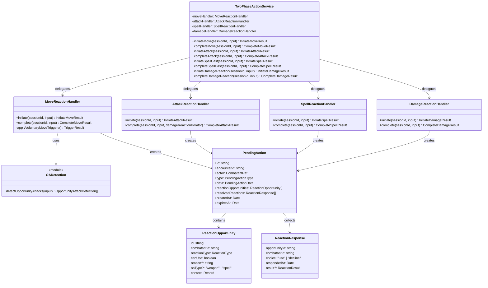
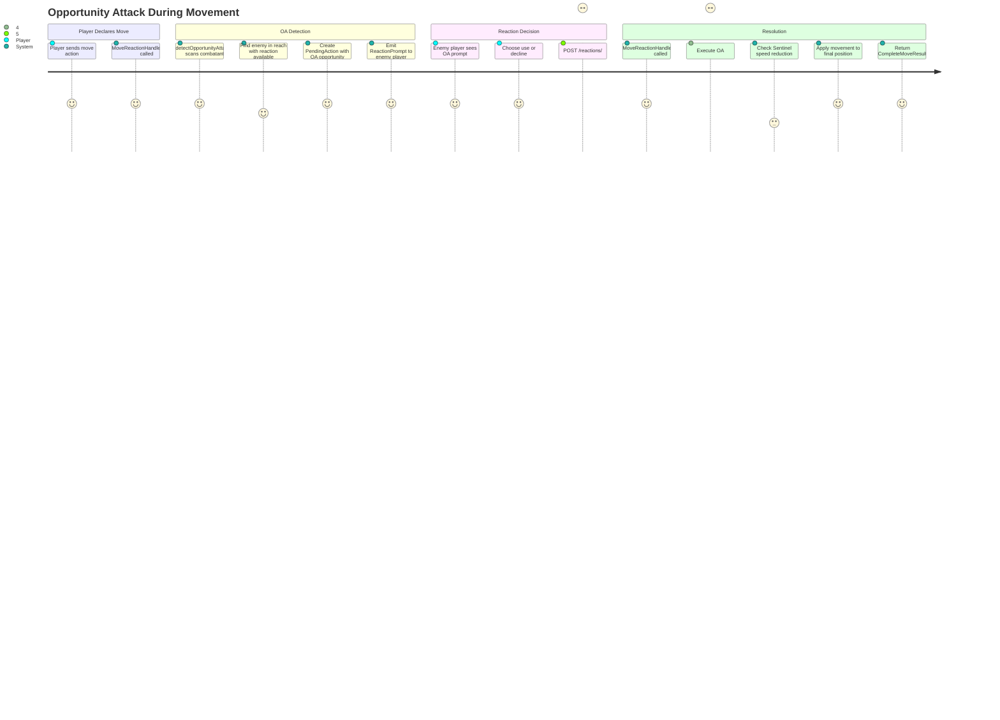

# ReactionSystem — Architecture Flow

> **Owner SME**: ReactionSystem-SME
> **Last updated**: 2026-04-12
> **Scope**: Two-phase reaction resolution — TwoPhaseActionService facade, 4 reaction handlers (move/attack/spell/damage), pending action state machine, opportunity attack detection, reaction API routes.

## Overview

The ReactionSystem flow implements D&D 5e's reaction mechanics as a **two-phase state machine**: Phase 1 detects reaction opportunities and creates a `PendingAction` (pausing the game), Phase 2 resolves player choices and completes the original action. It lives in the **application layer** (`application/services/combat/two-phase/`) with domain types in `domain/entities/combat/pending-action.ts` and infrastructure routes in `infrastructure/api/routes/reactions.ts`. The thin `TwoPhaseActionService` facade (~240 lines) delegates to 4 focused handler classes, each owning one category of reaction: movement (opportunity attacks), attacks (Shield/Deflect Attacks), spells (Counterspell), and damage (Absorb Elements/Hellish Rebuke).

## UML Class Diagram

## Data Flow Diagram

```mermaid
flowchart LR
    A["Action Trigger\n(Move/Attack/Spell/Damage)"] --> B["TwoPhaseActionService\n(Facade)"]
    B --> C{"Handler.initiate()"}
    C -->|"Detect reactions"| D{"Any eligible\nreactions?"}
    D -->|"No"| E["Return immediately\nstatus: no_reactions"]
    D -->|"Yes"| F["Create PendingAction\nwith ReactionOpportunities"]
    F --> G["Emit ReactionPrompt\nSSE events"]
    G --> H["Return awaiting_reactions\n+ pendingActionId"]

    H --> I["POST /reactions/:id/respond\n(Player choice: use/decline)"]
    I --> J["Add ReactionResponse\nto PendingAction"]
    J --> K{"All reactions\nresolved?"}
    K -->|"No"| I
    K -->|"Yes"| L["Handler.complete()"]
    L --> M["Apply reaction effects\n(Shield AC, OA damage, etc.)"]
    M --> N["Complete original action\n(move/attack/spell/damage)"]
    N --> O["Delete PendingAction\nEmit resolution events"]
```

## User Journey: Opportunity Attack During Movement

## File Responsibility Matrix

| File | Lines (approx) | Layer | Responsibility |
|------|----------------|-------|---------------|
| `application/services/combat/two-phase-action-service.ts` | ~240 | application | Thin facade with 8 public methods (initiate/complete × 4 categories); delegates to 4 handler instances |
| `application/services/combat/two-phase/move-reaction-handler.ts` | ~670 | application | Movement reactions — OA detection via shared helper, Booming Blade triggers (`on_voluntary_move`), prone stand-up cost, grapple drag speed, pit entry saves, zone damage along path, A* path computation |
| `application/services/combat/two-phase/attack-reaction-handler.ts` | ~750 | application | Attack reactions — Shield spell (+5 AC), Deflect Attacks (Monk damage reduction + Ki redirect), Sentinel feat (ally protection OA), readied action triggers, damage reaction detection (chains to DamageReactionHandler) |
| `application/services/combat/two-phase/spell-reaction-handler.ts` | ~270 | application | Spell reactions — Counterspell detection and resolution using 2024 model (target caster Constitution save vs counterspeller spell save DC) |
| `application/services/combat/two-phase/damage-reaction-handler.ts` | ~300 | application | Damage reactions — Absorb Elements (heal back half damage, gain resistance), Hellish Rebuke (2d10 fire retaliation, DEX save for half) |
| `domain/entities/combat/pending-action.ts` | ~236 | domain | `PendingAction` interface, 6 data variants (move/spell_cast/attack/damage_reaction/lucky_reroll/ability_check), `ReactionOpportunity`, `ReactionResponse`, `PendingActionStatus`, 13 `ReactionType` values |
| `infrastructure/api/routes/reactions.ts` | ~495 | infrastructure | 3 endpoints: `POST /respond` (auto-completes when all reactions resolved), `GET /:pendingActionId`, `GET /` (list all pending); handles Lucky reroll prompts, War Caster spell-as-OA |
| `application/services/combat/helpers/oa-detection.ts` | ~210 | application | `detectOpportunityAttacks()` — centralized OA eligibility: reach calculation, path-cell-by-cell tracing, Disengage check, Incapacitated/Charmed guards, War Caster + Sentinel feat flags |

## Key Types & Interfaces

| Type | File | Purpose |
|------|------|---------|
| `PendingAction` | `pending-action.ts` | Core state machine object: actor, type, data variant, reaction opportunities, resolved reactions, timestamps |
| `PendingActionType` | `pending-action.ts` | `"move" \| "spell_cast" \| "attack" \| "damage_reaction" \| "lucky_reroll" \| "ability_check"` |
| `PendingActionStatus` | `pending-action.ts` | `"awaiting_reactions" \| "ready_to_complete" \| "completed" \| "cancelled" \| "expired"` |
| `ReactionType` | `pending-action.ts` | 13-value union: `opportunity_attack`, `counterspell`, `shield`, `absorb_elements`, `hellish_rebuke`, `deflect_attacks`, `uncanny_dodge`, `readied_action`, `sentinel_attack`, `lucky_reroll`, `silvery_barbs`, `interception`, `protection` |
| `ReactionOpportunity` | `pending-action.ts` | Per-combatant reaction slot: id, combatantId, reactionType, canUse, oaType (weapon/spell for War Caster), context bag |
| `ReactionResponse` | `pending-action.ts` | Player's choice: opportunityId, combatantId, use/decline, result data |
| `PendingMoveData` | `pending-action.ts` | `{ type: "move", from, to, path: Position[] }` |
| `PendingAttackData` | `pending-action.ts` | `{ type: "attack", target, attackRoll, damageSpec?, critical?, targetAC? }` |
| `PendingSpellCastData` | `pending-action.ts` | `{ type: "spell_cast", spellName, spellLevel, target?, targetPosition? }` |
| `PendingDamageReactionData` | `pending-action.ts` | `{ type: "damage_reaction", attackerId, damageType, damageAmount }` |
| `PendingLuckyRerollData` | `pending-action.ts` | `{ type: "lucky_reroll", originalRoll, attackBonus, targetAC, ... }` |
| `OpportunityAttackDetection` | `oa-detection.ts` | Per-observer: combatant, reach, hasReaction, canAttack, canCastSpellAsOA, reducesSpeedToZero |
| `DetectOpportunityAttacksInput` | `oa-detection.ts` | Combatants, actor, from/to positions, pathCells, includeObserverFeatFlags |
| `InitiateMoveResult` | `two-phase-action-service.ts` | `{ status, pendingActionId?, opportunityAttacks[], standUpCost?, voluntaryMoveTriggerDamage? }` |
| `CompleteMoveResult` | `two-phase-action-service.ts` | `{ movedFeet, from, to, opportunityAttacks[] }` |

## Cross-Flow Dependencies

| This flow depends on | For |
|----------------------|-----|
| **CombatRules** | `canMakeOpportunityAttack()` for OA eligibility, `resolveAttack()` for OA damage, `canUseProtection()` for Protection fighting style |
| **ClassAbilities** | `detectAttackReactions(getAllCombatTextProfiles())` for Shield/Deflect Attacks detection; `classHasFeature()` for Sentinel/War Caster feat checks |
| **SpellCatalog** | `PreparedSpellDefinition` for Counterspell level comparison; spell slot tables for reaction slot spending |
| **CombatMap** | A* pathfinding for movement path computation; zone damage triggers along path; pit terrain entry resolution |
| **ActionEconomy** | `hasReactionAvailable()` / `useReaction()` for reaction flag tracking; `hasDisengaged()` for Disengage checks |
| **EntityManagement** | Repository reads for combatant stats (combat resolver), encounter state, pending action persistence |

| Depends on this flow | For |
|----------------------|-----|
| **CombatOrchestration** | TabletopCombatService calls `initiateMove()` / `initiateAttack()` / `initiateSpellCast()` to enter two-phase flow; `completeMove()` called after move resolution |
| **AIBehavior** | AI turn orchestrator pauses for reaction resolution; reaction route auto-resumes AI after completion |
| **SpellSystem** | SpellActionHandler calls `initiateSpellCast()` before spell delivery to check for Counterspell |

## Known Gotchas & Edge Cases

1. **Dual Pending Action Architecture** — The codebase has TWO pending action systems: (a) encounter-level `pendingAction` (singleton JSON blob for RollStateMachine — ATTACK, DAMAGE, INITIATIVE) and (b) `PendingActionRepository` (multi-record store for TwoPhaseActionService reactions). When encounter `pendingAction.type === "reaction_pending"`, the tabletop dice flow pauses waiting for reactions from the repository. Confusing these two systems is a common source of bugs.

2. **OA detection is centralized but resolution is split** — `detectOpportunityAttacks()` in `oa-detection.ts` is shared by both `ActionService.move()` (programmatic immediate resolution) and `MoveReactionHandler.initiate()` (two-phase pending reaction flow). Detection is identical; resolution semantics differ per path.

3. **Shield spell slot is spent even before player confirms** — In `AttackReactionHandler.complete()`, the Shield reaction spends a spell slot and reaction when processing the response. But the Counterspell in `SpellReactionHandler` similarly consumes slots. If a player declines, no slot is spent — the `choice: "decline"` path skips slot consumption.

4. **Damage reactions chain from attack completion** — `AttackReactionHandler.complete()` detects damage reactions (Absorb Elements, Hellish Rebuke) after applying damage, then calls `damageReactionInitiator.initiateDamageReaction()` to create a _second_ PendingAction. This means a single attack can create two sequential pending actions: first for Shield, then for damage reaction.

5. **Counterspell uses 2024 save model** — reacting caster spends slot/reaction, then target caster makes a Constitution save vs counterspeller spell save DC. A failed save stops the spell.

6. **War Caster spell-as-OA uses `oaType: "spell"` flag** — When a combatant has War Caster feat, their OA opportunity includes `oaType: "spell"` alongside `oaType: "weapon"`. The reaction route accepts `spellName` and `castAtLevel` params to resolve the spell-based OA.

7. **`on_voluntary_move` triggers (Booming Blade) can abort movement** — `MoveReactionHandler.initiate()` checks for active effects with `triggerAt: 'on_voluntary_move'` before computing the path. If trigger damage kills the actor, movement aborts with `status: "aborted_by_trigger"`.

8. **Sentinel reduces speed to zero on OA hit** — `OpportunityAttackDetection.reducesSpeedToZero` flags Sentinel hits. After OA resolution in `completeMove()`, if a Sentinel hit connects, the mover's remaining movement becomes 0 and they stop at the trigger position.

## Testing Patterns

- **Unit tests**: In-memory repos + stubs with `app.inject()` for reaction route testing. `MoveReactionHandler` tested via integration tests with deterministic dice.
- **E2E scenarios**: `opportunity-attacks/basic-oa.json`, `opportunity-attacks/sentinel-oa.json`, `opportunity-attacks/war-caster-oa.json`, `wizard/shield-reaction.json`, `wizard/counterspell.json`, `core/damage-reactions.json`. Scenarios use `respondToReaction` step type to simulate player choices.
- **Key test file(s)**: `infrastructure/api/app.test.ts` (reaction route integration), `combat-flow-tabletop.integration.test.ts` (full two-phase flow)
