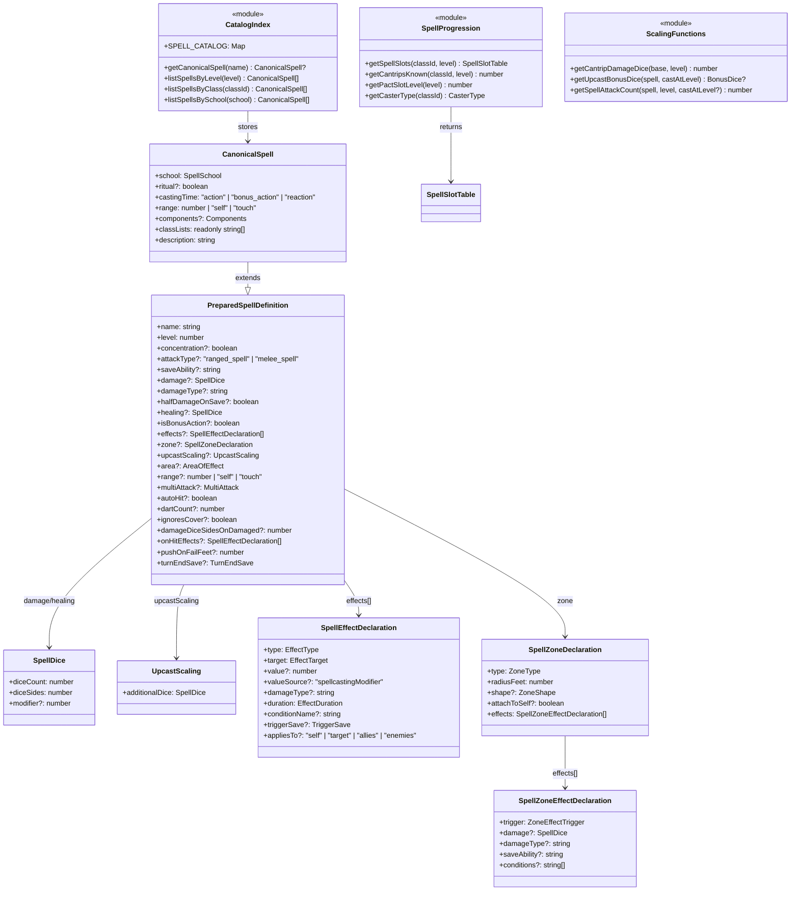
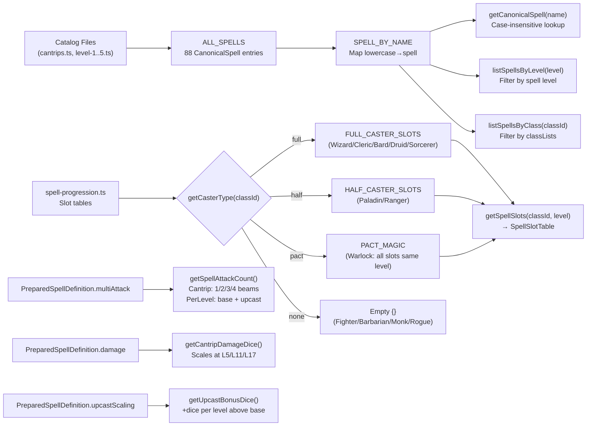
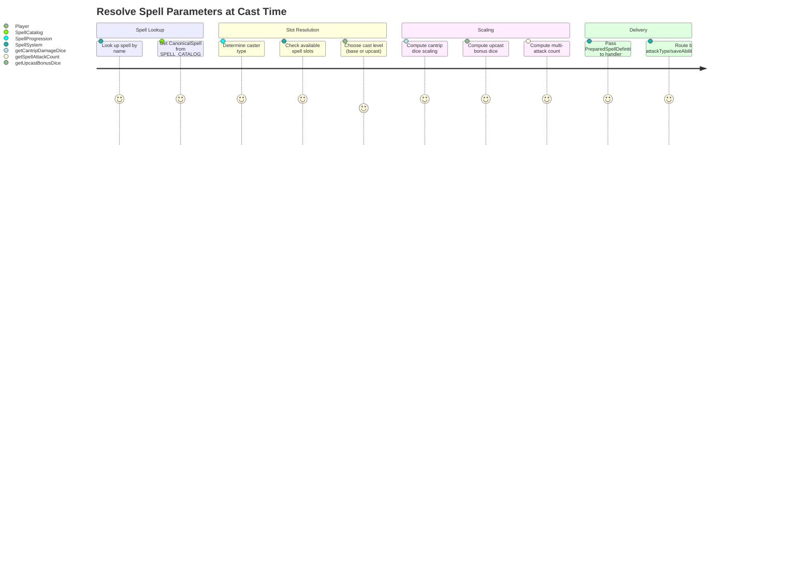

# SpellCatalog — Architecture Flow

> **Owner SME**: SpellCatalog-SME
> **Last updated**: 2026-04-12
> **Scope**: Pure spell data layer — spell entity definitions, catalog entries by level, spell progression tables, cantrip scaling, multi-attack spells. All types/functions are pure domain (no application or infrastructure dependencies).

## Overview

The SpellCatalog flow is the **pure data foundation** for all spell-related systems. It lives exclusively in `domain/entities/spells/` and defines the `PreparedSpellDefinition` type (the universal spell contract consumed by the SpellSystem, AISpellEvaluation, and CombatOrchestration flows), canonical spell catalog entries across levels 0-5 (currently 88 total), spell progression tables for all caster types (full/half/pact/none), and utility functions for cantrip scaling and multi-attack computation. This is a data-only layer — no orchestration, no persistence, no side effects.

## UML Class Diagram

## Data Flow Diagram

## User Journey: Resolve Spell Parameters at Cast Time

## File Responsibility Matrix

| File | Lines (approx) | Layer | Responsibility |
|------|----------------|-------|---------------|
| `domain/entities/spells/prepared-spell-definition.ts` | ~256 | domain | `PreparedSpellDefinition` interface, `SpellDice`, `UpcastScaling`, `SpellEffectDeclaration`, `SpellZoneDeclaration`, `SpellZoneEffectDeclaration`; pure scaling functions: `getCantripDamageDice()`, `getUpcastBonusDice()`, `getSpellAttackCount()` |
| `domain/entities/spells/spell-progression.ts` | ~349 | domain | Caster type classification (`full/half/pact/none`); slot tables for all 14 classes levels 1–20; cantrip-known tables; `getSpellSlots()`, `getCantripsKnown()`, `getPactSlotLevel()`, `getCasterType()` |
| `domain/entities/spells/catalog/types.ts` | ~46 | domain | `CanonicalSpell extends PreparedSpellDefinition` (adds school, ritual, castingTime, range, components, classLists, description); `SpellSchool` (8 values), `SpellCastingMode` |
| `domain/entities/spells/catalog/cantrips.ts` | ~170 | domain | 8 cantrip definitions (Eldritch Blast, Fire Bolt, Produce Flame, Sacred Flame, Ray of Frost, Toll the Dead, Chill Touch, Booming Blade) |
| `domain/entities/spells/catalog/level-1.ts` | ~426 | domain | 24 level-1 spell definitions (Shield, Magic Missile, Cure Wounds, Healing Word, Hex, Thunderwave, etc.) |
| `domain/entities/spells/catalog/level-2.ts` | ~240 | domain | 13 level-2 spell definitions (Hold Person, Misty Step, Scorching Ray, Spiritual Weapon, Web, etc.) |
| `domain/entities/spells/catalog/level-3.ts` | ~119 | domain | 5 level-3 spell definitions (Counterspell, Fireball, Spirit Guardians, Dispel Magic, Revivify) |
| `domain/entities/spells/catalog/level-4.ts` | ~154 | domain | 6 level-4 spell definitions (Banishment, Greater Invisibility, Polymorph, Wall of Fire, etc.) |
| `domain/entities/spells/catalog/level-5.ts` | ~200 | domain | 6 level-5 spell definitions (Cone of Cold, Hold Monster, Cloudkill, Wall of Force, etc.) |
| `domain/entities/spells/catalog/index.ts` | ~49 | domain | Aggregates ALL_SPELLS (62 total); builds `SPELL_BY_NAME` map; exports `getCanonicalSpell()`, `listSpellsByLevel()`, `listSpellsByClass()`, `listSpellsBySchool()`, `SPELL_CATALOG` |
| `domain/entities/spells/index.ts` | ~3 | domain | Barrel re-export of `prepared-spell-definition`, `spell-progression`, `catalog/index` |

## Key Types & Interfaces

| Type | File | Purpose |
|------|------|---------|
| `PreparedSpellDefinition` | `prepared-spell-definition.ts` | Universal spell contract — consumed by all spell handlers, AI evaluators, and catalog |
| `CanonicalSpell` | `catalog/types.ts` | Extended spell with metadata (school, components, classLists) for catalog entries |
| `SpellDice` | `prepared-spell-definition.ts` | `{ diceCount, diceSides, modifier? }` — reusable dice roll spec |
| `UpcastScaling` | `prepared-spell-definition.ts` | `{ additionalDice: SpellDice }` — bonus dice per upcasted level |
| `SpellEffectDeclaration` | `prepared-spell-definition.ts` | Declarative effect: type, target scope, duration, trigger-save, conditions |
| `SpellZoneDeclaration` | `prepared-spell-definition.ts` | Zone geometry: type (aura/placed), radius, shape, attach-to-self, effects |
| `SpellZoneEffectDeclaration` | `prepared-spell-definition.ts` | Zone trigger effect: damage on enter/end-turn, save, conditions |
| `SpellSlotTable` | `spell-progression.ts` | `Readonly<Record<number, number>>` — spell level 1–9 → slot count |
| `SpellSchool` | `catalog/types.ts` | 8-value union: abjuration, conjuration, divination, enchantment, evocation, illusion, necromancy, transmutation |
| `SpellCastingMode` | `catalog/types.ts` | `'normal' \| 'ritual'` |
| `CasterType` | `spell-progression.ts` | `'full' \| 'half' \| 'pact' \| 'none'` |

## Cross-Flow Dependencies

| This flow depends on | For |
|----------------------|-----|
| (None) | SpellCatalog is a leaf dependency — pure data types with no imports outside `domain/entities/` |

| Depends on this flow | For |
|----------------------|-----|
| **SpellSystem** | `PreparedSpellDefinition` drives all 5 delivery handlers; `getCantripDamageDice()` for cantrip damage; `getUpcastBonusDice()` for upcasting; `getSpellAttackCount()` for multi-attack spells |
| **AISpellEvaluation** | `getCanonicalSpell()` for spell lookup; `PreparedSpellDefinition` for spell effect evaluation; slot tables for slot economy decisions |
| **CombatOrchestration** | `getCanonicalSpell()` for spell parsing in ActionDispatcher; `PreparedSpellDefinition` for SpellActionHandler dispatch |
| **CombatRules** | `PreparedSpellDefinition` for War Caster OA spell eligibility; `getSpellSlots()`/`spendSpellSlot()` for spell slot state |
| **ReactionSystem** | `PreparedSpellDefinition` for Counterspell level comparison; spell slot tables for reaction slot spending |
| **ClassAbilities** | Spell progression tables for resource pool initialization (spell slot pools derived from `getSpellSlots()`) |
| **CreatureHydration** | Spell progression tables for initial combat stat assembly |

## Known Gotchas & Edge Cases

1. **Multi-attack cantrips skip `getCantripDamageDice()`** — Eldritch Blast scales via extra beams (`multiAttack.scaling: 'cantrip'`, computed by `getSpellAttackCount()`), NOT extra dice per beam. Calling `getCantripDamageDice()` on Eldritch Blast would incorrectly double-scale damage.

2. **Scorching Ray per-level scaling stacks with upcast** — `multiAttack: { baseCount: 3, scaling: 'perLevel' }` means casting at level 3 gives `3 + (3-2) = 4` rays. Each ray is an independent attack roll with its own hit/miss/crit resolution via the `spellStrike`/`spellStrikeTotal` chaining in RollStateMachine.

3. **AutoHit spells (Magic Missile) bypass attack rolls entirely** — `autoHit: true` + `dartCount: 3` means damage is applied per dart without d20 rolls. The SpellSystem must route these differently from attack-type spells.

4. **`damageDiceSidesOnDamaged` is runtime-conditional** — Toll the Dead declares `damage: 1d8` but upgrades to `1d12` (`damageDiceSidesOnDamaged: 12`) only if the target has taken damage. The delivery handler must check target HP vs maxHP at resolution time.

5. **Warlock Pact Magic slot level differs from other casters** — `getPactSlotLevel(level)` returns the single slot level (all Warlock slots are the same level). At level 5, all 2 slots are level-3. This differs from full/half casters who have mixed-level slots. `getSpellSlots()` returns slots keyed by the single pact level.

6. **`isBonusAction` on PreparedSpellDefinition controls action economy** — When `true`, the spell uses the caster's bonus action instead of their main action. The D&D 5e 2024 rule restricts the main action to cantrips only if a bonus-action spell was cast. This coordination lives in the AI layer (`ai-spell-evaluator.ts`), not in the catalog.

7. **Zone spells with `attachToSelf: true` move with the caster** — Spirit Guardians uses this pattern. Other zone spells (Cloud of Daggers, Moonbeam) are `placed` at a fixed position. The zone type determines whether the CombatMap re-centers the zone each turn.

8. **Spell level 0 cantrips always return `true` for slot availability** — `hasAvailableSlot()` in `ai-spell-evaluator.ts` special-cases `level === 0` to always return available, since cantrips are unlimited. Slot spending is skipped for cantrips.

## Testing Patterns

- **Unit tests**: `cantrip-scaling.test.ts` covers `getCantripDamageDice()` at all tier breakpoints (levels 1, 5, 11, 17). `spell-progression.test.ts` covers slot tables for all caster types at key levels. `catalog.test.ts` validates catalog aggregation and lookup functions.
- **E2E scenarios**: Spell catalog data is exercised indirectly through any scenario that involves spell casting — `wizard/` scenarios (Shield, Counterspell, Fireball), `core/spell-combat-basic.json`, `core/spell-saves.json`. Multi-attack tested via Scorching Ray and Eldritch Blast scenarios.
- **Key test file(s)**: `domain/entities/spells/cantrip-scaling.test.ts`, `domain/entities/spells/spell-progression.test.ts`, `domain/entities/spells/catalog/catalog.test.ts`
