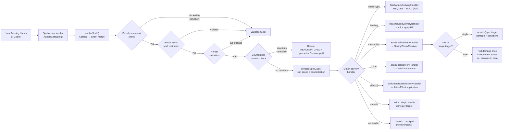
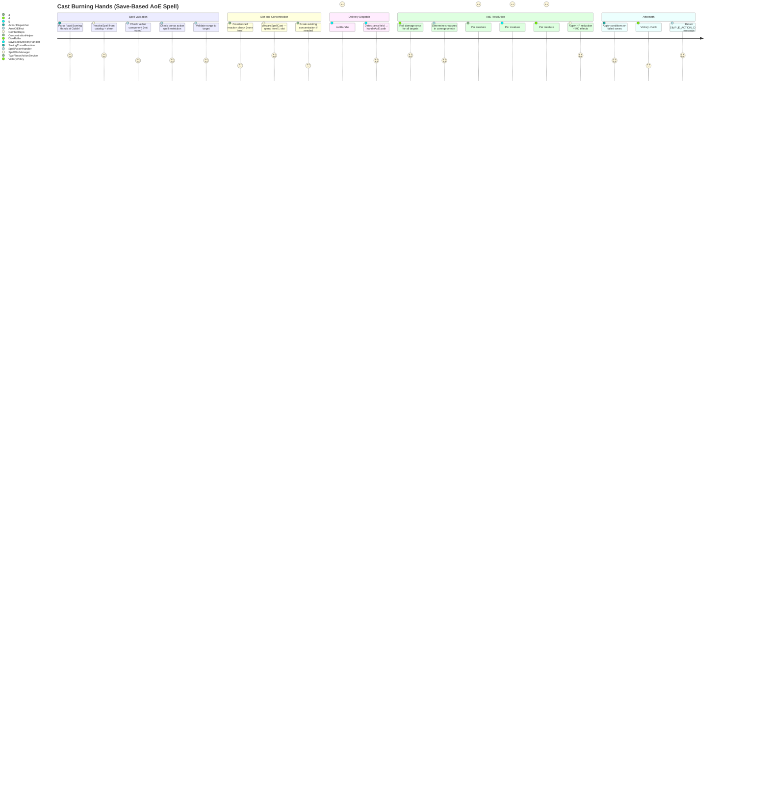

# SpellSystem — Architecture Flow

> **Owner SME**: SpellSystem-SME
> **Last updated**: 2026-04-12
> **Scope**: Spell CASTING pipeline — text parse -> spell lookup -> slot validation -> concentration management -> strategy-pattern delivery (6 handlers, including Dispel Magic) -> effect application. Spell entity definitions live in SpellCatalog; this flow consumes them.

## Overview

The SpellSystem flow is the application-layer spell casting pipeline that transforms a "cast X at Y" command into mechanical state changes (damage, healing, conditions, zones, buffs). It is centered on `SpellActionHandler`, a thin facade (~436 lines) that validates the cast (components, range, bonus-action restrictions, Counterspell reactions), spends the spell slot via `SpellSlotManager`, manages concentration via `ConcentrationHelper`, and then dispatches to one of 5 `SpellDeliveryHandler` strategy implementations. Auto-hit spells (Magic Missile) use an inline fallback path. The domain layer provides pure computation (`spell-casting.ts` for save DC/attack bonus, `concentration.ts` for the state machine), while all I/O-bearing orchestration lives in the application layer.

## UML Class Diagram

```mermaid
classDiagram
    direction TB

    class SpellActionHandler {
        -deliveryHandlers: SpellDeliveryHandler[]
        -savingThrowResolver: SavingThrowResolver
        +handleCastSpell(sessionId, encounterId, actorId, castInfo, characters, roster) ActionParseResult
        -resolveEncounterContext(sessionId, actorId)
    }

    class SpellDeliveryHandler {
        <<interface>>
        +canHandle(spell: PreparedSpellDefinition) boolean
        +handle(ctx: SpellCastingContext) ActionParseResult
    }

    class SpellAttackDeliveryHandler {
        +canHandle(spell) boolean
        +handle(ctx) ActionParseResult
    }
    class HealingSpellDeliveryHandler {
        +canHandle(spell) boolean
        +handle(ctx) ActionParseResult
        -handleAoE(ctx) ActionParseResult
    }
    class SaveSpellDeliveryHandler {
        +canHandle(spell) boolean
        +handle(ctx) ActionParseResult
        -handleSingleTarget(ctx) ActionParseResult
        -handleAoE(ctx) ActionParseResult
    }
    class ZoneSpellDeliveryHandler {
        +canHandle(spell) boolean
        +handle(ctx) ActionParseResult
    }
    class BuffDebuffSpellDeliveryHandler {
        +canHandle(spell) boolean
        +handle(ctx) ActionParseResult
    }

    class SpellCastingContext {
        +sessionId: string
        +encounterId: string
        +actorId: string
        +castInfo: CastInfo
        +spellMatch: PreparedSpellDefinition
        +spellLevel: number
        +castAtLevel: number
        +isConcentration: boolean
        +sheet: CharacterSheet
        +encounter: CombatEncounterRecord
        +combatants: CombatantStateRecord[]
        +actorCombatant: CombatantStateRecord
    }
    class SpellDeliveryDeps {
        +deps: TabletopCombatServiceDeps
        +eventEmitter: TabletopEventEmitter
        +debugLogsEnabled: boolean
        +savingThrowResolver: SavingThrowResolver
    }

    class SavingThrowResolver {
        +buildPendingAction(params) SavingThrowPendingAction
        +resolve(action, encounterId, characters, monsters, npcs) SavingThrowResolution
        +buildResult(action, resolution, opts?) SavingThrowAutoResult
    }

    class SpellSlotManager {
        <<module>>
        +resolveSpell(name, sheet) PreparedSpellDefinition
        +findPreparedSpellInSheet(sheet, name) PreparedSpellDefinition
        +validateUpcast(spellLevel, castAtLevel, isCantrip) void
        +prepareSpellCast(combatantId, encounterId, ...) void
    }

    class ConcentrationHelper {
        <<module>>
        +getConcentrationSpellName(resources) string
        +breakConcentration(combatant, encounterId, combatRepo) ConcentrationBreakResult
        +computeConSaveModifier(conScore, profBonus, saveProficiencies) number
    }

    class SpellCasting {
        <<module domain>>
        +computeSpellSaveDC(sheet) number
        +computeSpellAttackBonus(sheet) number
        +getSpellcastingModifier(sheet) number
    }

    class ConcentrationDomain {
        <<module domain>>
        +isConcentrationBreakingCondition(condition) boolean
        +shouldConcentrationEndFromHP(hp) boolean
        +concentrationCheckOnDamage(diceRoller, damage, conSaveMod, mode) ConcentrationCheckResult
        +concentrationSaveRollMode(warCaster) RollMode
    }

    SpellActionHandler --> SpellDeliveryHandler : dispatches via find(canHandle)
    SpellActionHandler --> SpellSlotManager : resolveSpell + prepareSpellCast
    SpellActionHandler --> SavingThrowResolver : creates in constructor
    SpellDeliveryHandler <|.. SpellAttackDeliveryHandler
    SpellDeliveryHandler <|.. HealingSpellDeliveryHandler
    SpellDeliveryHandler <|.. SaveSpellDeliveryHandler
    SpellDeliveryHandler <|.. ZoneSpellDeliveryHandler
    SpellDeliveryHandler <|.. BuffDebuffSpellDeliveryHandler
    SpellAttackDeliveryHandler --> SpellCasting : computeSpellAttackBonus
    SaveSpellDeliveryHandler --> SavingThrowResolver : buildPendingAction + resolve
    SaveSpellDeliveryHandler --> SpellCasting : computeSpellSaveDC
    ZoneSpellDeliveryHandler --> SpellCasting : computeSpellSaveDC
    SpellSlotManager --> ConcentrationHelper : breakConcentration
    ConcentrationHelper --> ConcentrationDomain : isConcentrationBreakingCondition
    SpellActionHandler ..> SpellCastingContext : builds and passes to handlers
    SpellAttackDeliveryHandler ..> SpellDeliveryDeps : injected
    SaveSpellDeliveryHandler ..> SpellDeliveryDeps : injected
    HealingSpellDeliveryHandler ..> SpellDeliveryDeps : injected
    ZoneSpellDeliveryHandler ..> SpellDeliveryDeps : injected
    BuffDebuffSpellDeliveryHandler ..> SpellDeliveryDeps : injected
```

## Data Flow Diagram

## User Journey: Cast a Save-Based AoE Spell (Burning Hands)

## File Responsibility Matrix

### Facade + Delivery Handlers (`tabletop/` + `tabletop/spell-delivery/`)

| File | Lines (approx) | Layer | Responsibility |
|------|----------------|-------|---------------|
| `spell-action-handler.ts` | ~436 | application | Thin facade: validates cast (components, range, bonus-action restriction), triggers Counterspell reaction check, calls `prepareSpellCast()`, dispatches to delivery handler, inline Magic Missile auto-hit fallback |
| `spell-delivery/spell-delivery-handler.ts` | ~65 | application | `SpellDeliveryHandler` interface + `SpellCastingContext` + `SpellDeliveryDeps` type definitions |
| `spell-delivery/spell-attack-delivery-handler.ts` | ~127 | application | Attack-roll spells (Fire Bolt, Guiding Bolt, Inflict Wounds). Multi-attack beams (Eldritch Blast, Scorching Ray) via `spellStrike`/`spellStrikeTotal`. Returns `REQUEST_ROLL` (d20 required). |
| `spell-delivery/healing-spell-delivery-handler.ts` | ~359 | application | Healing spells (Cure Wounds, Healing Word). Handles single-target + AoE mass healing. Revives from 0 HP (remove Unconscious, reset death saves). Chill Touch prevent-healing check. |
| `spell-delivery/save-spell-delivery-handler.ts` | ~724 | application | Save-based spells — the **largest** delivery handler. Single-target path + AoE path. Damage defenses, cover bonus on DEX saves, Evasion, half-damage-on-save, turn-end save tracking (Hold Person), Thunderwave push, Faerie Fire effects on fail. |
| `spell-delivery/zone-spell-delivery-handler.ts` | ~174 | application | Zone spells (Spirit Guardians, Spike Growth, Web). Creates persistent `CombatZone` on the map. Supports aura (moves with caster) and placed zones. |
| `spell-delivery/buff-debuff-spell-delivery-handler.ts` | ~190 | application | Buff/debuff spells (Bless, Shield of Faith, Heroism, Faerie Fire). Resolves `appliesTo` targets (self/target/allies/enemies), creates `ActiveEffect` instances on combatant resources. |
| `spell-delivery/index.ts` | ~16 | application | Barrel file re-exporting all delivery handler types and classes |

### Shared Helpers (`helpers/`)

| File | Lines (approx) | Layer | Responsibility |
|------|----------------|-------|---------------|
| `helpers/spell-slot-manager.ts` | ~300 | application | `resolveSpell()` (catalog-first, sheet-merge), `findPreparedSpellInSheet()`, `validateUpcast()`, `prepareSpellCast()` (slot spend + concentration management). Shared by both tabletop and AI paths. Supports standard slots, Pact Magic, and legacy `spellSlots` object format. |
| `helpers/concentration-helper.ts` | ~140 | application | `breakConcentration()` — removes `concentrationSpellName`, strips `duration: 'concentration'` ActiveEffects from all combatants, removes concentration zones from map. `getConcentrationSpellName()`, `computeConSaveModifier()`. |

### Saving Throw Resolution (`rolls/`)

| File | Lines (approx) | Layer | Responsibility |
|------|----------------|-------|---------------|
| `rolls/saving-throw-resolver.ts` | ~505 | application | Full saving throw pipeline: ability modifier + proficiency + effect bonuses (Bless dice) + exhaustion penalty + cover bonus + Paladin Aura of Protection + species advantages + Brutal Strike Staggering Blow. Applies conditions/forced movement on failure. Detects Evasion. |

### Domain Rules

| File | Lines (approx) | Layer | Responsibility |
|------|----------------|-------|---------------|
| `domain/rules/concentration.ts` | ~90 | domain | Pure state machine: `ConcentrationState`, `concentrationCheckOnDamage()` (DC = max(10, ⌊dmg/2⌋)), `isConcentrationBreakingCondition()`, `concentrationSaveRollMode()` (War Caster advantage) |
| `domain/rules/spell-casting.ts` | ~65 | domain | Pure computation: `computeSpellSaveDC()` (8 + prof + mod), `computeSpellAttackBonus()` (prof + mod), `getSpellcastingModifier()`. Falls back to stat block values if explicitly set. |

### Entity Lookup

| File | Lines (approx) | Layer | Responsibility |
|------|----------------|-------|---------------|
| `services/entities/spell-lookup-service.ts` | ~50 | application | Read-only spell definition lookup: canonical catalog first → `ISpellRepository` (Prisma) fallback. Used for spell metadata outside the casting pipeline. |

## Key Types & Interfaces

| Type | File | Purpose |
|------|------|---------|
| `SpellDeliveryHandler` | `spell-delivery-handler.ts` | Strategy interface: `canHandle(spell)` + `handle(ctx)` |
| `SpellCastingContext` | `spell-delivery-handler.ts` | All resolved cast data passed to handlers: actorId, spell def, encounter state (post-slot-spend), sheet, roster |
| `SpellDeliveryDeps` | `spell-delivery-handler.ts` | Shared handler dependencies: `TabletopCombatServiceDeps`, `TabletopEventEmitter`, `SavingThrowResolver` |
| `PreparedSpellDefinition` | `domain/entities/spells/prepared-spell-definition.ts` | Spell mechanical data: level, damage, healing, effects, attackType, saveAbility, zone, area, multiAttack, autoHit, concentration |
| `SavingThrowPendingAction` | `tabletop-types.ts` | Pending action for save resolution: actorId, ability, dc, onSuccess/onFailure outcomes |
| `SavingThrowResolution` | `saving-throw-resolver.ts` | Detailed save result: success, rawRoll, modifier, total, conditionsApplied, hasEvasion, coverBonus |
| `ConcentrationState` | `domain/rules/concentration.ts` | Pure state machine: `activeSpellId: string \| null` |
| `ConcentrationCheckResult` | `domain/rules/concentration.ts` | Result of `concentrationCheckOnDamage()`: dc, check (D20TestResult), maintained (boolean) |
| `ConcentrationBreakResult` | `helpers/concentration-helper.ts` | Return from `breakConcentration()`: spellName + casterId for logging |
| `ActionParseResult` | `tabletop-types.ts` | Union return type from all delivery handlers: `SIMPLE_ACTION_COMPLETE`, `REQUEST_ROLL`, `REACTION_CHECK` |

## Cross-Flow Dependencies

| This flow depends on | For |
|----------------------|-----|
| **SpellCatalog** | `PreparedSpellDefinition` entity, `getCanonicalSpell()` catalog lookup, cantrip scaling, upcast scaling, multi-attack counts |
| **CombatRules** | `DiceRoller` for all rolls, `applyDamageDefenses()` for resistance/immunity/vulnerability, `applyEvasion()` for Rogue/Monk DEX saves, `calculateDistance()` for range validation |
| **CombatMap** | `getCoverLevel()` / `getCoverSaveBonus()` for DEX save cover bonuses, `getCreaturesInArea()` / `computeDirection()` for AoE targeting, `addZone()` for zone spell map mutation |
| **ActionEconomy** | `normalizeResources()` / `patchResources()` for `actionSpellCastThisTurn` / `bonusActionSpellCastThisTurn` tracking, `bonusActionUsed` flag |
| **ReactionSystem** | `TwoPhaseActionService.initiateSpellCast()` for Counterspell opportunity windows before spell resolution |
| **CombatOrchestration** | `ActionService.castSpell()` to mark the action as spent, `RollStateMachine` for multi-attack spell beam chaining (spellStrike/spellStrikeTotal) |
| **EntityManagement** | `ICombatRepository` for all combatant state reads/writes, encounter data, pending action management |

| Depends on this flow | For |
|----------------------|-----|
| **AIBehavior** | `prepareSpellCast()` from SpellSlotManager for AI spell slot spending + concentration management |
| **CombatOrchestration** | `SpellActionHandler.handleCastSpell()` called by `ActionDispatcher` when text matches `castSpell` parser |
| **ReactionSystem** | `SpellReactionHandler` triggers Counterspell via `initiateSpellCast()` result consumed by SpellActionHandler |

## Known Gotchas & Edge Cases

1. **Delivery handler priority order matters** — `SpellActionHandler` dispatches to the **first** handler where `canHandle()` returns true. A spell with both `saveAbility` and `effects[]` will match `SaveSpellDeliveryHandler` before `BuffDebuffSpellDeliveryHandler` because save is checked first. The order is: attack → healing → save → zone → buff/debuff. If a spell has `saveAbility` AND `effects[]`, the save handler applies effects on failed save itself (Faerie Fire pattern), the buff/debuff handler never sees it.

2. **Slot consumed even if Counterspelled** — When Counterspell reactions are available, `prepareSpellCast()` is called *before* the reaction resolves. The spell slot is spent on cast attempt (D&D 5e 2024 rule). If the spell is Counterspelled, the slot is still consumed. This is intentional but can surprise players.

3. **AoE damage rolled once, saves independent** — `SaveSpellDeliveryHandler.handleAoE()` rolls damage a single time then iterates each creature in the area with independent saving throws. This matches D&D 5e 2024 AoE rules but means a single `DiceRoller.rollDie()` call determines damage for all targets — important for deterministic test reproducibility.

4. **Magic Missile uses an inline fallback, not a delivery handler** — Auto-hit spells (Magic Missile) are handled by an inline code path in `SpellActionHandler` after all 5 delivery handlers fail `canHandle()`. This was the original implementation before the strategy pattern extraction. It checks `autoHit + dartCount` fields on the spell definition. Future auto-hit spells should use this same pattern, not a new handler.

5. **Concentration break cleans up 3 things** — `breakConcentration()` must: (1) remove `concentrationSpellName` from caster resources (+ readied spell if held via concentration), (2) strip all `duration: 'concentration'` ActiveEffects from **every combatant** in the encounter (not just the caster), (3) remove concentration zones from the map. Missing any of these causes stale effects. Each step does its own DB write.

6. **Spell slot resolution has 3 fallback tiers** — `prepareSpellCast()` tries: (1) standard `spellSlot_N` resource pool, (2) Warlock `pactMagic` pool (validates pact slot level ≥ spell level), (3) legacy `spellSlots` object format (`{ "3": 2 }`) used by some monster/NPC stat blocks. All three paths converge to the same concentration management code.

7. **Healing at 0 HP triggers revival** — `HealingSpellDeliveryHandler` checks if target was at 0 HP: if so, it must remove the Unconscious condition and reset death saves *before* applying healing. The `updatePatch` is batched into a single combatant state update.

8. **Bonus action spell restriction is bidirectional** — D&D 5e 2024: If a leveled bonus action spell (Healing Word) was cast, only cantrips are allowed as action spells that turn, AND vice versa. Tracked via `actionSpellCastThisTurn` / `bonusActionSpellCastThisTurn` resource flags, checked before slot spending.

9. **SavingThrowResolver is far richer than it appears** — It handles proficiency, ActiveEffect bonuses (Bless dice rolls), exhaustion d20 penalty, DEX save cover bonus, Paladin Aura of Protection (range-checked), species save advantages (Halfling vs Frightened), Brutal Strike Staggering Blow disadvantage, Danger Sense negation when Blinded/Deafened, and Evasion detection. Any new save modifier source must be added here.

10. **Turn-end save tracking** — Spells like Hold Person that impose conditions with repeated saves use `spellMatch.turnEndSave` to attach a tracking `ActiveEffect` with `saveToEnd` metadata. This effect is checked by the turn-processing system to prompt saves at end of the target's turn. If concentration breaks, the tracking effect is cleaned up with all other concentration effects.

## Testing Patterns

- **Unit tests**: `spell-slot-manager.test.ts` tests `findPreparedSpellInSheet()`, `resolveSpell()`, `validateUpcast()`, and `prepareSpellCast()` with in-memory combat repo stubs. `spell-casting.test.ts` tests the pure domain DC/attack bonus computation. `buff-debuff-spell-delivery-handler.test.ts` tests Bless/Shield of Faith effect application.
- **Integration tests**: `spell-action-handler.test.ts` exercises `handleCastSpell()` end-to-end via `buildApp()` + `app.inject()` with seeded dice rollers and in-memory repos. Tests save spells, healing, attack spells, slot management, and concentration.
- **E2E scenarios**: 12 wizard scenarios in `scripts/test-harness/scenarios/wizard/` covering the full casting pipeline:
  - `cast.json` — Magic Missile auto-hit + Fire Bolt spell attack
  - `spell-attacks.json` — spell attack roll resolution
  - `spell-slots.json` — slot consumption and exhaustion
  - `aoe-burning-hands.json` — AoE save-based delivery
  - `concentration.json` — concentration tracking + replacement
  - `upcast-spell.json` — upcasting validation and bonus dice
  - `cantrip-scaling.json` — cantrip damage dice by character level
  - `hold-person-repeat-save.json` — turn-end save tracking
  - `scorching-ray-multi-attack.json` — multi-attack beam chaining
  - `counterspell.json` — Counterspell reaction flow integration
  - `shield-reaction.json` — Shield spell reaction (ReactionSystem cross-flow)
  - `absorb-elements.json` — Absorb Elements damage reaction
- **Cleric healing scenarios**: `scenarios/cleric/cure-wounds.json` tests `HealingSpellDeliveryHandler`
- **Domain tests**: `concentration.ts` is tested via `spell-casting.test.ts`; `spell-slots.test.ts` and `spell-preparation.test.ts` test Prisma-adjacent slot logic
- **Key test file(s)**: `spell-action-handler.test.ts`, `spell-slot-manager.test.ts`, `buff-debuff-spell-delivery-handler.test.ts`, `spell-casting.test.ts`
