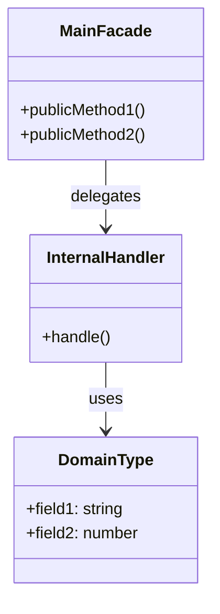
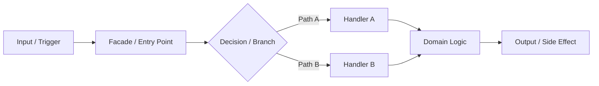
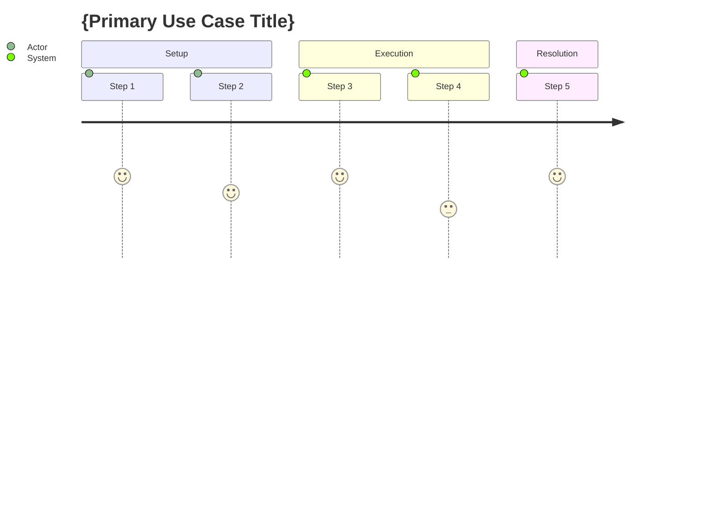

# {Flow Name} — Architecture Flow

> **Owner SME**: {SME-Name}-SME
> **Last updated**: {date}
> **Scope**: {brief 1-line scope description}

## Overview

{2-3 sentence description of what this flow does, WHY it exists, and where it sits in the DDD layer stack.}

## UML Class Diagram

## Data Flow Diagram

## User Journey: {Primary Use Case}

## File Responsibility Matrix

| File | Lines (approx) | Layer | Responsibility |
|------|----------------|-------|---------------|
| `file1.ts` | ~NNN | domain/app/infra | Brief responsibility |
| `file2.ts` | ~NNN | domain/app/infra | Brief responsibility |

## Key Types & Interfaces

| Type | File | Purpose |
|------|------|---------|
| `TypeName` | `file.ts` | Brief purpose |

## Cross-Flow Dependencies

| This flow depends on | For |
|----------------------|-----|
| {OtherFlow} | {what it provides} |

| Depends on this flow | For |
|----------------------|-----|
| {OtherFlow} | {what it consumes} |

## Known Gotchas & Edge Cases

1. **{Gotcha title}** — {Explanation of the non-obvious behavior and why it exists.}
2. **{Gotcha title}** — {Explanation.}

## Testing Patterns

- **Unit tests**: {How this flow is unit tested — in-memory repos, stubs, etc.}
- **E2E scenarios**: {Which test-harness scenarios exercise this flow}
- **Key test file(s)**: `path/to/test.ts`
