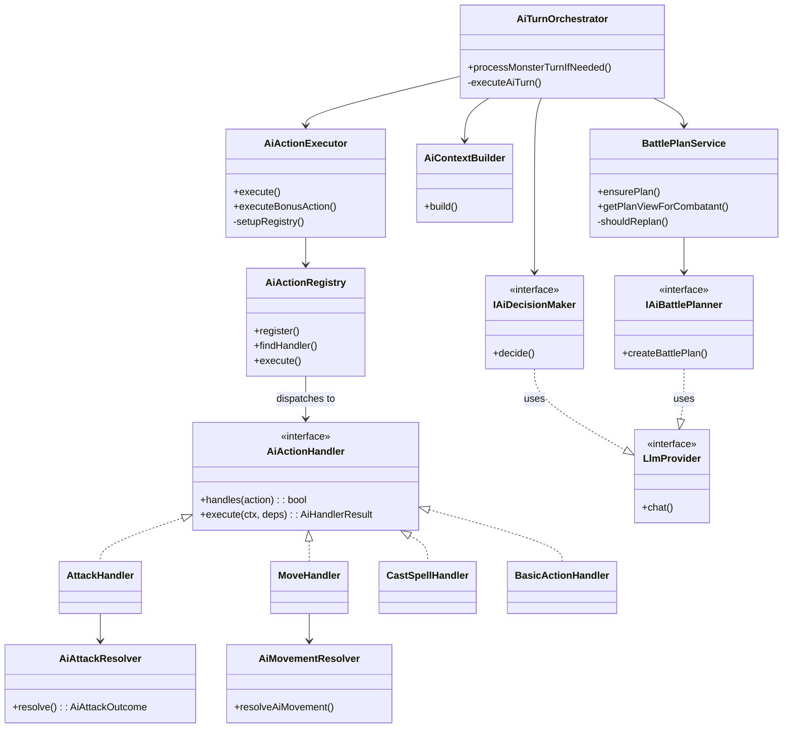

# AIBehavior Flow

## Purpose
AI-controlled combatant behavior and LLM integration. The AI system makes tactical decisions for monsters, NPCs, and AI-controlled characters. LLM providers handle intent parsing, narration, and AI decision-making. All LLM usage is optional — the system degrades gracefully.

## Architecture



## Key Contracts

| Type | File | Purpose |
|------|------|---------|
| `IAiDecisionMaker` | `ai/ai-types.ts` | Port for LLM-based tactical decisions |
| `IAiBattlePlanner` | `ai/battle-plan-service.ts` | Port for faction-level battle planning |
| `AiDecision` | `ai/ai-types.ts` | Structured decision with `action` union type |
| `AiCombatContext` | `ai/ai-types.ts` | Rich tactical context passed to LLM |
| `AiActionHandler` | `ai/ai-action-handler.ts` | Strategy interface for action execution |
| `AiActionHandlerContext` | `ai/ai-action-handler.ts` | Per-call runtime data (session, combatant, decision) |
| `AiActionHandlerDeps` | `ai/ai-action-handler.ts` | Injected services + bound helper methods |
| `LlmProvider` | `infrastructure/llm/types.ts` | Unified chat adapter for Ollama/OpenAI/GitHub Models |
| `IIntentParser` | `infrastructure/llm/intent-parser.ts` | Natural language → structured action |
| `INarrativeGenerator` | `infrastructure/llm/narrative-generator.ts` | Events → prose narration |

## Turn Orchestration Flow

`AiTurnOrchestrator.executeAiTurn()` runs a multi-step loop for each AI combatant:

1. **Pre-turn checks** — skip if downed (0 HP monsters die, characters get death save pending actions), stunned, incapacitated, or paralyzed. Check `isAIControlled()` via FactionService.
2. **Deferred bonus action** — if `resources.pendingBonusAction` is set (stashed when attack was paused by a reaction), execute it and end turn immediately.
3. **Build context** — `AiContextBuilder.build()` hydrates entity data, distances, battlefield, zones, economy, battle plan.
4. **Decide** — call `IAiDecisionMaker.decide()`. If null (LLM failure), break loop.
5. **Execute** — `AiActionExecutor.execute()` enforces action economy, delegates to `AiActionRegistry`.
6. **Record** — append to `actionHistory` (summaries) and `turnResults` for the next context build.
7. **Failure tracking** — 2 consecutive failures (`maxConsecutiveFailures`) → end turn. Resets on any success.
8. **Player-input pause** — if `result.data.awaitingPlayerInput` is true (e.g., player OA roll), return `false` immediately. Do NOT call `nextTurn()`.
9. **Loop gate** — if `decision.endTurn !== false`, break. If `iterations >= 5` (`maxIterations`), break.
10. **Advance** — `combatService.nextTurn()` after loop exits normally.

**Key invariant**: the loop refreshes `allCombatants` and `currentAiCombatant` from the repo after each action so handlers always see fresh HP/position/conditions.

## AI Action Handler Registry

Strategy pattern: each action type has a dedicated handler implementing `AiActionHandler`. Handlers are registered in `AiActionExecutor.setupRegistry()` and looked up via `AiActionRegistry.findHandler(action)` — first match wins (linear scan in registration order).

### Handler interface
```typescript
interface AiActionHandler {
  handles(action: string): boolean;  // usually simple equality
  execute(ctx: AiActionHandlerContext, deps: AiActionHandlerDeps): Promise<AiHandlerResult>;
}
```

### Registered handlers (15 total, in `ai/handlers/`)

| Handler | File | `handles()` values | Purpose |
|---------|------|-------------------|---------|
| `AttackHandler` | `attack-handler.ts` | `attack` | Two-phase attack via `AiAttackResolver`, bonus action after |
| `MoveHandler` | `move-handler.ts` | `move` | Move to explicit `{x,y}` coordinates via `resolveAiMovement` |
| `MoveTowardHandler` | `move-toward-handler.ts` | `moveToward` | A* pathfind toward named target to `desiredRange` |
| `MoveAwayFromHandler` | `move-away-from-handler.ts` | `moveAwayFrom` | Dijkstra flood-fill retreat via `findRetreatPosition()` |
| `BasicActionHandler` | `basic-action-handler.ts` | `disengage`, `dash`, `dodge` | Delegates to `actionService` methods |
| `UseFeatureHandler` | `use-feature-handler.ts` | `useFeature` | Executes class abilities and features |
| `HelpHandler` | `help-handler.ts` | `help` | Help action on named target |
| `CastSpellHandler` | `cast-spell-handler.ts` | `castSpell` | Spell slot validation + `actionService.castSpell()` |
| `ShoveHandler` | `shove-handler.ts` | `shove` | Shove attack on named target |
| `GrappleHandler` | `grapple-handler.ts` | `grapple` | Grapple attempt on named target |
| `EscapeGrappleHandler` | `escape-grapple-handler.ts` | `escapeGrapple` | Break free from grapple |
| `HideHandler` | `hide-handler.ts` | `hide` | Hide action via `actionService` |
| `SearchHandler` | `search-handler.ts` | `search` | Search action via `actionService` |
| `UseObjectHandler` | `use-object-handler.ts` | `useObject` | Use potion/item from inventory |
| `EndTurnHandler` | `end-turn-handler.ts` | `endTurn` | Explicit turn end, optional bonus action |

### Handler conventions
- **Never throw.** Return `{ ok: false, summary, data: { reason } }` on failure.
- **Bonus actions**: handlers that spend the main action call `deps.executeBonusAction()` after their core logic, appending the bonus result to the summary.
- **Name resolution**: use `deps.findCombatantByName(name, allCombatants)` (fuzzy match) to resolve `decision.target` to a `CombatantStateRecord`.
- **Movement deps**: call `deps.getMovementDeps()` to get the bundle for `resolveAiMovement()`.
- **Actor ref**: `ctx.actorRef` is pre-built; for targets use `deps.toCombatantRef(target)`.

## AiAttackResolver Conventions

`AiAttackResolver.resolve()` implements the full two-phase attack pipeline for AI combatants. The caller (`AttackHandler`) handles bonus actions and `TurnStepResult` construction.

### Flow
1. **Lookup attack** — find `attackName` in monster stat block `monsterAttacks[]`. Returns `not_applicable` if not found (fallback to `actionService.attack()`).
2. **ActiveEffect integration** — read attacker/target effects for advantage/disadvantage on attack rolls. Check melee vs ranged kind.
3. **Condition-derived roll mode** — `deriveRollModeFromConditions()` merges condition + effect adv/disadv.
4. **Roll d20** — uses `DiceRoller` with advantage/disadvantage. Check `d20 === 20` for critical.
5. **Effect attack bonus** — `calculateBonusFromEffects()` for Bless, etc. Rolled dice included.
6. **Target AC** — `combatantResolver.getCombatStats()` + `calculateFlatBonusFromEffects()` for Shield-like AC boosts.
7. **Initiate attack** — `twoPhaseActions.initiateAttack()` checks for Shield/Deflect Attacks/damage reactions.
8. **Rage tracking** — if attacker is raging, set `rageAttackedThisTurn = true` (any roll, hit or miss).
9. **Damage resolution (on hit)** — roll damage dice (doubled on crit), add effect damage (Rage, Hunter's Mark), apply `applyDamageDefenses()` (resistance/immunity/vulnerability from stat block + ActiveEffects).
10. **KO + retaliatory** — `applyKoEffectsIfNeeded()`, `applyDamageWhileUnconscious()`, then detect and handle `damageReactions` (Hellish Rebuke, etc.).
11. **Spend action** — `spendAction()` updates `resources.actionSpent`.

### Outcome types
`not_applicable` | `miss` | `awaiting_reactions` (player Shield pending) | `hit` | `awaiting_damage_reaction` (Absorb Elements pending)

## AiMovementResolver Pipeline

`resolveAiMovement()` (exported function, not a class) is the shared two-phase movement pipeline used by `MoveHandler`, `MoveTowardHandler`, and `MoveAwayFromHandler`.

### Steps
1. **Initiate move** — `twoPhaseActions.initiateMove()` with destination, pathCells, pathCostFeet.
2. **Aborted by trigger** — voluntary move triggers (Booming Blade) return `aborted_by_trigger`.
3. **No reactions** — update position, `syncEntityPosition()`, `syncAuraZones()`, resolve zone damage via `resolveZoneDamageForPath()`.
4. **OA resolution** — for each opportunity attacker: AI combatants auto-decide via `aiDecideReaction()`; Character combatants marked as `player_prompted`.
5. **Player OA pending** — if any player OAs need input, set `combat.setPendingAction()` and return `player_oa_pending`. The orchestrator pauses (returns `false`).
6. **Complete move** — `twoPhaseActions.completeMove()` after all reactions resolved.

**Critical**: `syncEntityPosition` and `syncAuraZones` must both be called after position updates — the first updates the map entity, the second re-centers aura zones on the entity's new position.

**`moveAwayFrom`** uses `getReachableCells()` (Dijkstra flood-fill) to find retreat positions. Do NOT replace with Euclidean distance — that allows picking unreachable cells behind walls.

## Context Builder Patterns

`AiContextBuilder.build()` assembles `AiCombatContext` for the LLM:

1. **Entity hydration** — loads full entity data (Character/Monster/NPC) from repos. Extracts `className`, `level`, `armorClass`, `speed`, `size`, `abilityScores`, `spellSaveDC`, `spellAttackBonus`.
2. **Creature abilities** — `listCreatureAbilities()` and `getClassAbilities()` produce `classAbilities[]` with economy info.
3. **Distance injection** — `calculateDistance()` from AI combatant position to each ally/enemy. Set as `distanceFeet` on each entry.
4. **Conditions & buffs** — `readConditionNames()` for conditions array, `getActiveBuffs()` for combined boolean flags + ActiveEffect sources.
5. **Resource pools** — `getResourcePools()` extracts ki, spell slots, rage, etc. as `{ name, current, max }[]`.
6. **Damage defenses** — `extractDamageDefenses()` from entity stat block for resistances/immunities/vulnerabilities.
7. **Concentration** — `getConcentrationSpell()` reads `concentrationSpellName` from resources.
8. **Death saves** — `getDeathSaves()` included for dying allies/enemies (triage decisions).
9. **Battlefield rendering** — `renderBattlefield()` produces ASCII grid + legend. Stripped from JSON payload (rendered as formatted section instead).
10. **Zone context** — `getMapZones()` provides active zone data (Spirit Guardians, Spike Growth, etc.).
11. **Potion detection** — `getInventory()` + `lookupMagicItem()` scans for healing potions; sets `hasPotions` flag. `useObject` action is only offered when creature has potions AND HP < 50%.
12. **Inventory enrichment** — equipped melee/ranged weapons listed for attack selection.
13. **Action history** — previous step summaries + results included so LLM sees feedback from its own actions.

## System Prompt Engineering Conventions

`LlmAiDecisionMaker.buildSystemPrompt()` constructs the system message. `PromptBuilder` provides section-based assembly.

### PromptBuilder usage
```typescript
new PromptBuilder('v1')
  .addSection('system', systemPromptText)        // → role: "system"
  .addSectionIf(!!bf, 'battlefield', bfContent)  // → role: "user" (conditional)
  .addSectionIf(!!bp, 'battle-plan', bpContent)
  .addSectionIf(hasNarrative, 'narrative', narrativeText)
  .addSection('combat-state', jsonContext)         // → role: "user"
  .buildAsMessages();  // [{role:"system",...}, {role:"user",...}]
```

- Section named `"system"` → system message. All others → joined as user message.
- `addSectionIf(condition, name, content)` — JS evaluates `content` eagerly, so guard nulls in the calling code before passing.
- Version string (`'v1'`) enables snapshot versioning for prompt regression tests.

### System prompt structure (key sections)
1. **COMBATANT IDENTITY** — name + type
2. **PERSONALITY & TACTICS** — use bonusActions, consider enemy knownAbilities
3. **CONDITIONS** — trust structured `conditions[]` over narrative text (critical rule)
4. **RESOURCES** — check `resourcePools[].current > 0` before using abilities
5. **CONCENTRATION** — casting new concentration spell drops current one
6. **ZONES** — avoid damaging zones, per_5ft_moved zones are especially costly
7. **DEFENSES** — prefer vulnerable targets, avoid immune/resistant damage types
8. **DISTANCES** — use pre-computed `distanceFeet`, do NOT calculate from grid coords
9. **D&D RULES** — action economy summary (action, bonus action, reaction, movement)
10. **AVAILABLE ACTIONS** — JSON schema for each action type

### Extending the system prompt for a new action type
1. Add the action to the `AiDecision.action` union in `ai-types.ts`
2. Add JSON schema description in `buildSystemPrompt()` → AVAILABLE ACTIONS section
3. Add conditional gating if the action should only appear when eligible (like `useObject` requires potions)
4. Update prompt snapshots: `pnpm -C packages/game-server test:llm:e2e:snapshot-update`

### Response format
LLM returns a single JSON object matching `AiDecision`. `extractFirstJsonObject()` parses it. On parse failure, one retry with "reply with ONLY a single JSON object" instruction.

## Mock Provider Conventions

All mocks live in `infrastructure/llm/mocks/index.ts`. Used by deterministic tests — no real LLM calls.

### MockAiDecisionMaker
- **Queue API**: `queueDecision(decision)` → FIFO queue. Takes priority over default behavior.
- **Default behaviors**: `setDefaultBehavior("attack" | "endTurn" | "flee" | "castSpell" | "approach" | "grapple" | "escapeGrapple" | "hide" | "usePotion")` — used when queue is empty. Default: `"attack"`.
- **Smart Prone handling** — if combatant has Prone condition and movement not spent, auto-inserts a `move` to current position (stand up) before the main action.
- **Context spy**: `capturedContexts` array records every `decide()` call. Use `getLastContext()` in test assertions. Call `clearCapturedContexts()` between test scenarios.
- **Bonus action**: `setDefaultBonusAction(name)` — attached to attack decisions.
- **Seed field**: fixed `seed` values in mock decisions control `DiceRoller` outcomes (e.g., `seed: 42` → d20=13).

### MockIntentParser
- Pattern-matching parser using regex. Extracts roster from `schemaHint`.
- `registerOverride(text, intent)` for custom test responses.

### MockNarrativeGenerator
- Template-based: maps event types to canned narrative strings.
- `setNextNarrative(text)` for one-shot custom responses.

### Testing patterns
- E2E scenarios use `MockAiDecisionMaker.queueDecision()` to script exact AI behavior sequences.
- Unit tests use `setDefaultBehavior()` for bulk behavior control.
- Context assertions: check `capturedContexts` for correct distances, conditions, zone data, resource pools, etc.

## End-to-End Guide: Adding a New AI Action

Example: adding a `"rally"` action.

### Step 1: Domain type
Add `"rally"` to the `AiDecision.action` union in `ai/ai-types.ts`.

### Step 2: Create handler
Create `ai/handlers/rally-handler.ts`:
```typescript
import type { AiActionHandler, AiActionHandlerContext, AiActionHandlerDeps, AiHandlerResult } from "../ai-action-handler.js";

export class RallyHandler implements AiActionHandler {
  handles(action: string): boolean { return action === "rally"; }
  async execute(ctx: AiActionHandlerContext, deps: AiActionHandlerDeps): Promise<AiHandlerResult> {
    // Validate, call services, return { action, ok, summary, data }
  }
}
```

### Step 3: Register handler
1. Export from `ai/handlers/index.ts`
2. Import in `ai-action-executor.ts`, add `this.registry.register(new RallyHandler())` in `setupRegistry()`

### Step 4: Update system prompt
In `infrastructure/llm/ai-decision-maker.ts` → `buildSystemPrompt()`, add the action schema to the AVAILABLE ACTIONS list. Add any conditional gating (only show when eligible).

### Step 5: Update mocks
1. Add `"rally"` to `MockAiDecisionMaker.defaultBehavior` union if it should be a default
2. Add case in `MockAiDecisionMaker.decide()` for the new behavior
3. Add `"rally"` to `AiActionRegistry.execute()` error message listing valid actions

### Step 6: Write tests
1. Unit test in `ai-action-executor.test.ts` — queue a rally decision, assert result
2. E2E scenario in `scripts/test-harness/scenarios/` — full combat with rally action
3. Update prompt snapshots: `pnpm -C packages/game-server test:llm:e2e:snapshot-update`

### Step 7: Verify
```bash
pnpm -C packages/game-server typecheck
pnpm -C packages/game-server test
pnpm -C packages/game-server test:e2e:combat:mock
```

## Known Gotchas

1. **LLM is ALWAYS optional** — every code path must handle "LLM not configured" gracefully
2. **AI decisions are advisory** — the rules engine validates and may reject LLM suggestions
3. **Battle plans are faction-scoped** — one plan per faction, re-planned when conditions change significantly
4. **Context building is expensive** — keep tactical context minimal but sufficient for good decisions
5. **Multiple backends** — Ollama (local), OpenAI, GitHub Models. Factory pattern via env vars. Always test with mock provider
6. **SpyLlmProvider** wraps real providers for snapshot testing — prompt format changes require `test:llm:e2e:snapshot-update`
7. **Mock providers** in `infrastructure/llm/mocks/` — used by all deterministic tests, must return structurally valid responses
8. **`moveAwayFrom` uses `getReachableCells` internally** — `MoveAwayFromHandler` calls `findRetreatPosition()` which runs a Dijkstra flood-fill to find cells truly reachable within the speed budget. Do NOT replace this with Euclidean distance — that would allow picking cells behind walls or only reachable via detours that exceed the budget.
9. **Action economy enforcement** — `AiActionExecutor.execute()` checks `actionSpent` BEFORE dispatching to the registry. Handlers should NOT re-check this.
10. **Deferred bonus actions** — when an attack is paused by a reaction (Shield), the bonus action is stashed in `resources.pendingBonusAction` and executed at the start of the next loop iteration.
11. **Condition text vs structured data** — the system prompt explicitly tells the LLM to trust `conditions[]` arrays over narrative text. This prevents the LLM from ending turn due to expired conditions mentioned in narration.
12. **Seed-based dice** — mock decisions with a `seed` field produce deterministic `DiceRoller` outcomes. Document expected rolls in test scenario comments.

## Battle Plan Replan Heuristics

`shouldReplan()` is a **private sync method** — it cannot call async services. Heuristics run on a battlefield snapshot embedded in `BattlePlan` at generation time:

| Snapshot field | Type | Purpose |
|----------------|------|---------|
| `allyHpAtGeneration` | `Record<string, number>` | combatantId → hpCurrent when plan was created |
| `livingAllyIdsAtGeneration` | `string[]` | IDs of living allies at generation |
| `livingEnemyIdsAtGeneration` | `string[]` | IDs of living enemies at generation |

All snapshot fields are **optional** — plans stored before this feature was added silently skip snapshot heuristics and fall back to stale-round check only (backward compat).

### Replan triggers (in order, first match wins):
1. **Stale plan** — `REPLAN_STALE_ROUNDS = 2` rounds since generation
2. **Ally died** — any ally in `livingAllyIdsAtGeneration` now has `hpCurrent ≤ 0`
3. **HP crisis** — any ally lost `> REPLAN_HP_LOSS_THRESHOLD (0.25)` × their max HP
4. **New threat** — a living combatant has an ID unknown at generation (reinforcements)

### Adding a new replan trigger
1. Add the relevant data to `BattlePlan` snapshot fields in `battle-plan-types.ts` (optional for compat)
2. Populate it in `ensurePlan()` AFTER calling `getAllies()` / `getEnemies()`
3. Add a sync heuristic check in `shouldReplan()` with a named constant threshold
4. Add vitest tests in `battle-plan-service.test.ts` — cover both the trigger and the non-trigger case

