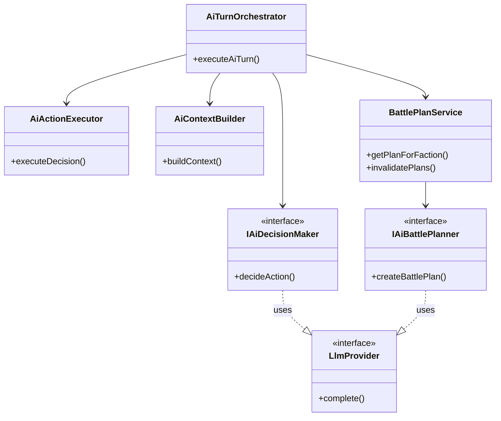

# AIBehavior Flow

## Purpose
AI-controlled combatant behavior and LLM integration. The AI system makes tactical decisions for monsters, NPCs, and AI-controlled characters. LLM providers handle intent parsing, narration, and AI decision-making. All LLM usage is optional — the system degrades gracefully.

## Architecture

## Key Contracts

| Type | File | Purpose |
|------|------|---------|
| `IAiDecisionMaker` | `ai/ai-types.ts` | Port for LLM-based tactical decisions |
| `IAiBattlePlanner` | `ai/battle-plan-types.ts` | Port for faction-level battle planning |
| `AiDecision` | `ai/ai-types.ts` | Structured decision: move, attack, use ability |
| `AiCombatContext` | `ai/ai-types.ts` | Tactical context passed to LLM |
| `LlmProvider` | `infrastructure/llm/types.ts` | Unified adapter for Ollama/OpenAI/GitHub Models |
| `IIntentParser` | `infrastructure/llm/intent-parser.ts` | Natural language → structured action |
| `INarrativeGenerator` | `infrastructure/llm/narrative-generator.ts` | Events → prose narration |

## Known Gotchas

1. **LLM is ALWAYS optional** — every code path must handle "LLM not configured" gracefully
2. **AI decisions are advisory** — the rules engine validates and may reject LLM suggestions
3. **Battle plans are faction-scoped** — one plan per faction, re-planned when conditions change
4. **Context building is expensive** — keep tactical context minimal but sufficient for good decisions
5. **Multiple backends** — Ollama (local), OpenAI, GitHub Models. Factory pattern via env vars. Always test with mock provider
6. **SpyLlmProvider** wraps real providers for snapshot testing — prompt format changes require `test:llm:e2e:snapshot-update`
7. **Mock providers** in `infrastructure/llm/mocks/` — used by all deterministic tests, must return structurally valid responses
