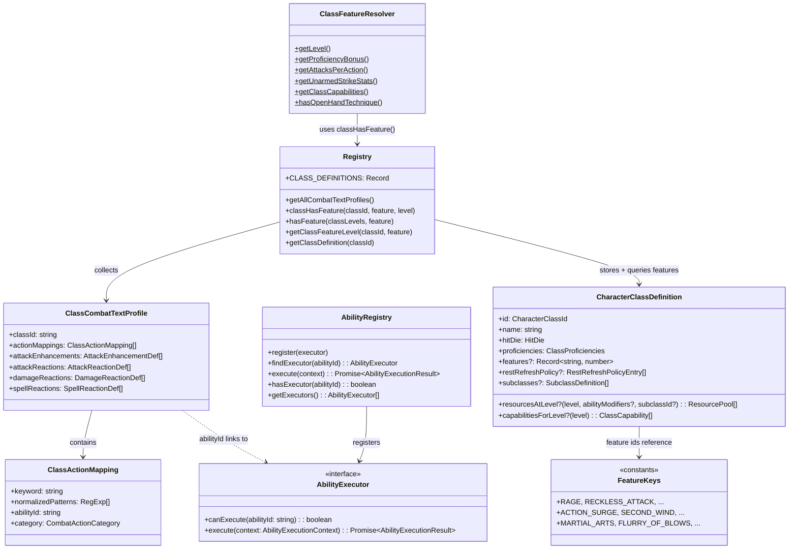

# ClassAbilities Flow

## Purpose
The class ability system: domain-declared class features (profiles, feature maps, resource pools) and application-layer executors that carry them out. Three complementary patterns — ClassCombatTextProfile for detection/matching, Feature Maps for boolean eligibility gates, and AbilityRegistry for execution.

Subclasses are first-class participants in the flow. `SubclassDefinition` can add both feature gates and its own combat text profile, and `getAllCombatTextProfiles()` returns base-class profiles plus subclass profiles.

## Architecture



## Adding a New Class Feature (Checklist)

### If it's a boolean feature gate (e.g., "has Rage", "has Cunning Action"):
1. Add the feature key constant in `feature-keys.ts` (e.g., `export const MY_FEATURE = "my-feature"`)
2. Add entry to the class's `features` map in its domain file (e.g., `barbarian.ts`): `"my-feature": 3` (minimum level)
3. Call `classHasFeature(classId, MY_FEATURE, level)` from application services — **never** add a new `has*()` method to ClassFeatureResolver
4. For subclass-gated features, the features map provides the **level gate** (necessary but not sufficient), and the executor's `canExecute()` guards the subclass requirement

### If it's a text-parsed action (e.g., "flurry of blows"):
1. Add `ClassActionMapping` in the class's domain file (e.g., `monk.ts`)
2. Add to the class's `ClassCombatTextProfile` export
3. If new class → register profile in `registry.ts` → `COMBAT_TEXT_PROFILES`
4. Create executor in `application/services/combat/abilities/executors/{class}/`
5. Register executor in `infrastructure/api/app.ts`

### If it's an attack enhancement (auto-triggers on hit, e.g., Stunning Strike):
1. Add `AttackEnhancementDef` in the class's domain file
2. Add to the class's `ClassCombatTextProfile.attackEnhancements`
3. Create executor if needed

### If it's a reaction (triggered by incoming attack/damage/spell):
1. Choose the correct reaction subtype (see **Reaction Subtypes** below)
2. Add the `*ReactionDef` in the class's domain file
3. Add to the class's `ClassCombatTextProfile` in the matching array (`attackReactions`, `damageReactions`, or `spellReactions`)
4. Wire into the two-phase reaction framework

## Reaction Subtypes (combat-text-profile.ts)

Three reaction categories, each with its own input type, detection function, and trigger timing:

| Subtype | Interface | Input | Trigger | Detection fn | Examples |
|---------|-----------|-------|---------|-------------|----------|
| **Attack** | `AttackReactionDef` | `AttackReactionInput` | Before hit resolves (incoming attack roll) | `detectAttackReactions(input, profiles)` | Shield (+5 AC), Deflect Attacks (reduce damage) |
| **Damage** | `DamageReactionDef` | `DamageReactionInput` | After damage is applied | `detectDamageReactions(input, profiles)` | Absorb Elements (resistance + rider), Hellish Rebuke (retaliatory fire) |
| **Spell** | `SpellReactionDef` | `SpellReactionInput` | When a creature casts a spell | `detectSpellReactions(input, profiles)` | Counterspell (interrupt spell within 60 ft) |

**Key input differences**: `AttackReactionInput` has `attackRoll` + `targetAC`. `DamageReactionInput` has `damageType` + `damageAmount` + `attackerId`. `SpellReactionInput` has `spellName` + `spellLevel` + `casterId` + `distance`.

All detection functions are **pure** — they take `(input, profiles[])` and scan all registered defs, returning an array of `Detected*Reaction` results with `reactionType` + `context` data. Class-gating is done inside each def's `detect()` method (often via resource flags like `hasShieldPrepared` rather than class name checks).

**Current reaction users**: Wizard (Shield, Counterspell, Absorb Elements, plus a declared Silvery Barbs detector that still needs prepared-flag wiring), Warlock (Hellish Rebuke), Bard (Cutting Words), Monk (Deflect Attacks), Fighter (Protection and Interception ally-scan reactions), and Rogue (Uncanny Dodge).

## Resource Lifecycle

### `resourcesAtLevel` as the single declaration path
Use `resourcesAtLevel` as the only class-owned resource declaration hook.
- Combat initialization calls `buildCombatResources()` in `domain/entities/classes/combat-resource-builder.ts`.
- Non-combat default pool setup reuses the same class declarations through `defaultResourcePoolsForClass()` in `domain/rules/class-resources.ts`.
- There is no separate live `resourcePoolFactory` contract in the current code.

The `abilityModifiers` param is a `Record<string, number>` of modifier values (not raw scores). `buildCombatResources()` computes these from `sheet.abilityScores` via `Math.floor((score - 10) / 2)`. Example: Monk's Wholeness of Body uses `abilityModifiers.wisdom`.

### restRefreshPolicy (RestRefreshPolicyEntry[])
Declares how each pool resets on rest. Used by `refreshClassResourcePools()` in `rest.ts`.

| Field | Type | Purpose |
|-------|------|---------|
| `poolKey` | `string` | Pool name to refresh (e.g., `"ki"`, `"rage"`, `"arcaneRecovery"`) |
| `refreshOn` | `"short" \| "long" \| "both" \| (rest, level) => boolean` | When the pool recharges |
| `computeMax` | `(level, abilityModifiers?) => number` | Optional: recompute pool max on refresh |

Three refresh modes: `"short"` (short rest only), `"long"` (long rest only), `"both"` (either). Custom function for level-dependent logic (e.g., Bard's Bardic Inspiration recharges on short rest at level 5+).

Examples: Monk ki → `refreshOn: "both"`, Barbarian rage → `refreshOn: "long"`, Warlock pactMagic → `refreshOn: "both"`.

## buildCombatResources (combat-resource-builder.ts)

Single entry point for initializing all combat resource pools when a character enters combat. Called from `handleInitiativeRoll()` in the roll state machine.

Steps:
1. Looks up `CharacterClassDefinition` → calls `resourcesAtLevel(level, abilityModifiers, subclassId)` for class-specific pools
2. Merges any existing sheet-level resource pools (homebrew)
3. Adds spell slot pools from `sheet.spellSlots`
4. Computes runtime flags such as prepared-spell flags, `hasCuttingWords`, `warCasterEnabled`, `sentinelEnabled`, `hasProtectionStyle`, `hasInterceptionStyle`, `hasShieldEquipped`, and `hasWeaponEquipped`

Returns `CombatResourcesResult` with `resourcePools[]` + prepared-spell boolean flags. The flags drive reaction detection eligibility (reaction defs check these flags, not class identity).

## capabilitiesForLevel (ClassCapability[])

Declared on `CharacterClassDefinition`. Returns the list of combat capabilities at a given level. Consumed by `ClassFeatureResolver.getClassCapabilities()` → tactical view + AI decision-making.

**Required `ClassCapability` fields**:
- `name`: Display name (e.g., "Flurry of Blows")
- `economy`: `"action" | "bonusAction" | "reaction" | "free"`
- `effect`: Human-readable description

**Optional fields for automated resolution**:
- `abilityId`: Stable executor lookup ID (e.g., `"class:monk:flurry-of-blows"`)
- `resourceCost`: `{ pool: string, amount: number }` for automated spending
- `executionIntent`: `{ kind: string, ... }` hint for data-driven ability resolution (consumer narrows on `kind`)
- `cost`: Human-readable cost string (e.g., `"1 ki"`)
- `requires`: Prerequisite description (e.g., `"Attack action on this turn"`)

**Classes with `capabilitiesForLevel`**: All 12 classes now implement `capabilitiesForLevel` (Barbarian, Bard, Cleric, Druid, Fighter, Monk, Paladin, Ranger, Rogue, Sorcerer, Warlock, Wizard).

## Dual-Mode Executor Pattern

Executors that produce attacks support two execution modes, branching on `params?.tabletopMode`:

- **AI mode** (default, `tabletopMode` falsy): Auto-rolls attacks via `services.diceRoller`, returns resolved `AbilityExecutionResult` with damage/hit data.
- **Tabletop mode** (`params.tabletopMode: true`): Builds a `pendingAction` with attack specs (weapon name, attack bonus, damage dice) and returns it in `result.data.pendingAction`. The tabletop service then manages the player-facing dice roll flow.

**Executors using dual-mode**: `FlurryOfBlowsExecutor`, `MartialArtsExecutor`, `OffhandAttackExecutor`. These all produce attack rolls, so they need both paths. Non-attack executors (Rage, Second Wind, Patient Defense, etc.) don't need tabletop mode — they resolve immediately regardless of mode.

Implementation pattern: `execute()` does shared validation, then branches to `executeTabletopMode()` or `executeAiMode()` private methods.

## Executor Helpers (executor-helpers.ts)

Shared validation guards for `execute()` methods. Each returns `AbilityExecutionResult | null` — non-null means failure (early return), null means check passed.

| Helper | Checks | Error code |
|--------|--------|-----------|
| `requireActor(params)` | `params.actor` exists | `MISSING_ACTOR` |
| `requireSheet(params)` | `params.sheet` exists | `MISSING_SHEET` |
| `requireResources(params)` | `params.resources` exists | `MISSING_RESOURCES` |
| `requireClassFeature(params, featureKey, displayName)` | `classHasFeature()` passes | `MISSING_FEATURE` |
| `extractClassInfo(params)` | Returns `{ level, className }` | *(utility, no error)* |

`extractClassInfo` lookup precedence: `params.level`/`className` → `params.sheet.level`/`.className` → `actorRef.getLevel()`/`.getClassId()`. Falls back to `level: 1, className: ""`.

Usage pattern in every executor:
```typescript
const err = requireActor(params); if (err) return err;
const featureErr = requireClassFeature(params, FEATURE_KEY, "Feature Name (requires Class level N+)"); if (featureErr) return featureErr;
```

## ActiveEffect Executor Pattern

For abilities that apply persistent state changes (buffs/debuffs) to a combatant's resources. Used by executors that modify combat state beyond spending a resource pool.

Pattern:
1. Call `createEffect(id, type, target, duration, metadata)` from `domain/entities/combat/effects.ts`
2. Attach effects to resources via `addActiveEffectsToResources(resources, ...effects)` from `helpers/resource-utils.ts`
3. Return `updatedResources` in `result.data` so the combat service persists them

**Executors using ActiveEffect**: `RageExecutor` (5 effects: melee damage bonus, 3× B/P/S resistance, STR save advantage), `RecklessAttackExecutor` (advantage on melee STR attacks + attacks against you have advantage).

Other executors (Second Wind, Flurry of Blows, etc.) spend pools or produce attacks but don't create persistent effects.

Guard against double-activation: check `getActiveEffects(resources).some(e => e.source === "Rage")` before applying.

## Key Contracts

| Type | File | Purpose |
|------|------|---------|
| `CharacterClassDefinition` | `class-definition.ts` | Base class metadata (hit die, proficiencies, capabilities, **features map**, `resourcesAtLevel`, optional subclasses, rest policy) |
| `features` map | Each class file | `Record<string, number>` — feature id → minimum class level for boolean gates |
| `feature-keys.ts` | `feature-keys.ts` | String constants for all standard feature keys (type safety without closed unions) |
| `classHasFeature()` | `registry.ts` | Single-class boolean feature check (normalizes classId to lowercase) |
| `hasFeature()` | `registry.ts` | Multi-class-ready feature check (`Array<{classId, level}>`) |
| `getClassFeatureLevel()` | `registry.ts` | Returns minimum level for a feature on a class |
| `ClassFeatureResolver` | `class-feature-resolver.ts` | **Computed values only** — `getAttacksPerAction`, `getUnarmedStrikeStats`, `getClassCapabilities`, `hasOpenHandTechnique` (subclass guard) |
| `ClassCombatTextProfile` | `combat-text-profile.ts` | Per-class regex→action + enhancement + 3 reaction subtypes |
| `AbilityExecutor` interface | `ability-executor.ts` | `canExecute()` + `execute()` for all ability executors |
| `AbilityRegistry` | `ability-registry.ts` | Central executor registry — queried by abilityId |
| `getAllCombatTextProfiles()` | `registry.ts` | Collects all registered class profiles and appends subclass combat text profiles |
| `buildCombatResources()` | `combat-resource-builder.ts` | Single resource init point for combat entry |
| `executor-helpers.ts` | `executors/executor-helpers.ts` | Shared validation guards (`requireActor`, `requireSheet`, etc.) |

## Per-Class Complexity

| Class | Complexity | Profile | Executors | Reactions | Notes |
|-------|-----------|---------|-----------|-----------|-------|
| **Monk** | Heavy | 6 action mappings, 1 enhancement (Stunning Strike), 1 attack reaction (Deflect Attacks) | 5 (flurry, patient defense, step of the wind, martial arts, wholeness) | Attack | 200+ lines, most complex domain file |
| **Barbarian** | Heavy | 4 action mappings (rage, reckless-attack, brutal-strike, frenzy) | 4 (rage, reckless-attack, brutal-strike, frenzy) | — | Cross-cutting ActiveEffects, rage tracking flags in combat-service |
| **Wizard** | Heavy | 0 action mappings | 0 | Attack (Shield, Silvery Barbs) + Damage (Absorb Elements) + Spell (Counterspell) | Reaction-only profile (4 reactions total) |
| **Fighter** | Moderate | 3 action mappings (action-surge, second-wind, indomitable); 2 attack reactions (Protection, Interception) | 3 (action surge, second wind, indomitable) | Attack | capabilitiesForLevel defined |
| **Paladin** | Moderate | 2 action mappings (lay-on-hands, divine-sense); 1 enhancement (Divine Smite) | 2 (lay-on-hands, channel-divinity) | — | Divine Smite is AttackEnhancementDef, NOT an action mapping |
| **Rogue** | Moderate | 1 action mapping (cunning-action); 1 attack reaction (Uncanny Dodge) | 1 (cunning action) | Attack | capabilitiesForLevel defined |
| **Cleric** | Moderate | 1 action mapping (turn-undead) | 1 (turn undead) | — | capabilitiesForLevel defined |
| **Warlock** | Light | 0 action mappings; 1 damage reaction (Hellish Rebuke) | 0 | Damage | Pact Magic pools |
| **Bard** | Light | 1 action mapping (bardic-inspiration) | 1 (bardic-inspiration) | — | capabilitiesForLevel defined |
| **Sorcerer** | Light | 2 action mappings (quickened-spell, twinned-spell) | 2 (quickened-spell, twinned-spell) | — | capabilitiesForLevel defined |
| **Druid** | Light | 1 action mapping (wild-shape) | 1 (wild-shape) | — | capabilitiesForLevel defined |
| **Ranger** | Skeleton | Empty profile (no mappings) | 0 | — | capabilitiesForLevel defined; class definition only |

## Registered Profiles
All 12 classes registered: Barbarian, Bard, Cleric, Druid, Fighter, Monk, Paladin, Ranger, Rogue, Sorcerer, Warlock, Wizard.

`getAllCombatTextProfiles()` also iterates subclass definitions and appends any `sub.combatTextProfile` — the OpenHand Monk subclass has one (containing the Open Hand Technique attack enhancement). This subclass expansion is in addition to the 12 base class profiles.

## Registered Executors (22 total, registered in AbilityRegistry)
- **barbarian** (4): rage, reckless-attack, brutal-strike, frenzy
- **monk** (5): flurry-of-blows, patient-defense, step-of-the-wind, martial-arts, wholeness-of-body
- **fighter** (3): action-surge, second-wind, indomitable
- **rogue** (1): cunning-action
- **paladin** (2): lay-on-hands, channel-divinity
- **cleric** (1): turn-undead
- **bard** (1): bardic-inspiration
- **druid** (1): wild-shape
- **sorcerer** (2): quickened-spell, twinned-spell
- **monster** (1): nimble-escape
- **common** (1): offhand-attack

Note: Stunning Strike, Deflect Attacks, and Open Hand Technique are handled as attack enhancements/reactions via `ClassCombatTextProfile`, not as AbilityRegistry executors. Divine Smite is an `AttackEnhancementDef` (not an action mapping, not an executor).

## Cross-Cutting Touchpoints

Class abilities reach beyond this flow in several places:
- **combat-service.ts** — Rage tracking flags (`rageAttackedThisTurn`, `rageDamageTakenThisTurn`), reset in `extractActionEconomy()` and `resetTurnResources()`. Rage-end check at START of barbarian's next turn.
- **saving-throw-resolver.ts** — Danger Sense (DEX save advantage) gated by `ActiveEffect` with condition checking (`isDangerSenseNegated()`).
- **roll-state-machine.ts** — `buildCombatResources()` called during initiative. Feral Instinct modifies both `computeInitiativeRollMode()` and `computeInitiativeModifiers()` (dual initiative paths).
- **Attack flow** — Divine Smite slot validation happens inline in the attack resolution, not through AbilityRegistry.
- **rest.ts** — `refreshClassResourcePools()` reads each class definition's `restRefreshPolicy`.

## Known Gotchas
1. **Domain-first principle** — class detection/eligibility/text matching MUST live in domain class files, NOT in application services
2. **Boolean gates use feature maps, NOT ClassFeatureResolver** — `classHasFeature(classId, FEATURE_KEY, level)` replaces all old `ClassFeatureResolver.has*()` / `is*()` methods. Never add new boolean checks to ClassFeatureResolver.
3. **classHasFeature normalizes classId to lowercase** — callers pass mixed-case className values (e.g., "Barbarian", "MONK") and the function handles normalization
4. **Subclass-gated features** (e.g., Open Hand Technique) — the features map provides the level gate (necessary), the executor guards the subclass (sufficient). Both are required.
5. **ClassFeatureResolver retains only computed-value methods** — `getAttacksPerAction`, `getUnarmedStrikeStats`, `getClassCapabilities`, `hasOpenHandTechnique` (subclass guard), `getLevel`, `getProficiencyBonus`
6. **Multi-class ready** — `hasFeature(classLevels, feature)` checks ANY class-level entry, supporting future multiclass characters
7. **Bonus actions** route through `handleBonusAbility()` (consumes bonus action economy). **Free abilities** through `handleClassAbility()`.
8. **Monk is the complexity outlier** — 200+ lines, 15+ exports, 5 executors + profile. All other classes are simpler.
9. **class-resources.ts** intentionally imports all class files — narrow changes still ripple here
10. **Registration in app.ts** — both main app AND test registry must register new executors
11. **Reaction defs check resource flags, not class identity** — Shield checks `hasShieldPrepared`, not `className === "wizard"`. Any class with the spell prepared can trigger the reaction.
12. **Dual-mode executors** — only attack-producing executors need tabletop mode (Flurry, Martial Arts, Offhand Attack). Non-attack executors resolve immediately.
