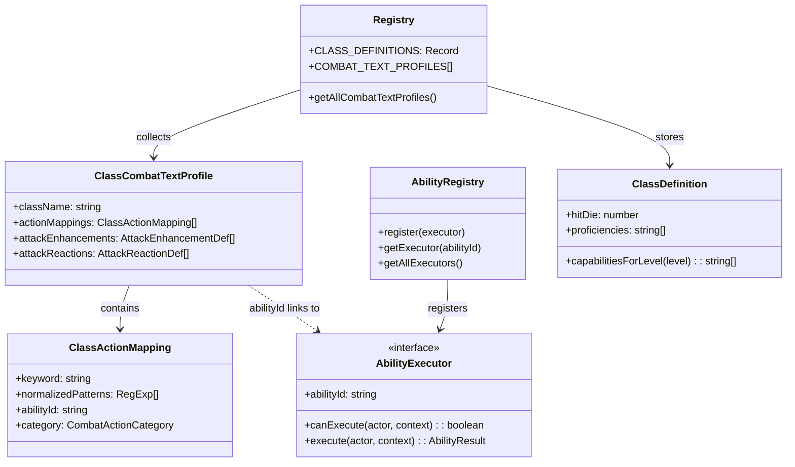

# ClassAbilities Flow

## Purpose
The class ability system: domain-declared class features (profiles, resource pools) and application-layer executors that carry them out. Two complementary patterns — ClassCombatTextProfile for detection/matching and AbilityRegistry for execution.

## Architecture

## Adding a New Class Feature (Checklist)

### If it's a text-parsed action (e.g., "flurry of blows"):
1. Add `ClassActionMapping` in the class's domain file (e.g., `monk.ts`)
2. Add to the class's `ClassCombatTextProfile` export
3. If new class → register profile in `registry.ts` → `COMBAT_TEXT_PROFILES`
4. Create executor in `application/services/combat/abilities/executors/{class}/`
5. Register executor in `infrastructure/api/app.ts`

### If it's an attack enhancement (auto-triggers on hit, e.g., Stunning Strike):
1. Add `AttackEnhancementDef` in the class's domain file
2. Add to the class's `ClassCombatTextProfile.attackEnhancements`
3. Create executor if needed

### If it's a reaction (triggered by incoming attack, e.g., Shield, Deflect Attacks):
1. Add `AttackReactionDef` in the class's domain file
2. Add to the class's `ClassCombatTextProfile.attackReactions`
3. Wire into reaction framework

## Key Contracts

| Type | File | Purpose |
|------|------|---------|
| `ClassCombatTextProfile` | `combat-text-profile.ts` | Per-class regex→action + enhancement + reaction bundle |
| `AbilityExecutor` interface | `ability-executor.ts` | `canExecute()` + `execute()` for all ability executors |
| `AbilityRegistry` | `ability-registry.ts` | Central executor registry — queried by abilityId |
| `ClassDefinition` | `class-definition.ts` | Base class metadata (hit die, proficiencies, capabilities by level) |
| `getAllCombatTextProfiles()` | `registry.ts` | Collects all registered class profiles |

## Registered Profiles
Barbarian, Cleric, Fighter, Monk, Paladin, Warlock, Wizard (7 of 12 classes)

## Registered Executors (23 total)
- **monk** (9): flurry-of-blows, patient-defense, step-of-the-wind, martial-arts, stunning-strike, wholeness-of-body, uncanny-metabolism, deflect-attacks, open-hand-technique
- **fighter** (2): action-surge, second-wind
- **rogue** (1): cunning-action
- **barbarian** (2): rage, reckless-attack
- **cleric** (1): turn-undead
- **monster** (1): nimble-escape
- **common** (1): offhand-attack

## Known Gotchas
1. **Domain-first principle** — class detection/eligibility/text matching MUST live in domain class files, NOT in application services
2. **Bonus actions** route through `handleBonusAbility()` (consumes bonus action economy). **Free abilities** through `handleClassAbility()`.
3. **Monk is the complexity outlier** — 200+ lines, 15+ exports, 9 executors. All other classes are simpler.
4. **class-resources.ts** intentionally imports all class files — narrow changes still ripple here
5. **Registration in app.ts** — both main app AND test registry must register new executors
