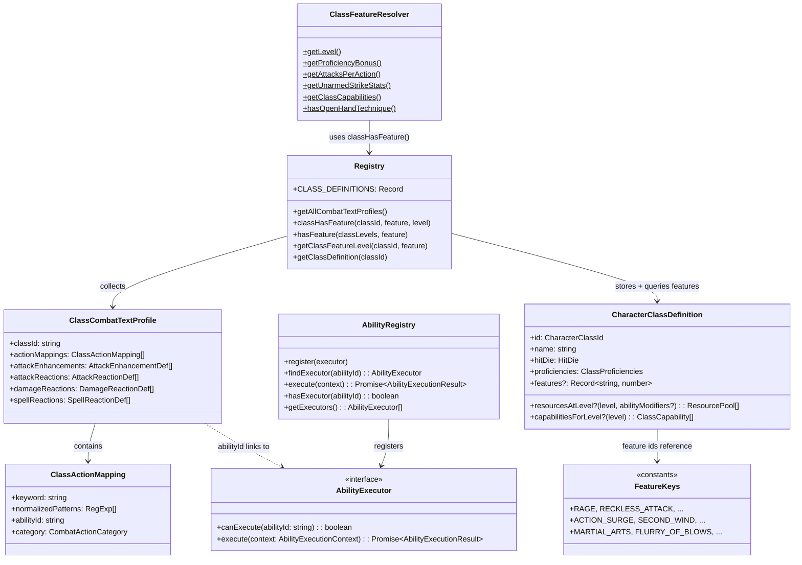

# ClassAbilities Flow

## Purpose
The class ability system: domain-declared class features (profiles, feature maps, resource pools) and application-layer executors that carry them out. Three complementary patterns — ClassCombatTextProfile for detection/matching, Feature Maps for boolean eligibility gates, and AbilityRegistry for execution.

## Architecture

## Adding a New Class Feature (Checklist)

### If it's a boolean feature gate (e.g., "has Rage", "has Cunning Action"):
1. Add the feature key constant in `feature-keys.ts` (e.g., `export const MY_FEATURE = "my-feature"`)
2. Add entry to the class's `features` map in its domain file (e.g., `barbarian.ts`): `"my-feature": 3` (minimum level)
3. Call `classHasFeature(classId, MY_FEATURE, level)` from application services — **never** add a new `has*()` method to ClassFeatureResolver
4. For subclass-gated features, the features map provides the **level gate** (necessary but not sufficient), and the executor's `canExecute()` guards the subclass requirement

### If it's a text-parsed action (e.g., "flurry of blows"):
1. Add `ClassActionMapping` in the class's domain file (e.g., `monk.ts`)
2. Add to the class's `ClassCombatTextProfile` export
3. If new class → register profile in `registry.ts` → `COMBAT_TEXT_PROFILES`
4. Create executor in `application/services/combat/abilities/executors/{class}/`
5. Register executor in `infrastructure/api/app.ts`

### If it's an attack enhancement (auto-triggers on hit, e.g., Stunning Strike):
1. Add `AttackEnhancementDef` in the class's domain file
2. Add to the class's `ClassCombatTextProfile.attackEnhancements`
3. Create executor if needed

### If it's a reaction (triggered by incoming attack, e.g., Shield, Deflect Attacks):
1. Add `AttackReactionDef` in the class's domain file
2. Add to the class's `ClassCombatTextProfile.attackReactions`
3. Wire into reaction framework

## Key Contracts

| Type | File | Purpose |
|------|------|---------|
| `CharacterClassDefinition` | `class-definition.ts` | Base class metadata (hit die, proficiencies, capabilities by level, **features map**) |
| `features` map | Each class file | `Record<string, number>` — feature id → minimum class level for boolean gates |
| `feature-keys.ts` | `feature-keys.ts` | String constants for all standard feature keys (type safety without closed unions) |
| `classHasFeature()` | `registry.ts` | Single-class boolean feature check (normalizes classId to lowercase) |
| `hasFeature()` | `registry.ts` | Multi-class-ready feature check (`Array<{classId, level}>`) |
| `getClassFeatureLevel()` | `registry.ts` | Returns minimum level for a feature on a class |
| `ClassFeatureResolver` | `class-feature-resolver.ts` | **Computed values only** — `getAttacksPerAction`, `getUnarmedStrikeStats`, `getClassCapabilities`, `hasOpenHandTechnique` (subclass guard) |
| `ClassCombatTextProfile` | `combat-text-profile.ts` | Per-class regex→action + enhancement + reaction bundle |
| `AbilityExecutor` interface | `ability-executor.ts` | `canExecute()` + `execute()` for all ability executors |
| `AbilityRegistry` | `ability-registry.ts` | Central executor registry — queried by abilityId |
| `getAllCombatTextProfiles()` | `registry.ts` | Collects all registered class profiles |

## Registered Profiles
Barbarian, Cleric, Fighter, Monk, Paladin, Warlock, Wizard (7 of 12 classes)

## Registered Executors (14 total, registered in AbilityRegistry)
- **barbarian** (2): rage, reckless-attack
- **monk** (5): flurry-of-blows, patient-defense, step-of-the-wind, martial-arts, wholeness-of-body
- **fighter** (2): action-surge, second-wind
- **rogue** (1): cunning-action
- **paladin** (1): lay-on-hands
- **cleric** (1): turn-undead
- **monster** (1): nimble-escape
- **common** (1): offhand-attack

Note: Stunning Strike, Deflect Attacks, and Open Hand Technique are handled as attack enhancements/reactions via `ClassCombatTextProfile`, not as AbilityRegistry executors. Divine Smite is handled inline in the attack flow.

## Known Gotchas
1. **Domain-first principle** — class detection/eligibility/text matching MUST live in domain class files, NOT in application services
2. **Boolean gates use feature maps, NOT ClassFeatureResolver** — `classHasFeature(classId, FEATURE_KEY, level)` replaces all old `ClassFeatureResolver.has*()` / `is*()` methods. Never add new boolean checks to ClassFeatureResolver.
3. **classHasFeature normalizes classId to lowercase** — callers pass mixed-case className values (e.g., "Barbarian", "MONK") and the function handles normalization
4. **Subclass-gated features** (e.g., Open Hand Technique) — the features map provides the level gate (necessary), the executor guards the subclass (sufficient). Both are required.
5. **ClassFeatureResolver retains only computed-value methods** — `getAttacksPerAction`, `getUnarmedStrikeStats`, `getClassCapabilities`, `hasOpenHandTechnique` (subclass guard), `getLevel`, `getProficiencyBonus`
6. **Multi-class ready** — `hasFeature(classLevels, feature)` checks ANY class-level entry, supporting future multiclass characters
7. **Bonus actions** route through `handleBonusAbility()` (consumes bonus action economy). **Free abilities** through `handleClassAbility()`.
8. **Monk is the complexity outlier** — 200+ lines, 15+ exports, 9 executors. All other classes are simpler.
9. **class-resources.ts** intentionally imports all class files — narrow changes still ripple here
10. **Registration in app.ts** — both main app AND test registry must register new executors
