# CombatOrchestration Flow

## Purpose
Combat orchestration layer — three thin facade services delegating to focused handler modules. Manages the pending action state machine, two-phase dice flow, text-to-action parsing, reaction resolution, and programmatic action execution.

## Architecture

```mermaid
classDiagram
    class TabletopCombatService {
        +initiateAction()
        +processRollResult()
        +parseCombatAction()
        +completeMove()
    }
    class ActionDispatcher {
        +dispatch()
        -buildParserChain()
    }
    class MovementHandlers { +handleMoveAction() }
    class AttackHandlers { +handleAttackAction() }
    class ClassAbilityHandlers { +handleClassAbility() }
    class GrappleHandlers { +handleShove() }
    class SocialHandlers { +handleDash() }
    class InteractionHandlers { +handlePickup() }

    class RollStateMachine {
        +handleInitiativeRoll()
        +handleAttackRoll()
        +handleDamageRoll()
        +handleDeathSaveRoll()
    }
    class InitiativeHandler { +handle() }
    class HitRiderResolver { +resolve() }
    class WeaponMasteryResolver { +resolve() }

    class ActionService {
        +executeAction()
    }
    class AttackActionHandler { +execute() }
    class GrappleActionHandler { +execute() }
    class SkillActionHandler { +execute() }

    class TwoPhaseActionService {
        +initiateMove()
        +completeMove()
        +initiateAttack()
        +completeAttack()
    }
    class MoveReactionHandler { +initiate()+complete() }
    class AttackReactionHandler { +initiate()+complete() }
    class SpellReactionHandler { +initiate()+complete() }

    class CombatTextParser { +tryParseMoveText()$ }
    class SavingThrowResolver { +resolveForTargets() }
    class TabletopEventEmitter { +emitNarration() }

    TabletopCombatService --> ActionDispatcher : parseCombatAction
    TabletopCombatService --> RollStateMachine : processRollResult
    TabletopCombatService --> TwoPhaseActionService : completeMove

    ActionDispatcher --> MovementHandlers
    ActionDispatcher --> AttackHandlers
    ActionDispatcher --> ClassAbilityHandlers
    ActionDispatcher --> GrappleHandlers
    ActionDispatcher --> SocialHandlers
    ActionDispatcher --> InteractionHandlers
    ActionDispatcher --> CombatTextParser

    RollStateMachine --> InitiativeHandler
    RollStateMachine --> HitRiderResolver
    RollStateMachine --> WeaponMasteryResolver
    RollStateMachine --> SavingThrowResolver

    ActionService --> AttackActionHandler
    ActionService --> GrappleActionHandler
    ActionService --> SkillActionHandler

    TwoPhaseActionService --> MoveReactionHandler
    TwoPhaseActionService --> AttackReactionHandler
    TwoPhaseActionService --> SpellReactionHandler
```

## Three Facade Services

| Facade | File | Purpose | Delegates To |
|--------|------|---------|-------------|
| **TabletopCombatService** | `tabletop-combat-service.ts` | Text-based dice flow (4 public methods) | `tabletop/` modules |
| **ActionService** | `action-service.ts` | Programmatic action execution | `action-handlers/` |
| **TwoPhaseActionService** | `two-phase-action-service.ts` | Reaction resolution (OA, Shield, Counterspell) | `two-phase/` |

## Module Decomposition

| Module | Responsibility | Lines | Owner |
|--------|---------------|-------|-------|
| **Tabletop subsystem** | | | |
| `tabletop-combat-service.ts` | Thin facade, 4 public methods | ~435 | — |
| `tabletop/action-dispatcher.ts` | Parser chain facade, delegates to handler classes | ~575 | — |
| `tabletop/dispatch/movement-handlers.ts` | Move, moveToward, jump dispatch handlers | ~480 | ActionDispatcher |
| `tabletop/dispatch/attack-handlers.ts` | Attack, offhand, TWF dispatch handlers | ~789 | ActionDispatcher |
| `tabletop/dispatch/class-ability-handlers.ts` | Class ability + bonus action dispatch handlers | ~549 | ActionDispatcher |
| `tabletop/dispatch/interaction-handlers.ts` | Pickup, drop, draw, sheathe, use-item handlers | ~471 | ActionDispatcher |
| `tabletop/dispatch/grapple-handlers.ts` | Shove, grapple, escape-grapple handlers | ~123 | ActionDispatcher |
| `tabletop/dispatch/social-handlers.ts` | Dash, dodge, disengage, ready, help, hide, search | ~197 | ActionDispatcher |
| `tabletop/roll-state-machine.ts` | All dice roll resolution | ~1555 | — |
| `tabletop/rolls/initiative-handler.ts` | Initiative roll, resource init, Alert feat | ~600 | RollStateMachine |
| `tabletop/rolls/hit-rider-resolver.ts` | Post-damage enhancement effects | ~148 | RollStateMachine |
| `tabletop/rolls/weapon-mastery-resolver.ts` | Weapon mastery effect resolution | ~308 | RollStateMachine |
| `tabletop/combat-text-parser.ts` | 20+ pure text parsing functions | ~616 | Multiple |
| `tabletop/rolls/saving-throw-resolver.ts` | Save-based effect resolution | ~337 | Multiple |
| `tabletop/spell-action-handler.ts` | Spell delivery facade | ~157 | ActionDispatcher |
| `tabletop/tabletop-types.ts` | All shared types/interfaces | ~418 | Multiple |
| `tabletop/tabletop-event-emitter.ts` | Narration + event helpers | ~250 | Multiple |
| `tabletop/action-parser-chain.ts` | Parser chain types | ~44 | ActionDispatcher |
| `tabletop/pending-action-state-machine.ts` | State transition validation | ~56 | Multiple |
| `tabletop/tabletop-utils.ts` | Initiative utilities | ~96 | Multiple |
| `tabletop/path-narrator.ts` | Movement narration text | ~119 | Multiple |
| **ActionService subsystem** | | | |
| `action-service.ts` | Programmatic action facade | ~568 | — |
| `action-handlers/attack-action-handler.ts` | Programmatic attack resolution | ~388 | ActionService |
| `action-handlers/grapple-action-handler.ts` | Programmatic grapple/shove resolution | ~542 | ActionService |
| `action-handlers/skill-action-handler.ts` | Programmatic hide/search/help | ~285 | ActionService |
| **TwoPhaseAction subsystem** | | | |
| `two-phase-action-service.ts` | Reaction resolution facade | ~422 | — |
| `two-phase/move-reaction-handler.ts` | Move reactions + opportunity attacks | ~450 | TwoPhaseActionService |
| `two-phase/attack-reaction-handler.ts` | Attack reactions (Shield, Deflect) | ~450 | TwoPhaseActionService |
| `two-phase/spell-reaction-handler.ts` | Spell reactions (counterspell) | ~320 | TwoPhaseActionService |
| **Combat lifecycle** | | | |
| `combat-service.ts` | Turn advancement, combat lifecycle | ~1083 | — |
| `tactical-view-service.ts` | Tactical view assembly | ~547 | — |
| `combat-victory-policy.ts` | Win/loss condition checks | ~53 | — |

## Key Contracts

| Type | File | Purpose |
|------|------|---------|
| `TabletopCombatServiceDeps` | `tabletop-types.ts` | Central dependency bag — all repos, services, registries |
| `TabletopPendingAction` | `tabletop-types.ts` | Union of all pending action types |
| `RollRequest` | `tabletop-types.ts` | What the server asks the client to roll |
| `CombatActionCategory` | `tabletop-types.ts` | Action classification for routing |
| `ActionParserEntry<T>` | `action-parser-chain.ts` | Parser chain entry — pairs `tryParse` (pure) with `handle` (async) |
| `DispatchContext` | `action-parser-chain.ts` | Context bag passed to every parser's `handle()` method |

## ActionDispatcher Parser Chain

`ActionDispatcher.dispatch()` uses a **registry-based parser chain** — an ordered array of 19 `ActionParserEntry<T>` objects. The dispatcher iterates in priority order; the first parser whose `tryParse()` returns non-null wins.

### Adding a new action type
1. Add a `tryParseXxxText()` function in `combat-text-parser.ts` (pure, no deps)
2. Add an entry to `buildParserChain()` in `action-dispatcher.ts` at the correct priority position
3. Implement the handler in the appropriate handler class (movement → `MovementHandlers`, combat → `AttackHandlers`, etc.)

### Parser chain order (priority)
1. move → 2. moveToward → 3. jump → 4. simpleAction → 5. classAction → 6. hide → 7. search → 8. offhand → 9. help → 10. shove → 11. escapeGrapple → 12. grapple → 13. castSpell → 14. pickup → 15. drop → 16. drawWeapon → 17. sheatheWeapon → 18. useItem → 19. attack

## Handler Ownership Rules

- **`tabletop/` dispatch handlers** (MovementHandlers, AttackHandlers, etc.) are **ActionDispatcher-private** — only imported by `action-dispatcher.ts`
- **`tabletop/` roll resolvers** (InitiativeHandler, HitRiderResolver, WeaponMasteryResolver) are **RollStateMachine-private** — only imported by `roll-state-machine.ts`
- **`action-handlers/`** files are **ActionService-private** — only imported by `action-service.ts`
- **`two-phase/`** files are **TwoPhaseActionService-private** — only imported by `two-phase-action-service.ts`

### Conventions
- `tryParse` must return `null` for no match (boolean parsers wrapped to `true | null`)
- Complex pre-dispatch logic (TWF validation, target resolution) lives in the entry's `handle` method
- LLM fallback runs **after** the entire chain when no parser matches

## Known Gotchas

1. **Facade stays thin** — 4 public method signatures ripple across all route handlers when changed
2. **RollStateMachine is ~1700 lines** — handles initiative, attack, damage, death save, concentration rolls, Sneak Attack, Divine Smite, mastery effects, resource pool init
3. **New action types**: add a parser entry to `buildParserChain()` in `action-dispatcher.ts` + a pure `tryParseXxxText()` in `combat-text-parser.ts`
4. **CombatTextParser functions are pure** — no `this.deps`, no side effects, testable in isolation
5. **Pending action state machine**: `initiate → (attack_pending | damage_pending | save_pending | death_save_pending) → resolved` — invalid transitions must be rejected
6. **Two-phase flow**: move phase → action phase → bonus phase → end turn — action economy tracked per phase
7. **`abilityRegistry` is required** in deps — no optional guards, no null checks
8. **Parser chain order matters** — priority position in `buildParserChain()` determines which parser wins for ambiguous text
