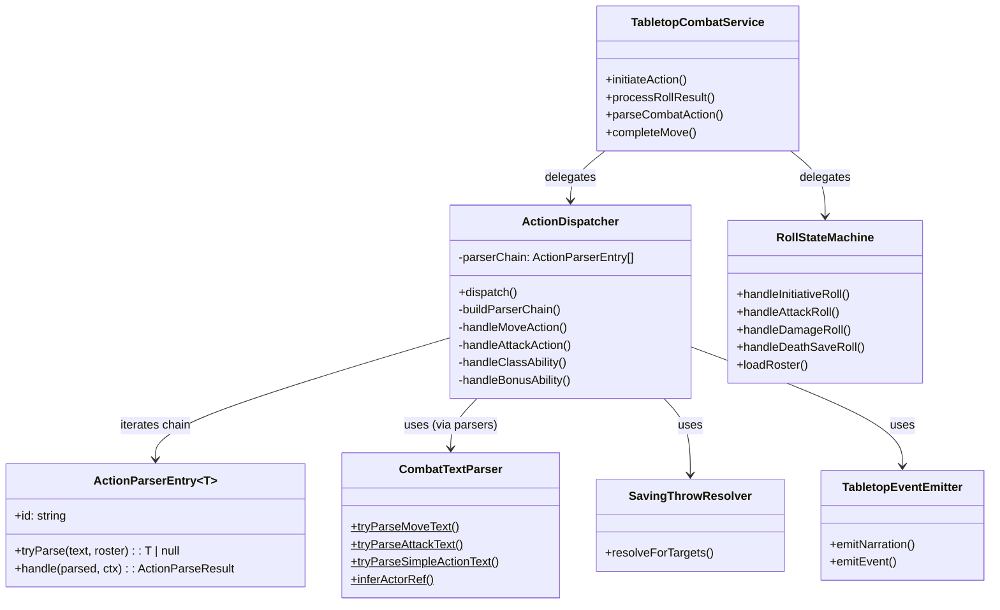

# CombatOrchestration Flow

## Purpose
Combat orchestration layer — thin facade delegating to focused sub-modules. Manages the pending action state machine, two-phase dice flow, text-to-action parsing, and action routing for all combat interactions.

## Architecture

## Module Decomposition

| Module | Responsibility | Lines |
|--------|---------------|-------|
| `tabletop-combat-service.ts` | Thin facade, 4 public methods | ~370 |
| `action-dispatcher.ts` | Parser chain + action handlers | ~1800 |
| `action-parser-chain.ts` | `ActionParserEntry<T>` + `DispatchContext` types | ~55 |
| `roll-state-machine.ts` | All dice roll resolution | ~1700 |
| `combat-text-parser.ts` | 20+ pure text parsing functions | ~1200 |
| `tabletop-types.ts` | All shared types and interfaces | ~400 |
| `spell-action-handler.ts` | Spell delivery (4 modes) | ~850 |
| `saving-throw-resolver.ts` | Save-based effect resolution | ~200 |
| `tabletop-event-emitter.ts` | Narration + event helpers | ~150 |

## Key Contracts

| Type | File | Purpose |
|------|------|---------|
| `TabletopCombatServiceDeps` | `tabletop-types.ts` | Central dependency bag — all repos, services, registries |
| `TabletopPendingAction` | `tabletop-types.ts` | Union of all pending action types |
| `RollRequest` | `tabletop-types.ts` | What the server asks the client to roll |
| `CombatActionCategory` | `tabletop-types.ts` | Action classification for routing |
| `ActionParserEntry<T>` | `action-parser-chain.ts` | Parser chain entry — pairs `tryParse` (pure) with `handle` (async) |
| `DispatchContext` | `action-parser-chain.ts` | Context bag passed to every parser's `handle()` method |

## ActionDispatcher Parser Chain

`ActionDispatcher.dispatch()` uses a **registry-based parser chain** — an ordered array of 19 `ActionParserEntry<T>` objects. The dispatcher iterates in priority order; the first parser whose `tryParse()` returns non-null wins.

### Adding a new action type
1. Add a `tryParseXxxText()` function in `combat-text-parser.ts` (pure, no deps)
2. Add an entry to `buildParserChain()` in `action-dispatcher.ts` at the correct priority position
3. Implement the handler method (or delegate to an existing one)

### Parser chain order (priority)
1. move → 2. moveToward → 3. jump → 4. simpleAction → 5. classAction → 6. hide → 7. search → 8. offhand → 9. help → 10. shove → 11. escapeGrapple → 12. grapple → 13. castSpell → 14. pickup → 15. drop → 16. drawWeapon → 17. sheatheWeapon → 18. useItem → 19. attack

### Conventions
- `tryParse` must return `null` for no match (boolean parsers wrapped to `true | null`)
- Complex pre-dispatch logic (TWF validation, target resolution) lives in the entry's `handle` method
- LLM fallback runs **after** the entire chain when no parser matches

## Known Gotchas

1. **Facade stays thin** — 4 public method signatures ripple across all route handlers when changed
2. **RollStateMachine is ~1700 lines** — handles initiative, attack, damage, death save, concentration rolls, Sneak Attack, Divine Smite, mastery effects, resource pool init
3. **New action types**: add a parser entry to `buildParserChain()` in `action-dispatcher.ts` + a pure `tryParseXxxText()` in `combat-text-parser.ts`
4. **CombatTextParser functions are pure** — no `this.deps`, no side effects, testable in isolation
5. **Pending action state machine**: `initiate → (attack_pending | damage_pending | save_pending | death_save_pending) → resolved` — invalid transitions must be rejected
6. **Two-phase flow**: move phase → action phase → bonus phase → end turn — action economy tracked per phase
7. **`abilityRegistry` is required** in deps — no optional guards, no null checks
8. **Parser chain order matters** — priority position in `buildParserChain()` determines which parser wins for ambiguous text
