# CombatOrchestration Flow

## Purpose
Combat orchestration layer — three thin facade services delegating to focused handler modules. Manages the pending action state machine, two-phase dice flow, text-to-action parsing, reaction resolution, and programmatic action execution.

## Architecture

```mermaid
classDiagram
    class TabletopCombatService {
        +initiateAction()
        +processRollResult()
        +parseCombatAction()
        +completeMove()
    }
    class ActionDispatcher {
        +dispatch()
        -buildParserChain()
    }
    class MovementHandlers { +handleMoveAction() }
    class AttackHandlers { +handleAttackAction() }
    class ClassAbilityHandlers { +handleClassAbility() }
    class GrappleHandlers { +handleShove() }
    class SocialHandlers { +handleDash() }
    class InteractionHandlers { +handlePickup() }

    class RollStateMachine {
        +handleInitiativeRoll()
        +handleAttackRoll()
        +handleDamageRoll()
        +handleDeathSaveRoll()
    }
    class InitiativeHandler { +handle() }
    class HitRiderResolver { +resolve() }
    class WeaponMasteryResolver { +resolve() }

    class ActionService {
        +executeAction()
    }
    class AttackActionHandler { +execute() }
    class GrappleActionHandler { +execute() }
    class SkillActionHandler { +execute() }

    class TwoPhaseActionService {
        +initiateMove()
        +completeMove()
        +initiateAttack()
        +completeAttack()
    }
    class MoveReactionHandler { +initiate()+complete() }
    class AttackReactionHandler { +initiate()+complete() }
    class SpellReactionHandler { +initiate()+complete() }

    class CombatTextParser { +tryParseMoveText()$ }
    class SavingThrowResolver { +resolveForTargets() }
    class TabletopEventEmitter { +emitNarration() }

    TabletopCombatService --> ActionDispatcher : parseCombatAction
    TabletopCombatService --> RollStateMachine : processRollResult
    TabletopCombatService --> TwoPhaseActionService : completeMove

    ActionDispatcher --> MovementHandlers
    ActionDispatcher --> AttackHandlers
    ActionDispatcher --> ClassAbilityHandlers
    ActionDispatcher --> GrappleHandlers
    ActionDispatcher --> SocialHandlers
    ActionDispatcher --> InteractionHandlers
    ActionDispatcher --> CombatTextParser

    RollStateMachine --> InitiativeHandler
    RollStateMachine --> HitRiderResolver
    RollStateMachine --> WeaponMasteryResolver
    RollStateMachine --> SavingThrowResolver

    ActionService --> AttackActionHandler
    ActionService --> GrappleActionHandler
    ActionService --> SkillActionHandler

    TwoPhaseActionService --> MoveReactionHandler
    TwoPhaseActionService --> AttackReactionHandler
    TwoPhaseActionService --> SpellReactionHandler
```

## Three Facade Services

| Facade | File | Purpose | Delegates To |
|--------|------|---------|-------------|
| **TabletopCombatService** | `tabletop-combat-service.ts` | Text-based dice flow (4 public methods) | `tabletop/` modules |
| **ActionService** | `action-service.ts` | Programmatic action execution | `action-handlers/` |
| **TwoPhaseActionService** | `two-phase-action-service.ts` | Reaction resolution (OA, Shield, Counterspell) | `two-phase/` |

## Module Decomposition

| Module | Responsibility | Lines | Owner |
|--------|---------------|-------|-------|
| **Tabletop subsystem** | | | |
| `tabletop-combat-service.ts` | Thin facade, 4 public methods | ~435 | — |
| `tabletop/action-dispatcher.ts` | Parser chain facade, delegates to handler classes | ~515 | — |
| `tabletop/dispatch/movement-handlers.ts` | Move, moveToward, jump dispatch handlers | ~613 | ActionDispatcher |
| `tabletop/dispatch/attack-handlers.ts` | Attack, offhand, TWF dispatch handlers | ~718 | ActionDispatcher |
| `tabletop/dispatch/class-ability-handlers.ts` | Class ability + bonus action dispatch handlers | ~487 | ActionDispatcher |
| `tabletop/dispatch/interaction-handlers.ts` | Pickup, drop, draw, sheathe, use-item handlers | ~567 | ActionDispatcher |
| `tabletop/dispatch/grapple-handlers.ts` | Shove, grapple, escape-grapple handlers | ~123 | ActionDispatcher |
| `tabletop/dispatch/social-handlers.ts` | Dash, dodge, disengage, ready, help, hide, search | ~197 | ActionDispatcher |
| `tabletop/roll-state-machine.ts` | All dice roll resolution | ~1556 | — |
| `tabletop/rolls/initiative-handler.ts` | Initiative roll, resource init, Alert feat | ~600 | RollStateMachine |
| `tabletop/rolls/hit-rider-resolver.ts` | Post-damage enhancement effects | ~148 | RollStateMachine |
| `tabletop/rolls/weapon-mastery-resolver.ts` | Weapon mastery effect resolution | ~308 | RollStateMachine |
| `tabletop/combat-text-parser.ts` | 20+ pure text parsing functions | ~616 | Multiple |
| `tabletop/rolls/saving-throw-resolver.ts` | Save-based effect resolution | ~337 | Multiple |
| `tabletop/spell-action-handler.ts` | Spell delivery facade (dispatches to `spell-delivery/`) | ~157 | ActionDispatcher |
| `tabletop/tabletop-types.ts` | All shared types/interfaces | ~418 | Multiple |
| `tabletop/tabletop-event-emitter.ts` | Narration + event helpers | ~250 | Multiple |
| `tabletop/action-parser-chain.ts` | Parser chain types | ~44 | ActionDispatcher |
| `tabletop/pending-action-state-machine.ts` | State transition validation | ~56 | Multiple |
| `tabletop/tabletop-utils.ts` | Initiative utilities | ~96 | Multiple |
| `tabletop/path-narrator.ts` | Movement narration text | ~119 | Multiple |
| **Spell Delivery subsystem** (see [spell-system.instructions.md](spell-system.instructions.md)) | | | |
| `tabletop/spell-delivery/spell-delivery-handler.ts` | Strategy interface + `SpellCastingContext` type | ~52 | SpellActionHandler |
| `tabletop/spell-delivery/spell-attack-delivery-handler.ts` | Attack-roll spells (Fire Bolt, Guiding Bolt) | ~79 | SpellActionHandler |
| `tabletop/spell-delivery/healing-spell-delivery-handler.ts` | Healing spells (Cure Wounds, Healing Word) | ~146 | SpellActionHandler |
| `tabletop/spell-delivery/save-spell-delivery-handler.ts` | Save-based spells (Burning Hands, Hold Person) | ~218 | SpellActionHandler |
| `tabletop/spell-delivery/zone-spell-delivery-handler.ts` | Zone/AoE spells (Spirit Guardians, Cloud of Daggers) | ~159 | SpellActionHandler |
| `tabletop/spell-delivery/buff-debuff-spell-delivery-handler.ts` | Buff/debuff ActiveEffect spells (Bless, Shield of Faith) | ~150 | SpellActionHandler |
| **ActionService subsystem** | | | |
| `action-service.ts` | Programmatic action facade | ~568 | — |
| `action-handlers/attack-action-handler.ts` | Programmatic attack resolution | ~343 | ActionService |
| `action-handlers/grapple-action-handler.ts` | Programmatic grapple/shove resolution | ~479 | ActionService |
| `action-handlers/skill-action-handler.ts` | Programmatic hide/search/help | ~247 | ActionService |
| **TwoPhaseAction subsystem** | | | |
| `two-phase-action-service.ts` | Reaction resolution facade | ~422 | — |
| `two-phase/move-reaction-handler.ts` | Move reactions + opportunity attacks | ~485 | TwoPhaseActionService |
| `two-phase/attack-reaction-handler.ts` | Attack reactions (Shield, Deflect) + damage reactions | ~598 | TwoPhaseActionService |
| `two-phase/spell-reaction-handler.ts` | Spell reactions (counterspell) | ~299 | TwoPhaseActionService |
| **Combat lifecycle** | | | |
| `combat-service.ts` | Turn advancement, combat lifecycle, zone/effect processing | ~1083 | — |
| `tactical-view-service.ts` | Tactical view assembly, OA prediction, query context | ~547 | — |
| `combat-victory-policy.ts` | Faction-based win/loss condition checks | ~53 | — |

## Key Contracts

| Type | File | Purpose |
|------|------|---------|
| `TabletopCombatServiceDeps` | `tabletop-types.ts` | Central dependency bag — all repos, services, registries |
| `TabletopPendingAction` | `tabletop-types.ts` | Union of all pending action types |
| `RollRequest` | `tabletop-types.ts` | What the server asks the client to roll |
| `CombatActionCategory` | `tabletop-types.ts` | Action classification for routing |
| `ActionParserEntry<T>` | `action-parser-chain.ts` | Parser chain entry — pairs `tryParse` (pure) with `handle` (async) |
| `DispatchContext` | `action-parser-chain.ts` | Context bag passed to every parser's `handle()` method |

## ActionDispatcher Parser Chain

`ActionDispatcher.dispatch()` uses a **registry-based parser chain** — an ordered array of 19 `ActionParserEntry<T>` objects. The dispatcher iterates in priority order; the first parser whose `tryParse()` returns non-null wins.

### Adding a new action type
1. Add a `tryParseXxxText()` function in `combat-text-parser.ts` (pure, no deps)
2. Add an entry to `buildParserChain()` in `action-dispatcher.ts` at the correct priority position
3. Implement the handler in the appropriate handler class (movement → `MovementHandlers`, combat → `AttackHandlers`, etc.)

### Parser chain order (priority)
1. move → 2. moveToward → 3. jump → 4. simpleAction → 5. classAction → 6. hide → 7. search → 8. offhand → 9. help → 10. shove → 11. escapeGrapple → 12. grapple → 13. castSpell → 14. pickup → 15. drop → 16. drawWeapon → 17. sheatheWeapon → 18. useItem → 19. attack

## Handler Ownership Rules

- **`tabletop/` dispatch handlers** (MovementHandlers, AttackHandlers, etc.) are **ActionDispatcher-private** — only imported by `action-dispatcher.ts`
- **`tabletop/` roll resolvers** (InitiativeHandler, HitRiderResolver, WeaponMasteryResolver) are **RollStateMachine-private** — only imported by `roll-state-machine.ts`
- **`action-handlers/`** files are **ActionService-private** — only imported by `action-service.ts`
- **`two-phase/`** files are **TwoPhaseActionService-private** — only imported by `two-phase-action-service.ts`

### Conventions
- `tryParse` must return `null` for no match (boolean parsers wrapped to `true | null`)
- Complex pre-dispatch logic (TWF validation, target resolution) lives in the entry's `handle` method
- LLM fallback runs **after** the entire chain when no parser matches

## Spell Delivery Subsystem (cross-reference)

`tabletop/spell-delivery/` contains 5 strategy handlers dispatched by `spell-action-handler.ts`. **Owned by [spell-system.instructions.md](spell-system.instructions.md)** — see that file for delivery handler internals, spell slot management, and concentration lifecycle.

| Handler | `canHandle()` gate | Spells covered |
|---------|-------------------|----------------|
| `SpellAttackDeliveryHandler` | `spell.attackType` exists | Fire Bolt, Guiding Bolt, Inflict Wounds |
| `HealingSpellDeliveryHandler` | `spell.isHealing` | Cure Wounds, Healing Word |
| `SaveSpellDeliveryHandler` | `spell.saveAbility` exists | Burning Hands, Hold Person, Thunderwave |
| `ZoneSpellDeliveryHandler` | `spell.zone` exists | Spirit Guardians, Cloud of Daggers, Spike Growth |
| `BuffDebuffSpellDeliveryHandler` | `spell.effects` non-empty | Bless, Shield of Faith, Faerie Fire |

Dispatch order: `find(h => h.canHandle(spell))` — first match wins. The shared `SpellDeliveryHandler` interface and `SpellCastingContext` type live in `spell-delivery-handler.ts`.

## Combat Service Lifecycle (`combat-service.ts`)

`CombatService.nextTurn()` orchestrates the full turn-advancement lifecycle. The sequence within a single `nextTurn()` call:

1. **Victory check** — `victoryPolicy.evaluate()` before any turn advancement. Returns early with `CombatEnded` event if a faction is wiped.
2. **End-of-turn cleanup (outgoing combatant)**:
   - Condition expiry: `removeExpiredConditions(structuredConditions, "end_of_turn", outgoingEntityId)`
   - ActiveEffect processing: `processActiveEffectsAtTurnEvent(..., "end_of_turn", ...)` — Phase A executes ongoing effects (damage, recurring temp HP, save-to-end), Phase B removes expired effects and decrements round counters.
   - Zone triggers: `processZoneTurnTriggers(..., "on_end_turn", ...)` — Cloud of Daggers, Spirit Guardians end-of-turn damage.
3. **Advance turn** — `combat.endTurn()` + skip defeated non-characters (monsters at 0 HP don't get turns).
4. **Rage-end check (incoming barbarian)** — Checked at **START** of the barbarian's turn (not end of previous). Reads `rageAttackedThisTurn`/`rageDamageTakenThisTurn` flags **before** `extractActionEconomy()` resets them. Calls `shouldRageEnd()` from domain.
5. **Action economy persist** — `extractActionEconomy()` for all combatants; new round resets all.
6. **Start-of-turn processing (incoming combatant)**:
   - Condition expiry at `"start_of_turn"` + `StunningStrikePartial` removal
   - ActiveEffect start-of-turn processing (same Phase A + B pattern)
   - Zone triggers: `processZoneTurnTriggers(..., "on_start_turn", ...)`
7. **Death save auto-roll** — Only for characters at 0 HP. Skipped when `skipDeathSaveAutoRoll: true` (tabletop mode sends death saves through RollStateMachine instead).
8. **AI orchestrator trigger** — If active combatant is AI-controlled (monster/NPC), triggers `aiOrchestrator.handleAiTurn()`.

### Zone processing helpers
- `processZoneTurnTriggers()` — applies zone damage/conditions to creatures in zone at turn start/end
- `cleanupExpiredZones()` — decrements zone round counters at round boundary, removes expired zones from map

## Damage Reaction Detection

`AttackReactionHandler.completeAttackReaction()` handles **two** reaction timing windows:

1. **Pre-damage reactions** (existing): Shield, Deflect Attacks — detected via `detectAttackReactions()` from `ClassCombatTextProfile.attackReactions`. Fires before the attack roll resolves. Target can raise AC or reduce damage.

2. **Post-damage reactions** (newer): Absorb Elements, Hellish Rebuke — detected via `detectDamageReactions()` after attack completion confirms a hit with `damageApplied > 0`. Only triggers for:
   - **Character** targets (not monsters/NPCs)
   - Target still alive (`hpCurrent > 0`)
   - Target still has reaction available
   - Attack dealt typed damage (`damageSpec.damageType` present)

The `DamageReactionInitiator` interface (exported from `attack-reaction-handler.ts`) allows TwoPhaseActionService to create a new pending action for the damage reaction, keeping it in the same two-phase flow. The result includes `damageReaction?: { pendingActionId, reactionType }` alongside the existing `hit`/`shieldUsed`/`redirect` fields.

## Tactical View Service (`tactical-view-service.ts`)

Three public methods:

| Method | Purpose |
|--------|---------|
| `getTacticalView()` | Full combat state snapshot — combatant positions, HP, conditions, action economy, resource pools, distances, ground items |
| `buildCombatQueryContext()` | Enriched context for LLM combat queries — includes OA prediction, actor capabilities, class features, attack options |
| `predictOpportunityAttacks()` (private) | Parses destination from query text, computes `crossesThroughReach()` for each enemy, returns `oaRisks[]` with reach/reaction availability |

Action economy reported per combatant: `actionAvailable`, `bonusActionAvailable`, `reactionAvailable`, `movementRemainingFeet`, `attacksUsed`, `attacksAllowed`.

Note: Path preview (`POST .../path-preview`) is handled directly in the route layer (`session-tactical.ts`) using A* pathfinding — it does not go through TacticalViewService.

## Shared Helpers (`helpers/`)

`helpers/` is a shared dependency used across all combat service modules. Key files:

| File | Lines | Key exports |
|------|-------|-------------|
| `resource-utils.ts` | ~442 | `normalizeResources()`, `getPosition()`, `readBoolean()`, `getEffectiveSpeed()`, `getActiveEffects()`, `addActiveEffectsToResources()`, action economy helpers (`hasSpentAction`, `canMakeAttack`, `useAttack`, `hasBonusActionAvailable`, etc.) |
| `ko-handler.ts` | — | `applyKoEffectsIfNeeded()` — Unconscious condition application |
| `concentration-helper.ts` | — | Concentration check + drop helpers |
| `spell-slot-manager.ts` | — | Spell slot spending + validation |
| `combat-hydration.ts` | — | `hydrateCombat()` — builds domain Combat from records |
| `faction-service.ts` | — | Faction resolution for victory policy |
| `zone-damage-resolver.ts` | — | Zone enter/movement damage resolution |
| `opportunity-attack-resolver.ts` | — | OA eligibility checks for movement |
| `movement-trigger-resolver.ts` | — | Zone/OA triggers during pathfinding |

These are **not** private to any single facade — imported by tabletop, action-handlers, two-phase, combat-service, and tactical-view-service alike.

## Known Gotchas

1. **Facade stays thin** — 4 public method signatures ripple across all route handlers when changed
2. **RollStateMachine is ~1556 lines** — handles initiative, attack, damage, death save, concentration rolls, Sneak Attack, Divine Smite, mastery effects, resource pool init
3. **New action types**: add a parser entry to `buildParserChain()` in `action-dispatcher.ts` + a pure `tryParseXxxText()` in `combat-text-parser.ts`
4. **CombatTextParser functions are pure** — no `this.deps`, no side effects, testable in isolation
5. **Pending action state machine**: `initiate → (attack_pending | damage_pending | save_pending | death_save_pending) → resolved` — invalid transitions must be rejected
6. **Two-phase flow**: move phase → action phase → bonus phase → end turn — action economy tracked per phase
7. **`abilityRegistry` is required** in deps — no optional guards, no null checks
8. **Parser chain order matters** — priority position in `buildParserChain()` determines which parser wins for ambiguous text
