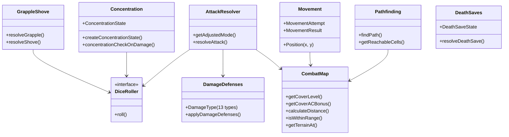

# CombatRules Flow

## Purpose
Pure D&D 5e 2024 rules engine — deterministic game mechanics with no Fastify, Prisma, or LLM dependencies. Takes inputs, returns outputs. Never reads repositories or emits events.

## Architecture

## Key Contracts

| Type/Function | File | Purpose |
|---------------|------|---------|
| `DiceRoller` interface | `dice-roller.ts` | Abstraction for all randomness — enables deterministic testing |
| `DamageDefenses` / `DamageType` | `damage-defenses.ts` | 13 damage types + resistance/immunity/vulnerability |
| `CoverLevel` / `getCoverLevel()` | `combat-map-sight.ts` | Cover detection between attacker and target |
| `Position` / `MovementAttempt` | `movement.ts` | Grid coordinates and movement validation |
| `ConcentrationState` | `concentration.ts` | Spell concentration state machine |
| `DeathSaveState` | `death-saves.ts` | Death save success/failure tracking |
| `TerrainType` (12 types) | `combat-map-types.ts` | Grid cell terrain classification |
| `CombatMap` interface | `combat-map-types.ts` | Full battlefield state (cells, entities, zones, ground items) |

## Combat Map Module Family

`combat-map.ts` is a **barrel re-export** — import from it as before. Internals split into:

| Module | Responsibility |
|--------|---------------|
| `combat-map-types.ts` | `TerrainType`, `CoverLevel`, `MapCell`, `MapEntity`, `CombatMap` interfaces |
| `combat-map-core.ts` | `createCombatMap`, `getCellAt`, `setTerrainAt`, entity CRUD, `isOnMap`, `isPositionPassable`, `getTerrainSpeedModifier` |
| `combat-map-sight.ts` | `hasLineOfSight`, `getCoverLevel`, `getCoverACBonus`, `getCoverSaveBonus`, `getEntitiesInRadius`, `getFactionsInRange` |
| `combat-map-zones.ts` | `getMapZones`, `addZone`, `removeZone`, `updateZone`, `setMapZones` |
| `combat-map-items.ts` | `getGroundItems`, `addGroundItem`, `removeGroundItem`, `getGroundItemsAtPosition`, `getGroundItemsNearPosition` |

## Dependencies
**Internal imports**: `domain/entities/` (creature types, item types, class definitions)
**External SDKs**: None — pure TypeScript

## Known Gotchas
1. **combat-map.ts is a barrel** — the implementation spans 5 sub-modules (`-types`, `-core`, `-sight`, `-zones`, `-items`). Add new functionality to the appropriate sub-module, not the barrel.
2. **class-resources.ts** imports all 10 class files to build resource pools — changes to class resource shapes propagate here
3. **Rules are pure functions** — if you need state, you're probably in the wrong layer
4. **D&D 5e 2024 rules** — not 2014. Verify against 2024 edition for any mechanic
5. **Dependency direction**: Rules → entities (never reversed, except `character.ts` → rest/hp rules)
6. **Cover uses ray-marching** — `getCoverLevel()` in `combat-map-sight.ts` samples the attacker→target line at `ceil(distance/gridSize)` intervals (same as `hasLineOfSight`). Cover cells at attacker and target positions are excluded — only intermediate cells count. `terrainToCoverLevel()` maps all terrain types: `"wall"` and `"cover-full"` → full, `"cover-three-quarters"` → three-quarters, `"cover-half"` and `"obstacle"` → half. Adding new terrain that should grant cover: add a case to `terrainToCoverLevel()` in `combat-map-sight.ts`.
