# CombatRules Flow

## Purpose
Pure D&D 5e 2024 rules engine — deterministic game mechanics with no Fastify, Prisma, or LLM dependencies. Takes inputs, returns outputs. Never reads repositories or emits events.

## Architecture

```mermaid
classDiagram
    class Combat {
        -combatants Map
        -activeEffects Map
        -positions Map
        -movementStates Map
        +endTurn()
        +addEffect()
        +cleanupExpiredEffects()
        +restoreState() / restoreActionEconomy()
    }
    class AttackResolver {
        +resolveAttack(diceRoller, attacker, target, spec)
    }
    class CombatRules {
        +resolveToHit(diceRoller, AC, bonus, mode)
        +resolveDamage(diceRoller, sides, count, mod)
    }
    class RulesMovement {
        +Position (x, y)
        +attemptMovement()
        +calculateDistance()
        +snapToGrid()
        +calculateLongJumpDistance()
    }
    class CombatMovement {
        +MovementState (position, movementUsed)
        +moveToPosition()
        +pushAwayFrom()
        +pullToward()
        +resetMovement()
    }
    class Pathfinding {
        +findPath() [A*]
        +getReachableCells() [Dijkstra]
        +diagonalStepCost()
    }
    class WeaponMastery {
        +WEAPON_MASTERY_MAP
        +resolveWeaponMastery()
    }
    class FeatModifiers {
        +computeFeatModifiers(featIds) → FeatModifiers
    }
    class DamageDefenses {
        +DamageType (13 types)
        +applyDamageDefenses()
    }
    class DiceRoller {
        <<interface>>
        +roll()
    }
    class Rest {
        +refreshClassResourcePools()
        +spendHitDice()
        +recoverHitDice()
    }
    class CombatMap {
        +getCoverLevel()
        +getCoverACBonus()
        +isPositionPassable()
    }
    class Concentration {
        +ConcentrationState
        +concentrationCheckOnDamage()
    }
    class GrappleShove {
        +resolveGrapple()
        +resolveShove()
    }
    class DeathSaves {
        +resolveDeathSave()
    }
    class Hide {
        +attemptHide()
        +computeSurprise()
    }

    Combat --> CombatMovement
    Combat --> ActiveEffect
    AttackResolver --> FeatModifiers
    AttackResolver --> DamageDefenses
    AttackResolver --> DiceRoller
    CombatRules --> DiceRoller
    Pathfinding --> CombatMap
    RulesMovement --> CombatMap
    GrappleShove --> DiceRoller
    Concentration --> DiceRoller
    Rest ..> ClassDefinition : refreshPolicy
```

## Dual Movement Files

Two `movement.ts` files serve distinct purposes — do NOT mix them up:

| File | Layer | Key Types | Purpose |
|------|-------|-----------|---------|
| `rules/movement.ts` | Pure math | `Position{x,y}`, `MovementAttempt`, `MovementResult` | Grid math: `calculateDistance()`, `snapToGrid()`, `isWithinRange()`, jump calculations (`calculateLongJumpDistance`, `calculateHighJumpDistance`, `computeJumpLandingPosition`), `getPositionsInRadius()` |
| `combat/movement.ts` | Stateful helper | `MovementState{position, movementUsed, movementAvailable, jumpDistanceMultiplier, difficultTerrain}` | Turn-scoped movement tracking: `moveToPosition()`, `pushAwayFrom()`, `pullToward()`, `resetMovement()`, `createMovementState()` |

**Rule**: `rules/movement.ts` is purely geometric — it knows nothing about turns or budget tracking. `combat/movement.ts` tracks how much movement a creature has spent this turn and handles forced movement (push/pull). Pathfinding (`rules/pathfinding.ts`) imports `Position` and `snapToGrid` from `rules/movement.ts`.

## Dual Attack Resolution

Two files resolve attacks at different abstraction levels:

| File | Function | When to Use |
|------|----------|-------------|
| `rules/combat-rules.ts` | `resolveToHit(diceRoller, AC, bonus, mode)` → `AttackResolution`, `resolveDamage(diceRoller, sides, count, mod)` → `DamageResolution` | Low-level primitives. Use when you need bare d20 + bonus vs AC with no feat/finesse/defense logic. |
| `combat/attack-resolver.ts` | `resolveAttack(diceRoller, attacker, target, spec, options?)` → `AttackResult` | Full pipeline. Infers ability (finesse auto-picks higher of STR/DEX), applies `computeFeatModifiers()` (Archery bonus, GWF die minimum), `applyDamageDefenses()`, calls `target.takeDamage()`. Use for real combat. |

**Rule**: New attack-related features (feats, class abilities, defenses) integrate into `attack-resolver.ts`. Only use `combat-rules.ts` for contexts that need a raw to-hit roll without creature state.

## Combat State Machine — `combat/combat.ts`

The `Combat` class is the **sole stateful object** in the domain layer. It owns:
- **Initiative order** (`CombatState{round, turnIndex, order}`) — rolled on construction via `rollInitiative()`
- **Action economy** per combatant — `freshActionEconomy(speed)` on turn start, delegates to `action-economy.ts` (`spendAction`, `spendBonusAction`, `spendReaction`, `spendMovement`)
- **Active effects** map (`creatureId → ActiveEffect[]`) — `addEffect()`, `removeEffect()`, `getEffects()`
- **Positions** and **MovementStates** per creature

Key lifecycle methods:
- `endTurn()` — cleans up end-of-turn effects, advances `turnIndex` (wraps to next round), resets action economy for new active creature, cleans up start-of-turn effects for incoming creature
- `restoreState(state)` / `restoreActionEconomy(creatureId, economy)` — hydration hooks called by combat-hydration after DB round-trip. Construction rolls initiative; restoration overwrites with persisted data.

## Weapon Mastery Pipeline — `rules/weapon-mastery.ts`

8 mastery keywords: `cleave`, `graze`, `nick`, `push`, `sap`, `slow`, `topple`, `vex`.

| Export | Purpose |
|--------|---------|
| `WEAPON_MASTERY_MAP` | `Record<string, WeaponMasteryProperty>` — 34 standard weapons → mastery keyword |
| `hasWeaponMasteryFeature(sheet)` | Class eligibility check (Fighter 3, Barbarian/Paladin/Ranger/Rogue 2 each) |
| `hasWeaponMastery(sheet, weaponName)` | Checks explicit `sheet.weaponMasteries[]`, falls back to class auto-grant |
| `resolveWeaponMastery(weaponName, sheet, className?, explicitMastery?)` | Full pipeline: eligibility gate → explicit override → `WEAPON_MASTERY_MAP` lookup. Returns `undefined` if not eligible. |

**Adding a new mastery type**: add to `WeaponMasteryProperty` union, update `isWeaponMasteryProperty()` guard, add weapon entries to `WEAPON_MASTERY_MAP`. Resolution effects live in the orchestration layer (`WeaponMasteryResolver` in `tabletop/rolls/`).

## Feat Modifier Pipeline — `rules/feat-modifiers.ts`

`computeFeatModifiers(featIds: string[])` → `FeatModifiers` accumulates boolean/numeric flags from feat ID strings. Feat IDs use the format `feat_<slug>` (e.g., `feat_great-weapon-fighting`).

Key modifiers consumed by `attack-resolver.ts`:
- `rangedAttackBonus` (Archery: +2 to ranged attacks)
- `greatWeaponFightingDamageDieMinimum` (GWF: reroll 1s and 2s on damage dice as 3)
- `twoWeaponFightingAddsAbilityModifierToBonusAttackDamage` (TWF)
- `armorClassBonusWhileArmored` (Defense: +1 AC in armor)
- `initiativeAddProficiency` / `initiativeSwapEnabled` (Alert feat)

**Adding a new feat**: add `FEAT_*` constant, add field to `FeatModifiers` interface, populate in `computeFeatModifiers()`, consume in the appropriate resolver (attack-resolver, initiative, etc.). Helper `shouldApplyGreatWeaponFighting()` gates GWF on melee + two-handed/versatile context.

## Rest & Resource Refresh — `rules/rest.ts`

| Function | Purpose |
|----------|---------|
| `refreshClassResourcePools(options)` | Iterates pools, calls `shouldRefreshOnRest()` per pool. Spell slot pools (`spellSlot_*`) always refresh on long rest. Class-specific pools use `ClassDefinition.restRefreshPolicy[]` entries. |
| `shouldRefreshOnRest(poolName, rest, level, classId)` | Policy lookup: checks `restRefreshPolicy` on the class definition. Policy `refreshOn` can be `"short"`, `"long"`, `"both"`, or a `(rest, level) => boolean` function. |
| `spendHitDice(input)` | Short rest HP recovery: roll hit die + CON mod per die spent (minimum 1 HP per die). |
| `recoverHitDice(remaining, total)` | Long rest: recover up to `floor(total/2)` spent hit dice (minimum 1). |
| `detectRestInterruption(restType, events)` | Checks event stream for combat/damage interruptions. |

**Adding a new refresh policy**: add `restRefreshPolicy` entry to the class definition with `poolKey`, `refreshOn`, and optional `computeMax(level, abilityModifiers)`.

## Surprise Computation — `rules/hide.ts`

`computeSurprise(creatures: SurpriseCreatureInfo[])` → `string[] | undefined` (list of surprised creature IDs).

A creature is surprised when **all** enemies are hidden AND every hidden enemy's `stealthRoll` beats the creature's `passivePerception`. If even one enemy is visible (`!isHidden`), the creature is not surprised. Returns `undefined` if no one is surprised.

`getPassivePerception(data)` resolves passive perception from: explicit `passivePerception` field (monsters) → `skills.perception` + 10 → `abilityScores.wisdom` modifier + 10 → default 10.

## D&D Diagonal Movement Cost — `rules/pathfinding.ts`

`diagonalStepCost(diagonalCount)` implements the **D&D 5e 2024 alternating diagonal rule**: odd diagonals (1st, 3rd, …) cost 5ft, even diagonals (2nd, 4th, …) cost 10ft. The `diagonalCount` is tracked per A* node and carries through the path. Difficult terrain multiplies after diagonal cost. This is NOT optional — all `findPath()` and `getReachableCells()` calls use it.

## Effect Lifecycle — `domain/entities/combat/effects.ts` ↔ `combat/combat.ts`

Effects are declared as data (`ActiveEffect` with `EffectDuration`). Two cleanup functions drive expiry:
- `shouldRemoveAtEndOfTurn(effect, round, turnIndex, isCreatureTurn)` — handles `until_end_of_turn`, `until_end_of_next_turn`, `rounds` (when `roundsRemaining ≤ 0`)
- `shouldRemoveAtStartOfTurn(effect, round, turnIndex, isCreatureTurn)` — handles `until_start_of_next_turn`

`Combat.endTurn()` calls `cleanupExpiredEffects(activeId, 'end')` before advancing, then `cleanupExpiredEffects(newActiveId, 'start')` for the incoming creature. `decrementRounds(effect)` decrements `roundsRemaining` (called externally, not by Combat). Effects carry `appliedAtRound`/`appliedAtTurnIndex` for "next turn" timing. `concentration` duration effects are removed by the concentration subsystem, not by the automatic cleanup.

## Key Contracts

| Type/Function | File | Purpose |
|---------------|------|---------|
| `DiceRoller` interface | `dice-roller.ts` | Abstraction for all randomness — enables deterministic testing |
| `DamageDefenses` / `DamageType` | `damage-defenses.ts` | 13 damage types + resistance/immunity/vulnerability |
| `CoverLevel` / `getCoverLevel()` | `combat-map-sight.ts` | Cover detection between attacker and target |
| `Position` / `MovementAttempt` | `rules/movement.ts` | Grid coordinates and movement validation |
| `MovementState` | `combat/movement.ts` | Turn-scoped movement tracking with push/pull |
| `ConcentrationState` | `concentration.ts` | Spell concentration state machine |
| `DeathSaveState` | `death-saves.ts` | Death save success/failure tracking |
| `TerrainType` (12 types) | `combat-map-types.ts` | Grid cell terrain classification |
| `CombatMap` interface | `combat-map-types.ts` | Full battlefield state (cells, entities, zones, ground items) |
| `findPath()` | `pathfinding.ts` | A* shortest path with movement budget, terrain costs, zone penalties |
| `getReachableCells()` | `pathfinding.ts` | Dijkstra flood-fill — all cells truly reachable within a movement budget |
| `findRetreatPosition()` | `pathfinding.ts` | Best retreat destination using `getReachableCells` (not Euclidean estimate) |
| `ActiveEffect` | `entities/combat/effects.ts` | Generic buff/debuff data with duration, triggers, save-to-end |
| `Combat` class | `combat/combat.ts` | Sole stateful object: initiative, action economy, effects, positions |

## Combat Map Module Family

`combat-map.ts` is a **barrel re-export** — import from it as before. Internals split into:

| Module | Responsibility |
|--------|---------------|
| `combat-map-types.ts` | `TerrainType`, `CoverLevel`, `MapCell`, `MapEntity`, `CombatMap` interfaces |
| `combat-map-core.ts` | `createCombatMap`, `getCellAt`, `setTerrainAt`, entity CRUD, `isOnMap`, `isPositionPassable`, `getTerrainSpeedModifier` |
| `combat-map-sight.ts` | `hasLineOfSight`, `getCoverLevel`, `getCoverACBonus`, `getCoverSaveBonus`, `getEntitiesInRadius`, `getFactionsInRange` |
| `combat-map-zones.ts` | `getMapZones`, `addZone`, `removeZone`, `updateZone`, `setMapZones` |
| `combat-map-items.ts` | `getGroundItems`, `addGroundItem`, `removeGroundItem`, `getGroundItemsAtPosition`, `getGroundItemsNearPosition` |

## Dependencies
**Internal imports**: `domain/entities/` (creature types, item types, class definitions, combat/effects, combat/action-economy)
**External SDKs**: None — pure TypeScript

## Known Gotchas
1. **combat-map.ts is a barrel** — the implementation spans 5 sub-modules (`-types`, `-core`, `-sight`, `-zones`, `-items`). Add new functionality to the appropriate sub-module, not the barrel.
2. **class-resources.ts** imports all 10 class files to build resource pools — changes to class resource shapes propagate here
3. **Rules are pure functions** — the only stateful exception is `Combat` class in `combat/combat.ts`. If you need state elsewhere, you're probably in the wrong layer.
4. **D&D 5e 2024 rules** — not 2014. Verify against 2024 edition for any mechanic
5. **Dependency direction**: Rules → entities (never reversed, except `character.ts` → rest/hp rules)
6. **Cover uses ray-marching** — `getCoverLevel()` in `combat-map-sight.ts` samples the attacker→target line at `ceil(distance/gridSize)` intervals (same as `hasLineOfSight`). Cover cells at attacker and target positions are excluded — only intermediate cells count. `terrainToCoverLevel()` maps all terrain types: `"wall"` and `"cover-full"` → full, `"cover-three-quarters"` → three-quarters, `"cover-half"` and `"obstacle"` → half. Adding new terrain that should grant cover: add a case to `terrainToCoverLevel()` in `combat-map-sight.ts`.
7. **Pathfinding reachability vs. Euclidean distance** — always use `getReachableCells(map, from, maxCostFeet, options)` when you need to know which cells are genuinely within a creature's movement budget. Euclidean distance (`calculateDistance`) is NOT a valid proxy for movement cost — it ignores walls, difficult terrain, and diagonal alternating cost. `findRetreatPosition` uses `getReachableCells` internally for this reason.
8. **Two Position types exist** — `rules/movement.ts` has `Position{x, y}` and `combat/movement.ts` has `Position{x, y, elevation?}`. Pathfinding imports from `rules/movement.ts`. Do not import the wrong one.
9. **Damage defense order** — immunity beats resistance beats vulnerability. If both resistance and vulnerability apply to the same type, they cancel out (D&D 5e rule). Applied by `applyDamageDefenses()` in `damage-defenses.ts`.
