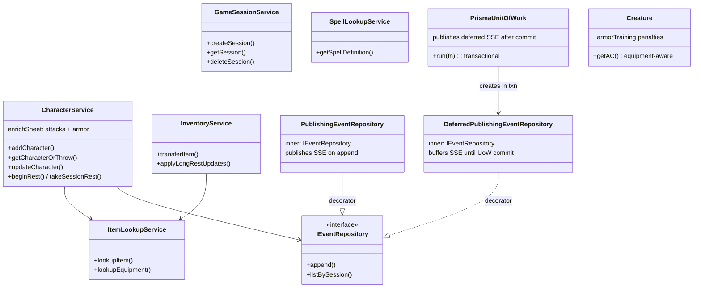

# EntityManagement Flow

## Purpose
EntityManagement owns the persistence-facing application contracts for sessions, characters, spell lookup, item lookup, inventory mutations, repository interfaces, shared record types, and creature entity models. Character lifecycle is service-led through `CharacterService`; session lifecycle is service-led through `GameSessionService`; spell and item lookup are read-oriented services. Monster and NPC lifecycle is part of the flow's persistence surface, but today it is mostly exercised through repository interfaces and session routes rather than dedicated application services. Hydration depends on these record and entity shapes, but the hydration logic itself lives in adjacent CreatureHydration helpers.

## Architecture



## Key Contracts

Key contracts in this flow:

- `CharacterService` (`services/entities/character-service.ts`): add/list/get/update/delete characters, enrich sheets before persistence, and run rest flows.
- `GameSessionService` (`services/entities/game-session-service.ts`): create/get/delete/list sessions.
- `SpellLookupService` (`services/entities/spell-lookup-service.ts`): read-only spell lookup, canonical catalog first and repository fallback second.
- `ItemLookupService` (`services/entities/item-lookup-service.ts`): unified equipment lookup across stored magic items and static weapon/armor catalogs.
- `InventoryService` (`services/entities/inventory-service.ts`): transactional inventory transfer, item creation, expiry sweep, and long-rest inventory updates.
- `Character`, `Monster`, `NPC`, and `Creature` (`domain/entities/creatures/*`): runtime domain models whose shapes must stay compatible with hydration.
- Repository interfaces (`application/repositories/*`), record types (`application/types.ts`), Prisma adapters (`infrastructure/db/*`), and memory adapters (`infrastructure/testing/memory-repos.ts`): the persistence contract surface for this flow.

## Record Types (`application/types.ts`)
Foundation types shared across repositories, services, and hydration:
- **`GameSessionRecord`** — session metadata + storyFramework JSON
- **`SessionCharacterRecord`** — character with sheet JSON, faction, aiControlled flag
- **`SessionMonsterRecord`** — monster with statBlock JSON, monsterDefinitionId
- **`SessionNPCRecord`** — NPC with statBlock JSON
- **`CombatEncounterRecord`** — encounter status, round/turn, mapData, surprise, battlePlans
- **`CombatantStateRecord`** — HP, initiative, conditions/resources JSON, combatantType discriminator (`"Character" | "Monster" | "NPC"`)
- **`GameEventRecord`** — event type + payload JSON + timestamp
- **`SpellDefinitionRecord`** — spell data from import pipeline

All JSON fields use `JsonValue` (aliased to `unknown`) — callers must cast and validate.

`application/types.ts` is part of the flow contract. In particular, `SessionCharacterRecord` carries `sheetVersion`, `faction`, and `aiControlled`, and `ItemDefinitionRecord` belongs to the shared persistence model alongside session, creature, combat, event, and spell records.

## Items & Equipment (`domain/entities/items/`)

EntityManagement documents app-service wiring and persistence contracts that touch inventory, but inventory mechanics and item semantics are owned by InventorySystem flow (`inventory-system.instructions.md`) as source of truth.

### Catalog Pattern
Static catalogs are the **single source of truth** for canon equipment stats. Never duplicate stats inline.

| File | Purpose |
|------|---------|
| `weapon-catalog.ts` | 38 weapons with properties, damage, mastery, range. `lookupWeapon(name)` by case-insensitive index. `enrichSheetAttacks(sheet)` resolves catalog properties onto character sheet attacks. |
| `armor-catalog.ts` | 12 armor entries with AC formula, category, STR requirement, stealth disadvantage. `lookupArmor(name)`, `deriveACFromArmor()`, `enrichSheetArmor(sheet)` adds `equippedArmor`/`equippedShield` to sheet. |
| `weapon-properties.ts` | Standardized property checkers (`isFinesse`, `isLight`, `isThrown`, `isReach`, etc.). Always use these — never ad-hoc `.includes()`. |
| `equipped-items.ts` | Types: `EquippedArmor`, `EquippedShield`, `EquippedArmorClassFormula`, `ArmorTraining` (light/medium/heavy/shield booleans). |

### Magic Items
| File | Purpose |
|------|---------|
| `magic-item.ts` | **Data model only** — `MagicItemDefinition` (modifiers, onHitEffects, grantedSpells, charges, potionEffects), `CharacterItemInstance` (runtime state: equipped, attuned, currentCharges, quantity, slot), `ItemSlot` enum. |
| `magic-item-catalog.ts` | Built-in definitions: bonus weapons/armor (+1/+2/+3 factories), named items (Flame Tongue, Frost Brand, Staff of Fire, etc.), potions (Healing, Greater Healing, etc.). |

### Inventory & Ground Items
| File | Purpose |
|------|---------|
| `inventory.ts` | Helpers operating on `CharacterItemInstance[]`: `findInventoryItem`, `addInventoryItem`, `removeInventoryItem`, `useConsumableItem`. Attunement: `MAX_ATTUNEMENT_SLOTS = 3`, `canAttune()`. Legacy `InventoryItem` type for thrown/ammo tracking. |
| `ground-item.ts` | `GroundItem` — a weapon/item on the battlefield grid. Sources: `"thrown" | "dropped" | "preplaced" | "loot"`. Has `weaponStats` for weapon pickup and `inventoryItem` for consumable pickup. Stored as MapEntity in encounter. |

## Event System

### Decorator Chain
Three implementations of `IEventRepository`, composed via decoration:

1. **`PrismaEventRepository`** — raw persistence (writes to DB).
2. **`PublishingEventRepository`** (decorator) — wraps inner repo; publishes SSE via `sseBroker` on every `append()`. Used for standalone (non-transactional) writes.
3. **`DeferredPublishingEventRepository`** (decorator) — wraps inner repo; buffers SSE events into a `DeferredEvent[]` array. Events are published **after** the Unit of Work transaction commits. Prevents SSE push from inside a DB transaction.

Treat `GameEventInput` in `application/repositories/event-repository.ts` as the source of truth for event types and payloads. Do not document a fixed event count here. This flow is responsible for keeping repository payload contracts, Prisma persistence, SSE publishing decorators, and memory-test implementations aligned when event shapes change.

## Unit of Work (`PrismaUnitOfWork`)
Transactional boundary for multi-repository operations:
```
PrismaUnitOfWork.run(async (repos: RepositoryBundle) => { ... })
```
- Creates a **Prisma transaction** (`$transaction`) — all repos share the txn client.
- Event repo is wrapped in `DeferredPublishingEventRepository` — SSE events buffer.
- After `$transaction` commits, `publishDeferredEvents(deferred)` pushes all buffered events via SSE.
- The current bundle includes sessions, characters, monsters, NPCs, combat, events, spells, item definitions, and pending actions.
- Use UoW when an operation must atomically update multiple entities (e.g., rest mechanics modifying all characters + firing events).

## Sheet Enrichment Pipeline
`CharacterService.addCharacter()` enriches raw JSON sheets before persisting:
```
enrichSheetArmor(enrichSheetAttacks(sheet))
```
1. **`enrichSheetAttacks(sheet)`** — resolves each attack's `properties` and `mastery` from `weapon-catalog.ts` by weapon name. Adds catalog data that the character generator may have omitted.
2. **`enrichSheetArmor(sheet)`** — finds armor in `equipment[]`, looks up armor catalog, adds `equippedArmor` (AC formula, category) and `equippedShield` fields to the sheet.

This ensures the combat system can compute AC from catalog formulas rather than relying solely on pre-computed `armorClass`.

## Rest Mechanics (`CharacterService`)
Two-phase rest flow with interruption detection:

1. **`beginRest(sessionId, restType)`** — records `RestStarted` event, returns `{ restId, startedAt }`.
2. **`takeSessionRest(sessionId, restType, hitDiceSpending?, restStartedAt?)`** — if `restStartedAt` provided, scans event log since that time for combat/damage events (interruption detection). If interrupted, returns `{ interrupted: true, interruptedBy }` without applying benefits.
   - **Short rest**: optionally spend Hit Dice (`hitDiceSpending[charId] = count`), roll dice via `DiceRoller`, recover HP capped at max.
   - **Long rest**: restore HP to max, recover spent Hit Dice (half total, rounded down, min 1).
   - **Both**: refresh class resource pools via `refreshClassResourcePools()`.
   - Fires `RestCompleted` event on success.

## Creature AC Computation (`Creature.getAC()`)
Equipment-aware AC calculation in `domain/entities/creatures/creature.ts`:
- **No equipment**: returns raw `armorClass` field (pre-calculated from stat block).
- **With armor**: computes from `EquippedArmorClassFormula` (base + capped DEX mod).
- **Shield**: adds `shield.armorClassBonus` only if `armorTraining.shield` is `true`.
- **Armor training penalties** (`isWearingUntrainedArmor()`): without training → cannot cast spells (`canCastSpells()`), disadvantage on STR/DEX D20 tests (`getD20TestModeForAbility()`).
- Barbarian unarmored defense computed separately in `barbarian.ts` → `barbarianUnarmoredDefenseAC()`.

## Hydration Cross-Reference
Hydration code lives in `combat/helpers/` (outside this flow's scope) but depends on entity shapes:
- `creature-hydration.ts`: `hydrateCharacter()`, `hydrateMonster()`, `hydrateNPC()` — convert `SessionXxxRecord` → domain `Creature`.
- `combat-hydration.ts`: `hydrateCombat()` — assembles full `Combat` from records + creatures.
- **Entity shape changes in this flow MUST be validated against hydration** — adding fields to `SessionCharacterRecord.sheet` or `Creature` requires checking that hydration still works.

## Known Gotchas

1. **Repository pattern** — all persistence through interfaces in `application/repositories/`. Prisma for prod, in-memory for tests.
2. **Repo interface changes require updating BOTH** Prisma impls in `infrastructure/db/` AND in-memory repos in `infrastructure/testing/memory-repos.ts`.
3. **Hydration helpers** enrich raw DB entities with computed fields (weapon properties, spell lists, class features) — entity shape changes ripple through hydration.
4. **Character sheet enrichment** depends on weapon/armor catalogs — ensure catalog entries exist before referencing new equipment.
5. **Monster stat blocks** from `import:monsters` — stat block shape must match `Monster` entity interface.
6. **Session events** fire on entity changes — event payloads must match SSE subscriber expectations.
7. **`JsonValue` is `unknown`** — all record JSON fields require runtime casting and validation. Don't assume shape without checking.
8. **Weapon property checks** — always use `weapon-properties.ts` helpers, never raw `.includes()` on property arrays.
9. **Magic item definitions are static** — runtime state (charges, attunement) lives on `CharacterItemInstance`, not `MagicItemDefinition`.
10. **UoW deferred events** — events inside a `PrismaUnitOfWork.run()` are NOT visible via SSE until `run()` returns. Don't depend on SSE receipt within the transaction.
