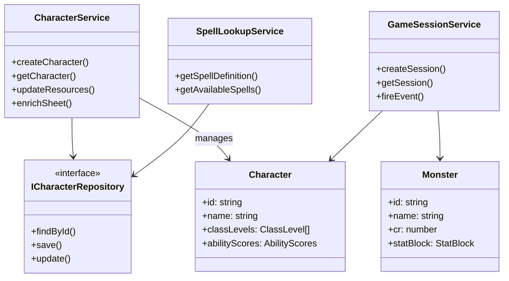

# EntityManagement Flow

## Purpose
Entity lifecycle management — CRUD operations for characters, monsters, NPCs, and game sessions. Handles creature hydration (enriching raw DB entities with computed fields), repository abstractions, and the bridge between persistence and domain models.

## Architecture

## Key Contracts

| Type | File | Purpose |
|------|------|---------|
| `CharacterService` | `services/entities/character-service.ts` | Character CRUD, resource mgmt, sheet enrichment |
| `GameSessionService` | `services/entities/game-session-service.ts` | Session lifecycle, event firing |
| `SpellLookupService` | `services/entities/spell-lookup-service.ts` | Spell definition lookup |
| `Character` | `domain/entities/creatures/character.ts` | Player character data model |
| `Monster` | `domain/entities/creatures/monster.ts` | Monster stat block data model |
| `NPC` | `domain/entities/creatures/npc.ts` | NPC data model |
| Repository interfaces | `application/repositories/*` | Persistence ports |
| `memory-repos.ts` | `infrastructure/testing/memory-repos.ts` | In-memory repo impls for tests |

## Known Gotchas

1. **Repository pattern** — all persistence through interfaces in `application/repositories/`. Prisma for prod, in-memory for tests.
2. **Repo interface changes require updating BOTH** Prisma impls in `infrastructure/db/` AND in-memory repos in `infrastructure/testing/memory-repos.ts`
3. **Hydration helpers** enrich raw DB entities with computed fields (weapon properties, spell lists, class features) — entity shape changes ripple through hydration
4. **Character sheet enrichment** depends on weapon/armor catalogs from `import:rulebook` — ensure data exists before referencing new equipment
5. **Monster stat blocks** from `import:monsters` — stat block shape must match `Monster` entity interface
6. **Session events** fire on entity changes — event payloads must match SSE subscriber expectations
