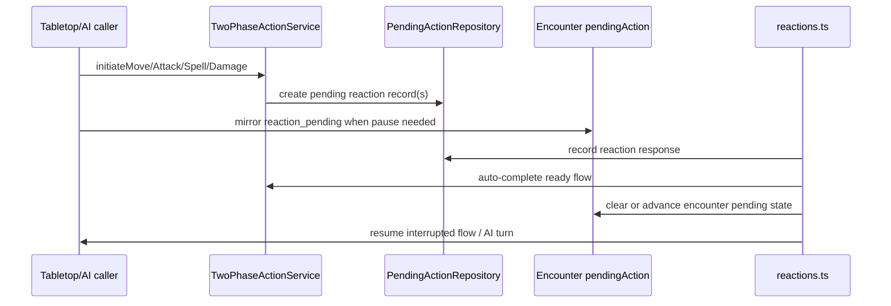

# ReactionSystem Flow

## Purpose
Manages the two-phase reaction pipeline: source code detects a reaction trigger, stores a repository-backed pending action, prompts the reacting player or AI, then resumes the interrupted move, attack, spell, or post-damage flow after responses are in. Current reaction coverage includes opportunity attacks, War Caster spell opportunity attacks, Shield, Deflect Attacks, Counterspell, Absorb Elements, Hellish Rebuke, Protection, Interception, Uncanny Dodge, Sentinel reaction attacks, and readied-action triggers.

## File Responsibility Matrix

| File | ~Lines | Responsibility |
|------|--------|----------------|
| `combat/two-phase-action-service.ts` | ~420 | Facade: delegates to 4 handler modules |
| `combat/two-phase/move-reaction-handler.ts` | ~200 | Move-trigger reactions: opportunity attacks, War Caster spell OAs, and readied-action move triggers |
| `combat/two-phase/attack-reaction-handler.ts` | ~180 | Shield (+5 AC retroactive), Deflect Attacks |
| `combat/two-phase/spell-reaction-handler.ts` | ~150 | Counterspell: reacting caster spends a slot, then the target caster makes a Constitution save against the counterspeller's spell save DC |
| `combat/two-phase/damage-reaction-handler.ts` | ~120 | Post-damage reaction opportunities |
| `domain/entities/combat/pending-action.ts` | ~100 | PendingAction union type for state machine |
| `combat/helpers/oa-detection.ts` | ~80 | `detectOpportunityAttacks()` — centralized OA eligibility |
| `combat/tabletop/pending-action-state-machine.ts` | ~150 | Adjacent tabletop roll-flow state machine; not the primary reaction lifecycle authority |
| `infrastructure/api/routes/reactions.ts` | ~100 | Record responses, query one or all pending reactions, auto-complete ready flows, mirror encounter `reaction_pending`, and resume AI turns |

## Key Types/Interfaces

- `TwoPhaseActionService` — facade with paired initiate/complete methods: `initiateMove()` / `completeMove()`, `initiateAttack()` / `completeAttack()`, `initiateSpellCast()` / `completeSpellCast()`, `initiateDamageReaction()` / `completeDamageReaction()`
- `PendingActionType` — `"move" | "spell_cast" | "attack" | "damage_reaction" | "lucky_reroll" | "ability_check"`
- `ReactionType` — `"opportunity_attack" | "counterspell" | "shield" | "absorb_elements" | "hellish_rebuke" | "deflect_attacks" | "uncanny_dodge" | "readied_action" | "sentinel_attack" | "lucky_reroll" | "silvery_barbs" | "interception" | "protection" | "cutting_words"`
- `PendingAction` — core interface with `id`, `encounterId`, `actor`, `type`, `data`, `reactionOpportunities`, `resolvedReactions`, `expiresAt`
- `DetectOpportunityAttacksInput` — single input object passed to `detectOpportunityAttacks(input: DetectOpportunityAttacksInput)`; NOT positional args
- `PendingActionRepository` / `PendingActionStatus` — the reaction flow's lifecycle authority. Status is repository-derived, not validated by the tabletop roll state machine.

### Dual Pending Action Systems (CO-L7)
There are TWO parallel pending action systems that do NOT conflict:
1. **Encounter-level `pendingAction` field** — singleton JSON blob; used by the tabletop dice flow (RollStateMachine) for ATTACK/DAMAGE/INITIATIVE rolls
2. **PendingActionRepository** — multi-record store; used by TwoPhaseActionService for reaction opportunities

The only synchronization point: when encounter `pendingAction = "reaction_pending"`, the tabletop flow is paused waiting for reactions from PendingActionRepository.

## Known Gotchas

- **Reactions consume one per round** — resets at the start of the creature's OWN turn, not at round start. A creature that uses Shield on someone else's turn cannot take an OA until their next turn begins.
- **OA uses reach, not range** — a creature with 5ft reach threatens adjacent squares only. A creature with 10ft reach (e.g., with a polearm) threatens a wider area.
- **Shield is retroactive** — it applies +5 AC to the TRIGGERING attack (possibly turning a hit into a miss) and persists until the start of the caster's next turn.
- **The two-phase flow pauses combat through orchestration layers** — callers mirror repository-backed reaction prompts into encounter `pendingAction = reaction_pending` when needed. Do not assume the handler itself mutates encounter pending state.
- **OA detection is centralized in `oa-detection.ts`** — both ActionService.move (programmatic) and MoveReactionHandler.initiate (two-phase) reuse it. Never duplicate OA eligibility logic inline.
- **Move reactions are broader than leave-reach weapon OAs** — the current flow also supports War Caster spell OAs and `readied_action` move triggers, so move-trigger logic should stay centralized in the helper plus the move handler.

## API Docs Alignment

- Canonical client API docs live in `docs/api/` (README + reference + guides).
- When changing routes, payloads, errors, events, or client integration loops, update the matching files in `docs/api/reference/` and `docs/api/guides/` in the same change.
- For SME research, agent reviews, and implementation plans that affect client contracts, cite and update the impacted docs under `docs/api/`.
- Treat these docs as done criteria for contract changes: `docs/api/reference/endpoints.md`, `docs/api/reference/schemas.md`, `docs/api/reference/events.md`, and `docs/api/reference/errors.md`.
