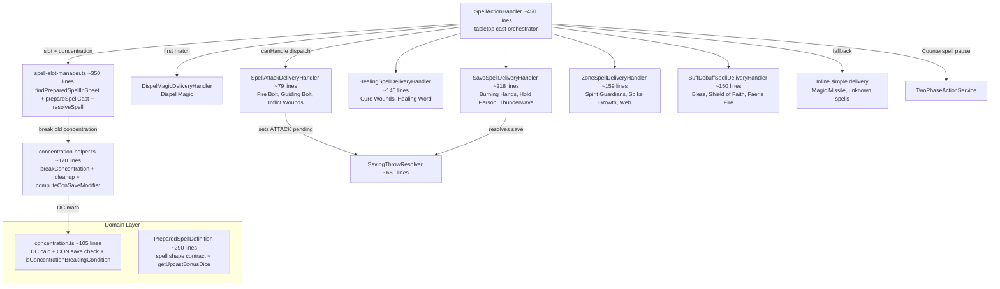

# SpellSystem Flow

## Purpose
Spell casting pipeline for mechanical resolution after parsing has already identified a cast intent. Covers spell lookup, slot spending, concentration transitions, component and range validation, Counterspell pause points, delivery routing, saving-throw resolution, and post-cast side effects. Tabletop and AI share spell preparation helpers, but mechanical delivery is split between `SpellActionHandler` and `AiSpellDelivery`.

## Architecture

`SpellActionHandler` is the tabletop spell orchestrator. It resolves the spell definition, validates upcasting, enforces current cast restrictions (components, range, bonus-action spell limits), opens Counterspell reaction windows, spends slots and swaps concentration through `prepareSpellCast()`, dispatches to the first matching delivery handler, then runs any `onCastSideEffects` after a successful completion.

## Delivery Handler Routing Table

SpellActionHandler iterates `deliveryHandlers[]` in priority order. First `canHandle()` that returns `true` wins.

| Priority | Handler | `canHandle()` gate | PreparedSpellDefinition field |
|----------|---------|-------------------|------------------------------|
| 1 | `DispelMagicDeliveryHandler` | named special-case route | spell identity |
| 2 | `SpellAttackDeliveryHandler` | `!!spell.attackType` | `attackType: 'ranged_spell' \| 'melee_spell'` |
| 3 | `HealingSpellDeliveryHandler` | `!!spell.healing && diceRoller` | `healing: SpellDice` |
| 4 | `SaveSpellDeliveryHandler` | `!!spell.saveAbility && diceRoller` | `saveAbility: string` |
| 5 | `ZoneSpellDeliveryHandler` | `!!spell.zone` | `zone: SpellZoneDeclaration` |
| 6 | `BuffDebuffSpellDeliveryHandler` | `!!spell.effects?.length` | `effects: SpellEffectDeclaration[]` |
| — | Auto-hit/simple fallback | fallback | none of the above |

**Implication**: A spell with BOTH `attackType` and `saveAbility` routes to attack-roll (priority 1 wins). Order matters.

## Key Contracts

| Type/Function | File | Purpose |
|---------------|------|---------|
| `SpellActionHandler` | `tabletop/spell-action-handler.ts` (~450 lines) | Tabletop spell orchestrator: validation, Counterspell pause, slot spend, and delivery routing |
| `SpellDeliveryHandler` | `tabletop/spell-delivery/spell-delivery-handler.ts` | Strategy interface: `canHandle(spell)` + `handle(ctx)` |
| `SpellCastingContext` | same file | All data for a cast — resolved AFTER slot spending |
| `SpellDeliveryDeps` | same file | Shared deps injected into every handler |
| `PreparedSpellDefinition` | `domain/entities/spells/prepared-spell-definition.ts` | Canonical shape for `sheet.preparedSpells[]` entries |
| `findPreparedSpellInSheet` | `helpers/spell-slot-manager.ts` | Pure lookup — no I/O, case-insensitive match |
| `prepareSpellCast` | `helpers/spell-slot-manager.ts` | Slot validation + spend + concentration swap — shared with AI path |
| `resolveSpell` | `helpers/spell-slot-manager.ts` | Catalog-first spell resolution: catalog base + sheet override merge |
| `validateUpcast` | `helpers/spell-slot-manager.ts` | Pure upcast validation helper: spellLevel vs castAtLevel |
| `breakConcentration` | `helpers/concentration-helper.ts` | Full cleanup: resources + effects on all combatants + zones on map |
| `getConcentrationSpellName` | `helpers/concentration-helper.ts` | Read current concentration from resources bag |
| `computeConSaveModifier` | `helpers/concentration-helper.ts` | Computes CON save modifier for concentration checks |
| `concentrationCheckOnDamage` | `domain/rules/concentration.ts` | Pure DC calc: `max(10, floor(damage/2))` + CON save roll |
| `isConcentrationBreakingCondition` | `domain/rules/concentration.ts` | Returns true if condition auto-breaks concentration |
| `SavingThrowResolver` | `tabletop/rolls/saving-throw-resolver.ts` (~650 lines) | Per-target save: proficiency, effect bonuses, cover, advantage/disadvantage |
| `SpellLookupService` | `services/entities/spell-lookup-service.ts` | Static spell definition lookup (wraps `ISpellRepository`) |

Important modern `PreparedSpellDefinition` fields used by the current pipeline include `area`, `range`, `ignoresCover`, `damageDiceSidesOnDamaged`, `onHitEffects`, `pushOnFailFeet`, `turnEndSave`, `multiAttack`, `autoHit`, `dartCount`, and `onCastSideEffects`.

## Cross-Flow Notes

- **SavingThrowResolver** is shared with ClassAbilities flow (Stunning Strike, Open Hand Technique). Changes affect both flows.
- **spell-slot-manager.ts** is shared with the AI path. `CastSpellHandler` calls `prepareSpellCast()` and then applies mechanics through `AiSpellDelivery`; AI does not use the interactive tabletop pending-roll flow.
- **Catalog level breadth belongs to SpellCatalog**. Current spell data is levels 0-5; adding/expanding level content is a SpellCatalog concern, while this flow owns delivery wiring and spell-cast mechanics.
- **concentration-helper.ts** is shared with `RollStateMachine` (tabletop) and `ActionService` (programmatic). Three consumers of `breakConcentration()`.
- **PreparedSpellDefinition** is the contract between entity management (character sheet population) and the spell pipeline. Changes here affect both flows.
- **Concentration is intentionally split** — `domain/rules/concentration.ts` holds pure rules such as DC calculation and break conditions, while `helpers/concentration-helper.ts` performs encounter-wide cleanup, active-effect removal, condition cleanup, and map-zone removal.

## How to Add a New Delivery Mode

1. Create `your-spell-delivery-handler.ts` in `tabletop/spell-delivery/` implementing `SpellDeliveryHandler`
2. Implement `canHandle(spell: PreparedSpellDefinition): boolean` — gate on a specific field
3. Implement `handle(ctx: SpellCastingContext): Promise<ActionParseResult>` — use `ctx.spellMatch` for spell data, `handlerDeps` for repos/dice
4. Export from `spell-delivery/index.ts` barrel
5. Add to the `deliveryHandlers[]` array in `SpellActionHandler` constructor — **priority order matters** (first match wins)
6. Add the gating field to `PreparedSpellDefinition` if it doesn't exist
7. Populate the field on relevant spells in character sheet `preparedSpells[]` (entity management concern)
8. Write a test scenario in `scripts/test-harness/scenarios/` exercising the new delivery path

## Known Gotchas

1. **Concentration DC**: `max(10, floor(damage / 2))` from pure concentration rules. Unconscious/KO break behavior is handled by combat-state/condition pathways around the check.
2. **Handler priority order** — a spell matching multiple gates routes to the FIRST handler in array order. Test edge cases with spells having multiple delivery-relevant fields.
3. **Zone spells** create persistent `CombatZone` on the map. Triggered effects are applied by configured zone trigger types (for example on-enter and movement/start-of-turn paths depending on spell setup). Zone cleanup happens via `breakConcentration()` for concentration zones.
4. **Healing at 0 HP** triggers revival flow — HealingSpellDeliveryHandler removes Unconscious + resets death saves BEFORE applying healing.
5. **Spell slots** validated in `prepareSpellCast()` (throws `ValidationError`). Slot spending happens BEFORE delivery handler dispatch.
6. **Save-based spells** apply damage defenses (resistance/immunity/vulnerability), cover bonus on DEX saves, and half-damage-on-save logic. Full cover causes early return with no damage.
7. **Buff/debuff target resolution** uses `appliesTo` field: `'self' | 'target' | 'allies' | 'enemies'`. Faction is determined by `combatantType`.
8. **Attack delivery** returns `requiresPlayerInput: true` (sets ATTACK pending action for dice roll). All other handlers resolve immediately.
9. **Context fetched AFTER slot spend** — `SpellCastingContext.encounter/combatants/actorCombatant` reflect post-deduction state.
10. **AI spell delivery is mechanical now** — do not describe AI as bookkeeping-only; the delivery path is split, not missing.

## API Docs Alignment

- Canonical client API docs live in `docs/api/` (README + reference + guides).
- When changing routes, payloads, errors, events, or client integration loops, update the matching files in `docs/api/reference/` and `docs/api/guides/` in the same change.
- For SME research, agent reviews, and implementation plans that affect client contracts, cite and update the impacted docs under `docs/api/`.
- Treat these docs as done criteria for contract changes: `docs/api/reference/endpoints.md`, `docs/api/reference/schemas.md`, `docs/api/reference/events.md`, and `docs/api/reference/errors.md`.
