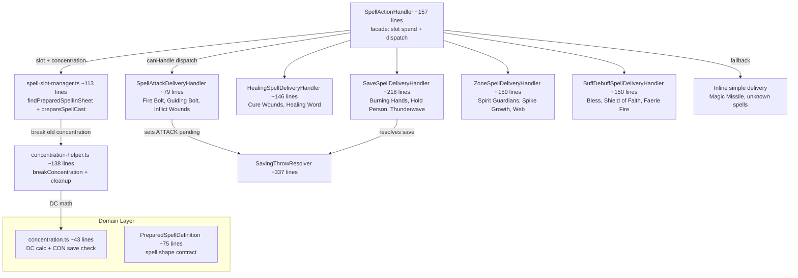

# SpellSystem Flow

## Purpose
Spell casting pipeline — from text parsing through slot spending, concentration management, and mechanical delivery to state changes. Strategy-pattern facade with 5 delivery handlers + inline simple fallback.

## Architecture

SpellActionHandler (~157 lines) is a thin facade that:
1. Looks up the spell in `sheet.preparedSpells[]` via `findPreparedSpellInSheet()`
2. Spends slots + manages concentration via `prepareSpellCast()` (shared with AI path)
3. Dispatches to the first `SpellDeliveryHandler` where `canHandle(spell)` returns true
4. Falls through to inline simple delivery (Magic Missile, unknown spells) if no handler matches

## Delivery Handler Routing Table

SpellActionHandler iterates `deliveryHandlers[]` in priority order. First `canHandle()` that returns `true` wins.

| Priority | Handler | `canHandle()` gate | PreparedSpellDefinition field |
|----------|---------|-------------------|------------------------------|
| 1 | `SpellAttackDeliveryHandler` | `!!spell.attackType` | `attackType: 'ranged_spell' \| 'melee_spell'` |
| 2 | `HealingSpellDeliveryHandler` | `!!spell.healing && diceRoller` | `healing: SpellDice` |
| 3 | `SaveSpellDeliveryHandler` | `!!spell.saveAbility && diceRoller` | `saveAbility: string` |
| 4 | `ZoneSpellDeliveryHandler` | `!!spell.zone` | `zone: SpellZoneDeclaration` |
| 5 | `BuffDebuffSpellDeliveryHandler` | `!!spell.effects?.length` | `effects: SpellEffectDeclaration[]` |
| — | Inline simple (facade) | fallback | none of the above |

**Implication**: A spell with BOTH `attackType` and `saveAbility` routes to attack-roll (priority 1 wins). Order matters.

## Key Contracts

| Type/Function | File | Purpose |
|---------------|------|---------|
| `SpellActionHandler` | `tabletop/spell-action-handler.ts` (~157 lines) | Thin facade: slot spend + strategy dispatch |
| `SpellDeliveryHandler` | `tabletop/spell-delivery/spell-delivery-handler.ts` | Strategy interface: `canHandle(spell)` + `handle(ctx)` |
| `SpellCastingContext` | same file | All data for a cast — resolved AFTER slot spending |
| `SpellDeliveryDeps` | same file | Shared deps injected into every handler |
| `PreparedSpellDefinition` | `domain/entities/spells/prepared-spell-definition.ts` | Canonical shape for `sheet.preparedSpells[]` entries |
| `findPreparedSpellInSheet` | `helpers/spell-slot-manager.ts` | Pure lookup — no I/O, case-insensitive match |
| `prepareSpellCast` | `helpers/spell-slot-manager.ts` | Slot validation + spend + concentration swap — shared with AI path |
| `breakConcentration` | `helpers/concentration-helper.ts` | Full cleanup: resources + effects on all combatants + zones on map |
| `getConcentrationSpellName` | `helpers/concentration-helper.ts` | Read current concentration from resources bag |
| `concentrationCheckOnDamage` | `domain/rules/concentration.ts` | Pure DC calc: `max(10, floor(damage/2))` + CON save roll |
| `SavingThrowResolver` | `tabletop/rolls/saving-throw-resolver.ts` (~337 lines) | Per-target save: proficiency, effect bonuses, cover, advantage/disadvantage |
| `SpellLookupService` | `services/entities/spell-lookup-service.ts` | Static spell definition lookup (wraps `ISpellRepository`) |

## Cross-Flow Notes

- **SavingThrowResolver** is shared with ClassAbilities flow (Stunning Strike, Open Hand Technique). Changes affect both flows.
- **spell-slot-manager.ts** is shared with the AI path (`ai-action-executor.ts executeCastSpell()`). The AI path calls `prepareSpellCast()` for resource bookkeeping but does NOT use delivery handlers (no interactive dice rolls).
- **concentration-helper.ts** is shared with `RollStateMachine` (tabletop) and `ActionService` (programmatic). Three consumers of `breakConcentration()`.
- **PreparedSpellDefinition** is the contract between entity management (character sheet population) and the spell pipeline. Changes here affect both flows.

## How to Add a New Delivery Mode

1. Create `your-spell-delivery-handler.ts` in `tabletop/spell-delivery/` implementing `SpellDeliveryHandler`
2. Implement `canHandle(spell: PreparedSpellDefinition): boolean` — gate on a specific field
3. Implement `handle(ctx: SpellCastingContext): Promise<ActionParseResult>` — use `ctx.spellMatch` for spell data, `handlerDeps` for repos/dice
4. Export from `spell-delivery/index.ts` barrel
5. Add to the `deliveryHandlers[]` array in `SpellActionHandler` constructor — **priority order matters** (first match wins)
6. Add the gating field to `PreparedSpellDefinition` if it doesn't exist
7. Populate the field on relevant spells in character sheet `preparedSpells[]` (entity management concern)
8. Write a test scenario in `scripts/test-harness/scenarios/` exercising the new delivery path

## Known Gotchas

1. **Concentration DC**: `max(10, floor(damage / 2))` — auto-fail if unconscious (2024 rules)
2. **Handler priority order** — a spell matching multiple gates routes to the FIRST handler in array order. Test edge cases with spells having multiple delivery-relevant fields.
3. **Zone spells** create persistent `CombatZone` on the map — damage applies on entry AND at start of turn. Zone cleanup happens via `breakConcentration()` for concentration zones.
4. **Healing at 0 HP** triggers revival flow — HealingSpellDeliveryHandler removes Unconscious + resets death saves BEFORE applying healing.
5. **Spell slots** validated in `prepareSpellCast()` (throws `ValidationError`). Slot spending happens BEFORE delivery handler dispatch.
6. **Save-based spells** apply damage defenses (resistance/immunity/vulnerability), cover bonus on DEX saves, and half-damage-on-save logic. Full cover causes early return with no damage.
7. **Buff/debuff target resolution** uses `appliesTo` field: `'self' | 'target' | 'allies' | 'enemies'`. Faction is determined by `combatantType`.
8. **Attack delivery** returns `requiresPlayerInput: true` (sets ATTACK pending action for dice roll). All other handlers resolve immediately.
9. **Context fetched AFTER slot spend** — `SpellCastingContext.encounter/combatants/actorCombatant` reflect post-deduction state.
