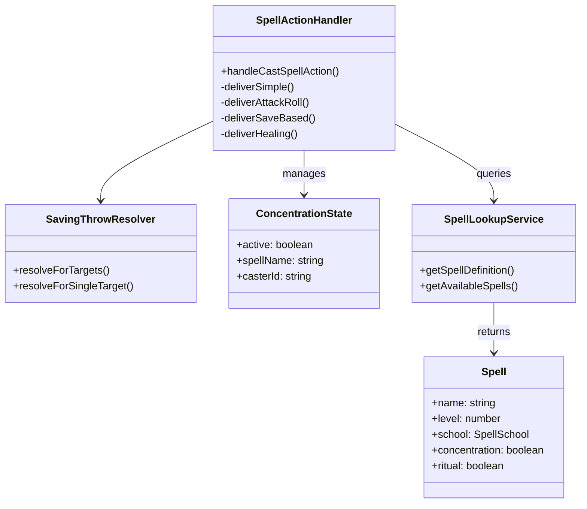

# SpellSystem Flow

## Purpose
Spell casting pipeline — handles all spell effects from text parsing through delivery to state changes. Four delivery modes (simple, attack-roll, save-based, healing), concentration state machine, and zone effect management.

## Architecture

## Key Contracts

| Type/Function | File | Purpose |
|---------------|------|---------|
| `SpellActionHandler` | `tabletop/spell-action-handler.ts` | Central handler (~850 lines), 4 delivery modes |
| `SavingThrowResolver` | `tabletop/saving-throw-resolver.ts` | Per-target save resolution, replaces old MonkTechniqueResolver |
| `ConcentrationState` | `domain/rules/concentration.ts` | State machine: create → start → check on damage → end |
| `Spell` entity | `domain/entities/spells/` | Spell data model (level 0-9, school, components) |
| `SpellLookupService` | `services/entities/spell-lookup-service.ts` | Spell definition lookup and availability |

## Known Gotchas

1. **Concentration DC**: `max(10, floor(damage / 2))` — auto-fail if unconscious (2024 rules)
2. **SpellActionHandler is ~850 lines** with 4 independent delivery paths — test ALL paths when modifying shared logic
3. **Zone spells** create persistent area effects — damage applies on entry AND at start of turn
4. **Healing at 0 HP** triggers revival flow — must revive BEFORE applying healing
5. **Spell slots** tracked per rest cycle — validate slot availability before casting
6. **Multi-target spells** iterate targets with individual save outcomes — each target resolves independently
7. **Effect application** is per-target — a target that saves may take half damage while another takes full
